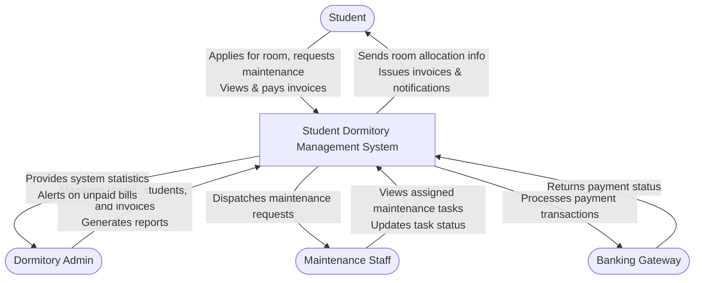

# Context Diagram — Student Dormitory Management System

## Mermaid Code

## Actor & Interaction Table | Bảng Actor & Tương tác
| # | Actor | Type | Interaction with System / Tương tác với hệ thống |
|---|-------|------|--------------------------------------------------|
| 1 | Student | External | Applies for room, pays fees, and requests maintenance. / Đăng ký phòng ở, thanh toán phí và báo cáo sự cố cơ sở vật chất. |
| 2 | Dormitory Admin | External | Manages student applications, rooms, and billing. / Quản lý đơn đăng ký của sinh viên, phòng ở và hóa đơn. |
| 3 | Maintenance Staff | External | Resolves maintenance issues reported by students. / Xử lý các yêu cầu bảo trì, sửa chữa từ sinh viên. |
| 4 | Banking Gateway | External | Handles online payment processing for invoices. / Xử lý giao dịch thanh toán trực tuyến cho các hóa đơn. |
