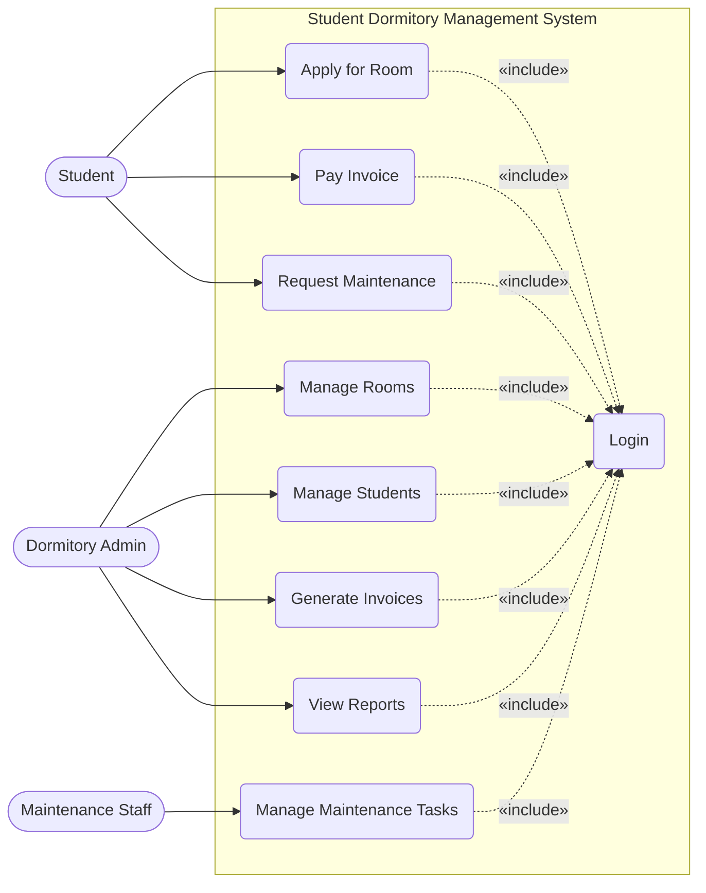

# Use Case Diagram — Student Dormitory Management System

## Mermaid Code

## Actor Table | Bảng Actor
| # | Actor | Mô tả |
|---|-------|-------|
| 1 | Student | Sinh viên có nhu cầu thuê và đang ở tại KTX, sử dụng hệ thống để đăng ký, thanh toán và báo cáo sự cố. |
| 2 | Dormitory Admin | Ban quản lý KTX, chịu trách nhiệm xét duyệt đơn, sắp xếp phòng và thu phí. |
| 3 | Maintenance Staff | Nhân viên bảo vệ/kỹ thuật, tiếp nhận và cập nhật tiến độ sửa chữa thiết bị trong KTX. |

## Use Case Table | Bảng Use Case
| # | Use Case ID | Use Case Name | Actor | Mô tả |
|---|-------------|---------------|-------|-------|
| 1 | UC01 | Apply for Room | Student | Sinh viên đăng ký xin ở KTX. |
| 2 | UC02 | Manage Rooms | Admin | Quản lý thông tin, tình trạng của các tòa nhà và phòng KTX. |
| 3 | UC03 | Manage Students | Admin | Quản lý hồ sơ sinh viên đang lưu trú. |
| 4 | UC04 | Generate Invoices | Admin | Tạo hóa đơn tiền phòng, điện, nước hàng tháng. |
| 5 | UC05 | Pay Invoice | Student | Sinh viên thanh toán các hóa đơn qua hệ thống. |
| 6 | UC06 | Request Maintenance | Student | Sinh viên báo cáo hư hỏng tài sản trong phòng. |
| 7 | UC07 | Manage Maintenance Tasks | Staff | Nhân viên kỹ thuật xem và cập nhật trạng thái sửa chữa. |
| 8 | UC08 | View Reports | Admin | Xem báo cáo thống kê doanh thu, tỷ lệ lấp đầy phòng. |
| 9 | UC09 | Login | All Actors | Xác thực người dùng trước khi sử dụng hệ thống. |

## Use Case Specification | Đặc tả Use Case (2-3 UC quan trọng nhất)

### UC01 — Apply for Room
| Field | Detail / Chi tiết |
|-------|-------------------|
| **ID** | UC01 |
| **Name** | Apply for Room / Đăng ký phòng KTX |
| **Actor(s)** | Student |
| **Precondition** | Sinh viên đã đăng nhập và hệ thống đang trong đợt tiếp nhận hồ sơ. |
| **Main Flow** | 1. Sinh viên chọn chức năng "Đăng ký phòng".   2. Hệ thống hiển thị các loại phòng đang còn trống.   3. Sinh viên chọn loại phòng mong muốn và điền thông tin bổ sung.   4. Sinh viên xác nhận nộp đơn.   5. Hệ thống lưu đơn đăng ký ở trạng thái "Chờ duyệt" và gửi thông báo xác nhận. |
| **Alternative Flow** | Ở bước 3, nếu loại phòng đã hết chỗ trống do có người khác vừa đăng ký xong, hệ thống thông báo lỗi và yêu cầu chọn loại phòng khác. |
| **Postcondition** | Đơn đăng ký của sinh viên được lưu trên hệ thống, chờ Admin duyệt. |
| **Exception** | Nếu sinh viên đã có đơn đăng ký chờ duyệt trước đó, hệ thống không cho phép tạo đơn mới. |

### UC05 — Pay Invoice
| Field | Detail / Chi tiết |
|-------|-------------------|
| **ID** | UC05 |
| **Name** | Pay Invoice / Thanh toán hóa đơn |
| **Actor(s)** | Student |
| **Precondition** | Sinh viên đã đăng nhập và có hóa đơn ở trạng thái "Chưa thanh toán". |
| **Main Flow** | 1. Sinh viên vào mục "Hóa đơn của tôi".   2. Hệ thống hiển thị danh sách hóa đơn (tiền phòng, điện nước).   3. Sinh viên chọn hóa đơn cần thanh toán.   4. Hệ thống chuyển hướng sang cổng thanh toán trực tuyến (Banking Gateway).   5. Sinh viên thực hiện thanh toán trên cổng ngân hàng.   6. Cổng ngân hàng trả về kết quả thành công, hệ thống cập nhật trạng thái hóa đơn thành "Đã thanh toán" và lưu biên lai. |
| **Alternative Flow** | Ở bước 6, nếu giao dịch thất bại (không đủ tiền, lỗi mạng), hệ thống thông báo thanh toán không thành công và giữ nguyên trạng thái hóa đơn. |
| **Postcondition** | Hóa đơn được thanh toán thành công, cập nhật doanh thu cho KTX. |
| **Exception** | Cổng thanh toán (Banking Gateway) bị lỗi không thể kết nối ở bước 4, hệ thống thông báo bảo trì dịch vụ thanh toán. |
