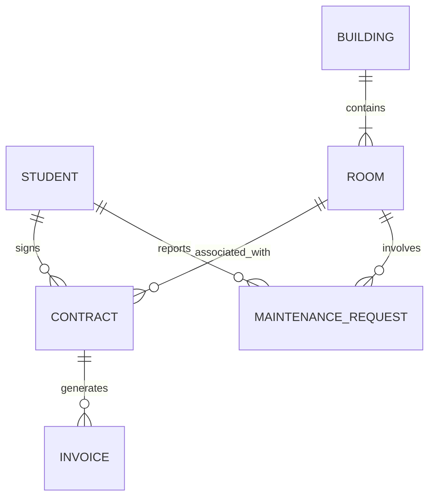

# Conceptual ERD — Student Dormitory Management System

## Mermaid Code

## Entity Description Table | Bảng mô tả Entity
| # | Entity | Mô tả | Key Attributes |
|---|--------|-------|----------------|
| 1 | STUDENT | Thông tin của sinh viên đăng ký ở KTX | student_id, full_name, dob, phone, email |
| 2 | BUILDING | Thông tin các tòa nhà trong khu KTX | building_id, name, location, total_floors |
| 3 | ROOM | Thông tin chi tiết từng phòng | room_id, building_id, room_number, capacity, status |
| 4 | CONTRACT | Hợp đồng lưu trú giữa sinh viên và KTX | contract_id, student_id, room_id, start_date, end_date |
| 5 | INVOICE | Hóa đơn thanh toán (tiền phòng, điện, nước) | invoice_id, contract_id, amount, issue_date, status |
| 6 | MAINTENANCE_REQUEST | Yêu cầu sửa chữa thiết bị trong phòng | request_id, student_id, room_id, description, status |
