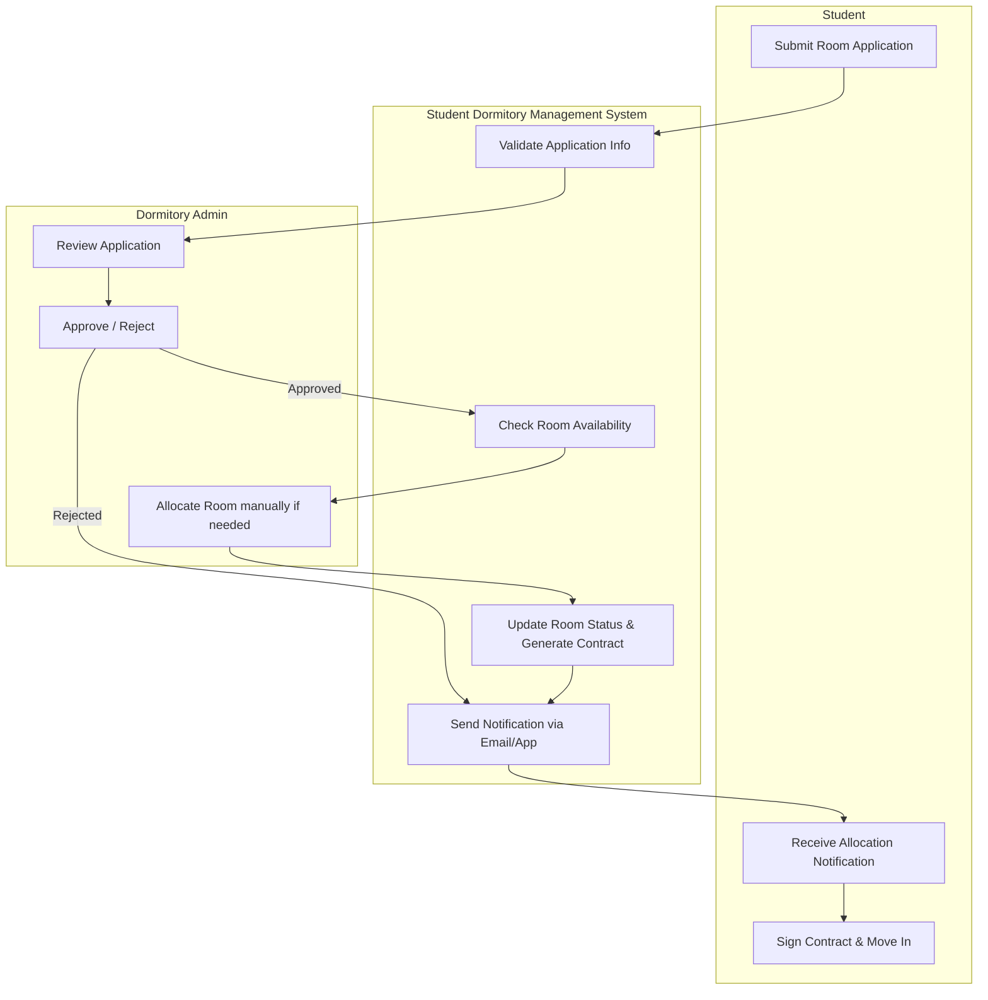

# Swimlane Diagram — Student Dormitory Management System

## Mermaid Code

## Mô tả luồng | Flow Description
1. **Student**: Nộp đơn đăng ký ở ký túc xá qua hệ thống.
2. **System**: Kiểm tra tính hợp lệ của đơn và chuyển đến Ban quản lý.
3. **Admin**: Xem xét hồ sơ và quyết định Phê duyệt (Approve) hoặc Từ chối (Reject). Nếu phê duyệt, Admin tiến hành xếp phòng (nếu hệ thống không tự động xếp).
4. **System**: Cập nhật trạng thái phòng (giảm số giường trống), tạo hợp đồng lưu trú và gửi thông báo cho sinh viên.
5. **Student**: Nhận thông báo xếp phòng thành công, ký hợp đồng và chuẩn bị chuyển vào KTX.
