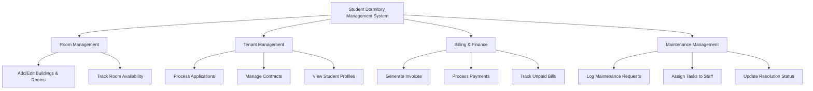

# Action Tree — Student Dormitory Management System

## Mermaid Code

## Mô tả | Description
- **Room Management (Quản lý phòng ốc)**: Khởi tạo và thiết lập các tòa nhà, phòng ở, theo dõi trạng thái số giường trống của từng phòng.
- **Tenant Management (Quản lý người lưu trú)**: Tiếp nhận và xử lý đơn đăng ký của sinh viên, quản lý hợp đồng thuê và hồ sơ thông tin sinh viên đang lưu trú.
- **Billing & Finance (Quản lý hóa đơn & Tài chính)**: Sinh hóa đơn định kỳ (tiền phòng, điện, nước), xử lý thanh toán và theo dõi các hóa đơn đang nợ.
- **Maintenance Management (Quản lý bảo trì)**: Tiếp nhận các báo cáo hỏng hóc từ sinh viên, phân công nhân viên kỹ thuật và cập nhật trạng thái sửa chữa.
