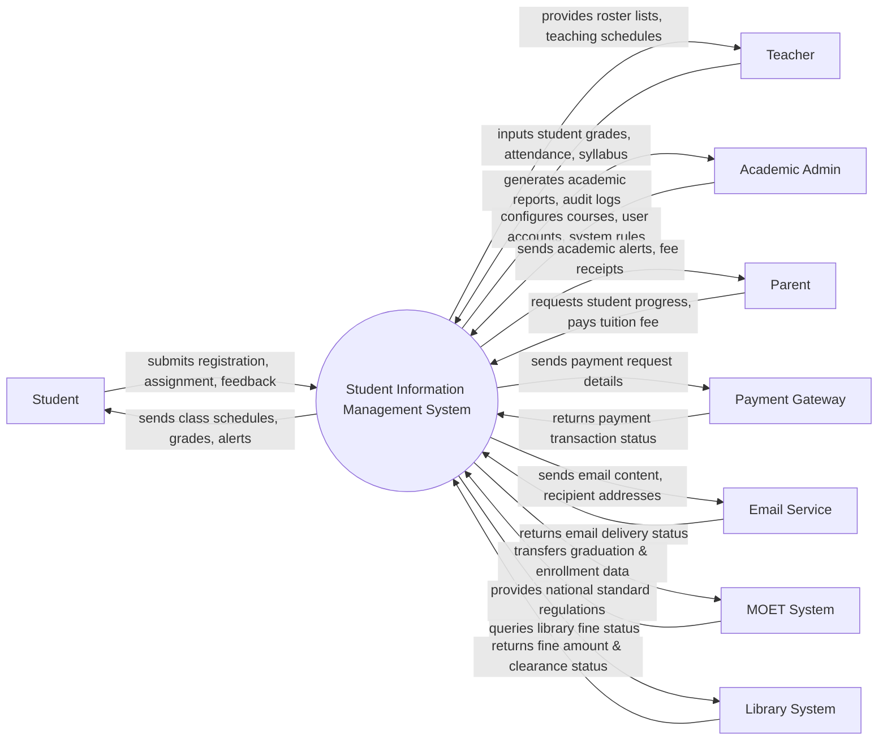

# Context Diagram — Student Information Management System

## Mermaid Code

## Actor & Interaction Table | Bảng Actor & Tương tác

| # | Actor | Actor Type | Data Sent TO System | Data Received FROM System | Notes |
|---|-------|------------|---------------------|---------------------------|-------|
| 1 | Student | Primary | Course registration request, submitted assignments, feedback inquiries | Class schedules, grade records, system notifications, learning materials | Người học chính trong hệ thống, thực hiện các thao tác học vụ |
| 2 | Teacher | Primary | Component grades, attendance records, course syllabus, assignment topics | Roster lists, teaching schedules, student academic profiles | Giảng viên trực tiếp giảng dạy các lớp học phần |
| 3 | Academic Admin | Primary | Course catalogs, user account creations, system configurations | Academic reports, system audit logs, statistical dashboards | Quản trị viên giáo vụ, chịu trách nhiệm vận hành hệ thống |
| 4 | Parent | Primary | Student progress inquiries, tuition payment confirmation | Student progress reports, attendance alerts, fee receipts | Phụ huynh sinh viên theo dõi tình hình học tập và hỗ trợ tài chính |
| 5 | Payment Gateway | Supporting | Payment confirmation token, transaction status | Payment amount, student ID, invoice reference | Cổng thanh toán bên thứ 3 (VNPay, MoMo) xử lý giao dịch học phí |
| 6 | Email Service | Supporting | Delivery status report, bounce alerts | Email body content, recipient email list | Hệ thống gửi email tự động (SendGrid, AWS SES) |
| 7 | MOET System | Regulatory | National standard rules, education degree codes | Student enrollment data, annual graduation reports | Hệ thống quản lý của Bộ Giáo dục và Đào tạo |
| 8 | Library System | Supporting | Library fine details, book clearance status | Student ID query | Hệ thống quản lý thư viện trường đại học |

## System Boundary Description | Mô tả Phạm vi Hệ thống

Hệ thống Student Information Management System (SIMS) chịu trách nhiệm quản lý toàn bộ vòng đời học tập của sinh viên từ khi nhập học đến khi hoàn thành chương trình đào tạo. Phạm vi bên trong hệ thống bao gồm quản lý lý lịch cá nhân, quá trình đăng ký môn học, theo dõi điểm số, ghi nhận điểm danh, và xuất các báo cáo học vụ cho ban quản lý. Ngược lại, những chức năng không thuộc phạm vi xử lý trực tiếp của hệ thống bao gồm: xử lý giao dịch thanh toán tài chính chuyên sâu (được ủy quyền cho Payment Gateway), hạ tầng truyền tải email vật lý (giao cho Email Service), lưu trữ danh mục sách và mượn trả thư viện chi tiết (do Library System quản lý), và ban hành các quy chế giáo dục cấp quốc gia (do MOET System cung cấp).
