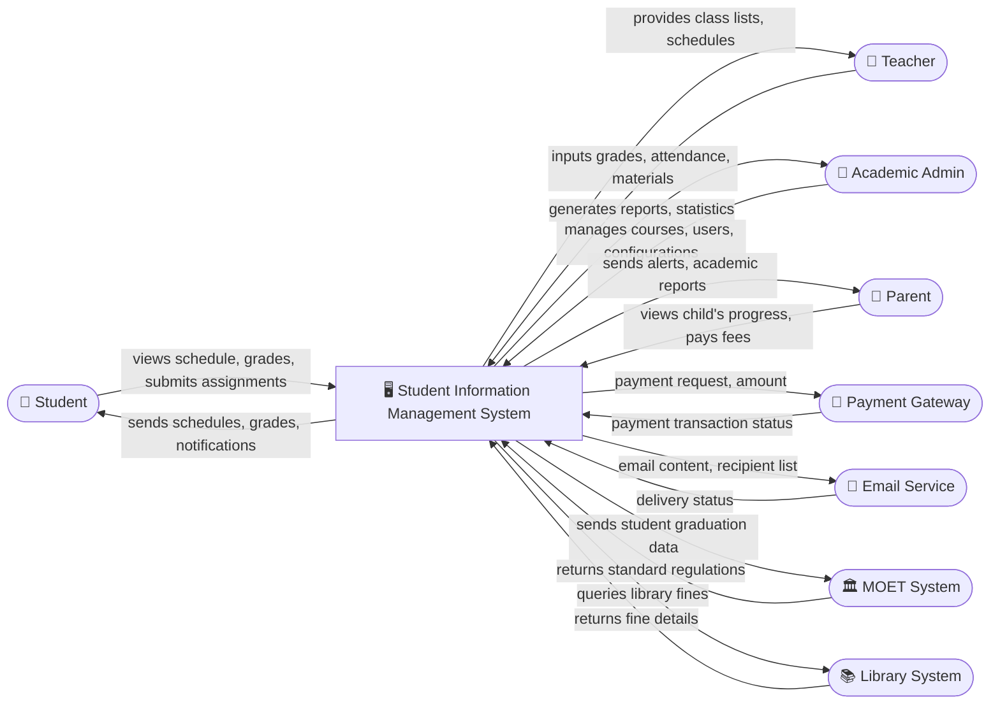

# Context Diagram — Student Information Management System

## Mermaid Code

## Actor & Interaction Table | Bảng Actor & Tương tác

| # | Actor | Actor Type | Data Sent TO System | Data Received FROM System | Ghi chú / Notes |
|---|-------|------------|---------------------|---------------------------|-----------------|
| 1 | Student | Primary | Course registration, assignments, feedback | Schedule, grades, notifications, course materials | Người học chính trong hệ thống, thực hiện các thao tác học vụ |
| 2 | Teacher | Primary | Grades, attendance, course materials, feedback | Class lists, schedules, student information | Giảng viên trực tiếp giảng dạy các lớp |
| 3 | Academic Admin | Primary | Course schedules, user data, system configurations | Reports, system status, academic statistics | Quản trị viên giáo vụ, vận hành hệ thống |
| 4 | Parent | Primary | Inquiries, tuition fee payment | Student progress, attendance records, alerts | Phụ huynh theo dõi tình hình học tập của sinh viên |
| 5 | Payment Gateway | Supporting | Payment confirmation, transaction ID | Payment request, amount, student ID | Cổng thanh toán (VNPay, Momo...) xử lý học phí |
| 6 | Email Service | Supporting | Delivery status, bounce reports | Email content, recipient addresses | Hệ thống gửi email tự động (SendGrid, AWS SES) |
| 7 | MOET System | Regulatory | Regulations, standard national codes | Student enrollment data, graduation reports | Hệ thống quản lý của Bộ Giáo dục và Đào tạo |
| 8 | Library System | Supporting | Fine details, borrowed books status | Student ID for query | Hệ thống thư viện nội bộ của trường đại học |

## System Boundary Description | Mô tả Phạm vi Hệ thống

Hệ thống Student Information Management System (SIMS) chịu trách nhiệm quản lý toàn bộ vòng đời học tập của sinh viên từ khi nhập học đến khi tốt nghiệp. Phạm vi hệ thống bao gồm quản lý thông tin cá nhân, hồ sơ học tập, đăng ký môn học, theo dõi điểm số, điểm danh, và quản lý lịch biểu cho giảng viên cũng như sinh viên. Hệ thống cũng xử lý việc lưu trữ học liệu cơ bản và xuất báo cáo cho ban giáo vụ. Tuy nhiên, hệ thống KHÔNG bao gồm việc xử lý giao dịch tài chính cốt lõi (ủy quyền cho Payment Gateway), KHÔNG trực tiếp vận hành việc gửi email mức vật lý (giao cho Email Service), và KHÔNG quản lý việc mượn trả sách chi tiết của thư viện (do Library System đảm nhận).
