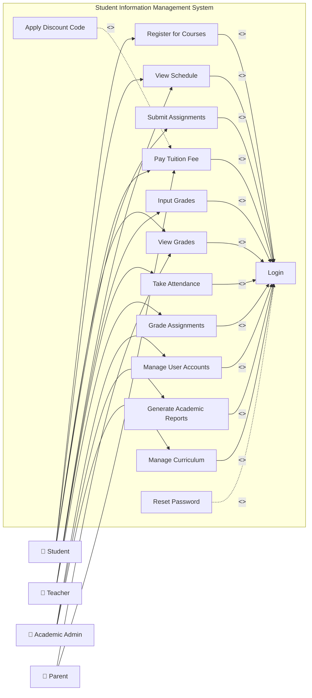

# Use Case Diagram — Student Information Management System

## Mermaid Code

## Actor Table | Bảng Actor

| # | Actor | Loại Actor | Mô tả vai trò | Use Cases liên quan |
|---|-------|------------|----------------|---------------------|
| 1 | Student | Primary | Người học trực tiếp tương tác hệ thống để đăng ký môn, xem lịch, nộp bài, thanh toán học phí | UC03, UC04, UC06, UC08, UC11 |
| 2 | Teacher | Primary | Giảng viên tham gia giảng dạy, nhập điểm, điểm danh, chấm bài sinh viên | UC04, UC05, UC07, UC12 |
| 3 | Academic Admin | Primary | Quản trị viên giáo vụ phụ trách quản lý chương trình học, tài khoản, và trích xuất báo cáo | UC02, UC09, UC10 |
| 4 | Parent | Primary | Phụ huynh sinh viên có nhu cầu xem điểm số và hỗ trợ đóng học phí cho con em | UC06, UC08 |
| 5 | Payment Gateway | Supporting | Cổng thanh toán (bên thứ 3) hỗ trợ xử lý và xác nhận giao dịch tài chính | Tương tác gián tiếp qua UC08 |
| 6 | Email Service | Supporting | Hệ thống tự động gửi email phục vụ tính năng lấy lại mật khẩu và thông báo | Tương tác gián tiếp qua UC14 |

## Use Case Table | Bảng Use Case

| # | UC ID | Use Case Name | Actor chính | Actor phụ | Mô tả chức năng | Priority |
|---|-------|---------------|-------------|-----------|-----------------|----------|
| 1 | UC01 | Login | All users | None | Xác thực danh tính người dùng để truy cập hệ thống | High |
| 2 | UC02 | Manage User Accounts | Academic Admin | None | Thêm, sửa, xóa, cấp quyền tài khoản người dùng | High |
| 3 | UC03 | Register for Courses | Student | None | Sinh viên chọn và đăng ký lớp học cho học kỳ mới | High |
| 4 | UC04 | View Schedule | Student, Teacher | None | Xem thời khóa biểu cá nhân theo tuần hoặc học kỳ | High |
| 5 | UC05 | Input Grades | Teacher | None | Giảng viên nhập điểm các thành phần cho sinh viên | High |
| 6 | UC06 | View Grades | Student, Parent | None | Xem kết quả học tập và điểm số chi tiết các môn | High |
| 7 | UC07 | Take Attendance | Teacher | None | Điểm danh sinh viên tham gia từng buổi học cụ thể | Medium |
| 8 | UC08 | Pay Tuition Fee | Student, Parent | Payment Gateway | Thanh toán học phí trực tuyến qua cổng thanh toán | High |
| 9 | UC09 | Generate Academic Reports| Academic Admin | None | Xuất các báo cáo thống kê tình hình học tập toàn trường | Medium |
| 10| UC10 | Manage Curriculum | Academic Admin | None | Quản lý khung chương trình đào tạo, tạo mới môn học | High |
| 11| UC11 | Submit Assignments | Student | None | Tải bài tập hoặc tiểu luận lên hệ thống nộp cho giảng viên | Medium |
| 12| UC12 | Grade Assignments | Teacher | None | Chấm điểm bài tập, tiểu luận đã nộp của sinh viên | Medium |
| 13| UC13 | Apply Discount Code | Student, Parent | None | Áp dụng mã giảm giá, học bổng khi thanh toán học phí | Low |
| 14| UC14 | Reset Password | All users | Email Service | Khôi phục mật khẩu thông qua liên kết gửi vào email | High |

## Use Case Specification | Đặc tả Use Case

---

### UC03 — Register for Courses

| Field | Detail / Chi tiết |
|-------|-------------------|
| **UC ID** | UC03 |
| **Use Case Name** | Register for Courses |
| **Actor(s)** | Primary: Student / Secondary: None |
| **Description** | Sinh viên chọn và đăng ký các môn học mong muốn trong kỳ học mới. |
| **Precondition** | 1. Hệ thống đang trong thời gian mở cổng đăng ký môn học.   2. Sinh viên đã đăng nhập và không bị cấm đăng ký do nợ học phí. |
| **Main Flow** | 1. Student chọn chức năng "Đăng ký môn học".   2. System hiển thị danh sách các môn học được phép đăng ký trong kỳ.   3. Student chọn các môn học và lớp học tương ứng.   4. System kiểm tra sĩ số lớp và điều kiện môn học tiên quyết.   5. System thêm môn học vào danh sách đăng ký tạm thời.   6. Student nhấn "Xác nhận đăng ký".   7. System lưu kết quả và hiển thị thông báo đăng ký thành công cùng hóa đơn học phí dự kiến. |
| **Alternative Flow** | **AF1** — Sinh viên hủy môn học: Nếu Student chọn "Hủy môn" ở bước 5, System loại bỏ môn học khỏi danh sách tạm thời và quay lại bước 2. |
| **Exception Flow** | **EX1** — Lớp đã đầy: Nếu ở bước 4 System phát hiện lớp đã hết chỗ, System hiển thị cảnh báo "Lớp học đã đầy" và yêu cầu Student chọn lớp khác.   **EX2** — Chưa đạt môn tiên quyết: Nếu Student chưa qua môn tiên quyết, System chặn đăng ký và báo lỗi tương ứng. |
| **Postcondition** | Các môn học được đăng ký thành công sẽ lưu vào hồ sơ của sinh viên, học phí tương ứng được cập nhật vào công nợ. |
| **Business Rule** | **BR1**: Một sinh viên không được đăng ký quá số tín chỉ tối đa quy định trong 1 học kỳ (VD: 24 tín chỉ).   **BR2**: Chỉ được đăng ký vào các lớp còn chỗ trống (số lượng đăng ký < sĩ số tối đa). |

---

### UC05 — Input Grades

| Field | Detail / Chi tiết |
|-------|-------------------|
| **UC ID** | UC05 |
| **Use Case Name** | Input Grades |
| **Actor(s)** | Primary: Teacher / Secondary: None |
| **Description** | Giảng viên nhập hoặc cập nhật điểm số các thành phần cho sinh viên trong lớp do mình phụ trách. |
| **Precondition** | 1. Teacher đã đăng nhập.   2. Teacher được phân công giảng dạy lớp học đó.   3. Hệ thống đang trong thời hạn cho phép nhập điểm. |
| **Main Flow** | 1. Teacher chọn chức năng "Quản lý điểm số".   2. System hiển thị danh sách các lớp Teacher đang phụ trách.   3. Teacher chọn một lớp cụ thể.   4. System hiển thị bảng điểm của lớp với danh sách sinh viên.   5. Teacher nhập điểm (bài tập, giữa kỳ, cuối kỳ) cho từng sinh viên.   6. Teacher nhấn "Lưu bảng điểm".   7. System kiểm tra tính hợp lệ của điểm số.   8. System lưu dữ liệu và thông báo cập nhật thành công. |
| **Alternative Flow** | **AF1** — Import điểm từ Excel: Nếu ở bước 5 Teacher chọn "Import Excel", System cho phép tải file lên, đọc dữ liệu điểm và điền tự động vào bảng trước khi Teacher lưu. |
| **Exception Flow** | **EX1** — Điểm không hợp lệ: Nếu ở bước 7 System phát hiện điểm số nằm ngoài phạm vi 0-10, System báo lỗi bôi đỏ ô điểm sai và yêu cầu nhập lại.   **EX2** — Quá hạn nhập điểm: Nếu ở bước 5 hệ thống phát hiện đã quá hạn đóng cổng điểm, System chặn thao tác và hiển thị cảnh báo. |
| **Postcondition** | Điểm của sinh viên được cập nhật vào cơ sở dữ liệu và sinh viên có thể xem điểm khi bảng điểm được publish. |
| **Business Rule** | **BR1**: Điểm số phải là số thực từ 0.0 đến 10.0.   **BR2**: Điểm tổng kết được tính tự động dựa trên trọng số điểm các thành phần do Admin cấu hình. |

---

### UC07 — Take Attendance

| Field | Detail / Chi tiết |
|-------|-------------------|
| **UC ID** | UC07 |
| **Use Case Name** | Take Attendance |
| **Actor(s)** | Primary: Teacher / Secondary: None |
| **Description** | Giảng viên đánh dấu điểm danh sự có mặt của sinh viên trong một buổi học. |
| **Precondition** | 1. Teacher đã đăng nhập.   2. Buổi học đang diễn ra hoặc vừa kết thúc trong ngày. |
| **Main Flow** | 1. Teacher chọn lịch học của ngày hôm nay.   2. System hiển thị chi tiết buổi học và nút "Điểm danh".   3. Teacher click "Điểm danh".   4. System hiển thị danh sách sinh viên của lớp với trạng thái mặc định (vd: Có mặt).   5. Teacher cập nhật trạng thái (Có mặt / Vắng mặt / Đi muộn) cho những sinh viên tương ứng.   6. Teacher nhấn "Lưu điểm danh".   7. System lưu thông tin và cập nhật tổng số buổi vắng của sinh viên. |
| **Alternative Flow** | **AF1** — Cập nhật lại điểm danh: Nếu Teacher phát hiện lỗi ngay sau khi lưu, họ có thể mở lại bảng điểm danh và sửa trạng thái (trong khoảng thời gian 24h sau buổi học). |
| **Exception Flow** | **EX1** — Lỗi mạng khi lưu: Nếu kết nối gián đoạn ở bước 6, System hiển thị thông báo lỗi và giữ nguyên dữ liệu chưa lưu trên giao diện để Teacher thử lại. |
| **Postcondition** | Lịch sử điểm danh buổi học được lưu lại, tổng số buổi vắng của sinh viên tăng lên nếu bị đánh dấu vắng. |
| **Business Rule** | **BR1**: Nếu tổng số buổi vắng vượt quá 20% tổng số buổi học, sinh viên sẽ tự động bị cấm thi môn đó.   **BR2**: Chỉ được phép điểm danh cho các buổi học của ngày hiện tại hoặc trước đó (không được điểm danh tương lai). |

---

### UC08 — Pay Tuition Fee

| Field | Detail / Chi tiết |
|-------|-------------------|
| **UC ID** | UC08 |
| **Use Case Name** | Pay Tuition Fee |
| **Actor(s)** | Primary: Student, Parent / Secondary: Payment Gateway |
| **Description** | Người dùng thanh toán các khoản công nợ học phí thông qua cổng thanh toán trực tuyến. |
| **Precondition** | 1. Người dùng đã đăng nhập.   2. Sinh viên có khoản học phí chưa thanh toán (công nợ > 0). |
| **Main Flow** | 1. Người dùng chọn mục "Thanh toán học phí".   2. System hiển thị bảng kê chi tiết các khoản nợ học phí và tổng số tiền phải đóng.   3. Người dùng chọn các khoản muốn thanh toán và chọn phương thức thanh toán.   4. Người dùng nhấn "Thanh toán".   5. System tạo phiên thanh toán và chuyển hướng sang Payment Gateway.   6. Người dùng thực hiện thanh toán trên cổng của bên thứ 3.   7. Payment Gateway trả kết quả về System.   8. System cập nhật trạng thái công nợ và hiển thị biên lai thành công. |
| **Alternative Flow** | **AF1** — Áp dụng mã giảm giá (Extend UC13): Trước bước 4, người dùng nhập mã giảm giá, System kiểm tra và giảm trừ số tiền thanh toán thực tế nếu mã hợp lệ. |
| **Exception Flow** | **EX1** — Thanh toán thất bại: Nếu ở bước 7 Payment Gateway trả về lỗi (hết tiền, hủy giao dịch), System thông báo thanh toán thất bại và giữ nguyên công nợ.   **EX2** — Lỗi timeout cổng thanh toán: Nếu System không nhận được phản hồi từ Payment Gateway quá 15 phút, System đánh dấu giao dịch "Pending" và hướng dẫn người dùng liên hệ giáo vụ để đối soát. |
| **Postcondition** | Công nợ học phí được trừ đi tương ứng với số tiền đã thanh toán thành công, biên lai được tạo trong lịch sử giao dịch. |
| **Business Rule** | **BR1**: Các khoản phí phải được thanh toán theo thứ tự từ cũ đến mới (nợ cũ phải trả trước).   **BR2**: Số tiền thanh toán phải lớn hơn 0 và nhỏ hơn hoặc bằng tổng dư nợ (trừ khi có học bổng chi trả toàn phần). |
