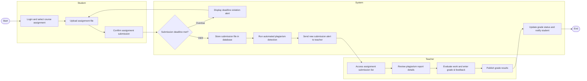

# Swimlane Diagram — Student Information Management System

## Mermaid Code

## Flow Description | Mô tả luồng

Luồng nghiệp vụ: Nộp bài và Chấm điểm bài tập (Assignment Submission & Grading)

| Lane | Actor | Role in Flow / Vai trò trong luồng |
|------|-------|------------------------------------|
| 1 | Student | Khởi tạo quy trình bằng việc chọn bài tập, tải tệp bài làm lên và xác nhận nộp bài. Sinh viên phải bảo đảm nộp bài trước hạn chót. Cuối luồng, sinh viên nhận thông báo kết quả điểm số. |
| 2 | System | Xử lý logic nghiệp vụ tự động: kiểm tra thời hạn nộp bài (decision node), hiển thị cảnh báo nếu quá hạn, lưu trữ file bài làm, chạy tự động kiểm tra đạo văn, gửi thông báo cho giảng viên và cập nhật điểm số. |
| 3 | Teacher | Tiếp nhận danh sách bài nộp, tham khảo báo cáo đạo văn, nhập điểm cùng nhận xét chi tiết, và xuất bản (publish) kết quả cho sinh viên. |
