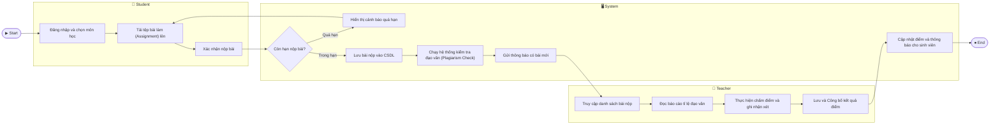

# Swimlane Diagram — Student Information Management System

## Mermaid Code

## Flow Description | Mô tả luồng

Luồng nghiệp vụ: Nộp bài và Chấm điểm bài tập (Assignment Submission & Grading)

| Lane | Actor | Vai trò trong luồng |
|------|-------|---------------------|
| 1 | Student | Khởi tạo quy trình bằng việc tải lên và nộp tệp bài làm. Sinh viên phải đảm bảo bài làm được nộp trong thời hạn cho phép. Kết thúc luồng, sinh viên sẽ nhận được thông báo điểm số. |
| 2 | System | Xử lý logic nghiệp vụ tự động: kiểm tra thời hạn nộp bài (decision node), chặn thao tác nếu quá hạn, lưu trữ file, quét đạo văn tự động để hỗ trợ giảng viên, và điều phối các thông báo giữa hai bên. |
| 3 | Teacher | Tiếp nhận thông báo hệ thống, xem xét bài nộp và báo cáo đạo văn để đưa ra đánh giá. Giảng viên nhập điểm, phản hồi và quyết định publish (công bố) điểm số lên hệ thống cho sinh viên. |
