# Action Tree — Student Information Management System

## Mermaid Code

```mermaid
graph TD
    Root["Student Information Management System"]

    Root --> M1["User Management"]
    Root --> M2["Course Registration"]
    Root --> M3["Academic Records"]
    Root --> M4["Financial Management"]
    Root --> M5["Report & Analytics"]

    M1 --> A11["Manage Accounts"]
    M1 --> A12["Role Assignment"]
    M1 --> A13["Password Reset"]

    M2 --> A21["Browse Courses"]
    M2 --> A22["Enroll in Class"]
    M2 --> A23["Drop Class"]
    M2 --> A24["View Schedule"]

    M3 --> A31["Take Attendance"]
    M3 --> A32["Input Grades"]
    M3 --> A33["View Grades"]
    M3 --> A34["Export Transcript"]

    M4 --> A41["View Invoices"]
    M4 --> A42["Pay Tuition Fee"]
    M4 --> A43["Transaction History"]

    M5 --> A51["Student Statistics"]
    M5 --> A52["Grade Distribution"]
    M5 --> A53["System Audit Logs"]
```

## Module Description | Mô tả Module

| # | Module | Mô tả | Actions |
|---|--------|-------|---------|
| 1 | User Management | Quản lý toàn bộ thông tin đăng nhập, hồ sơ cá nhân, và phân quyền truy cập an toàn cho các nhóm người dùng khác nhau. | Manage Accounts, Role Assignment, Password Reset |
| 2 | Course Registration | Hỗ trợ sinh viên tra cứu danh sách môn học, thực hiện đăng ký hoặc hủy lớp học phần, và quản lý thời khóa biểu. | Browse Courses, Enroll in Class, Drop Class, View Schedule |
| 3 | Academic Records | Module cốt lõi chịu trách nhiệm ghi nhận quá trình điểm danh, điểm số bài tập/thi và trích xuất bảng điểm. | Take Attendance, Input Grades, View Grades, Export Transcript |
| 4 | Financial Management | Quản lý các khoản công nợ học phí, tích hợp cổng thanh toán trực tuyến và đối soát lịch sử giao dịch. | View Invoices, Pay Tuition Fee, Transaction History |
| 5 | Report & Analytics | Cung cấp các công cụ trích xuất báo cáo, phân tích biểu đồ điểm số và theo dõi log hệ thống dành cho ban quản trị. | Student Statistics, Grade Distribution, System Audit Logs |
