# Action Tree — Student Information Management System

## Mermaid Code

```mermaid
graph TD
    Root["Student Information Management System"]

    Root --> M1["User Management"]
    Root --> M2["Course Registration"]
    Root --> M3["Academic Records"]
    Root --> M4["Financial Management"]
    Root --> M5["Report & Analytics"]

    M1 --> A11["Manage User Accounts"]
    M1 --> A12["Assign Roles & Permissions"]
    M1 --> A13["Reset User Password"]

    M2 --> A21["Browse Course Catalog"]
    M2 --> A22["Enroll in Class Section"]
    M2 --> A23["Drop Enrolled Class"]
    M2 --> A24["View Personal Schedule"]

    M3 --> A31["Take Daily Attendance"]
    M3 --> A32["Input Component Grades"]
    M3 --> A33["View Student Grades"]
    M3 --> A34["Export Academic Transcript"]

    M4 --> A41["View Tuition Invoices"]
    M4 --> A42["Pay Tuition Online"]
    M4 --> A43["View Transaction History"]

    M5 --> A51["Generate Student Statistics"]
    M5 --> A52["Analyze Grade Distribution"]
    M5 --> A53["Export System Audit Logs"]
```

## Module Description | Mô tả Module

| # | Module | Description / Mô tả | Actions |
|---|--------|---------------------|---------|
| 1 | User Management | Quản lý thông tin tài khoản, hồ sơ cá nhân và phân quyền truy cập an toàn cho người dùng hệ thống. | Manage User Accounts, Assign Roles & Permissions, Reset User Password |
| 2 | Course Registration | Hỗ trợ tra cứu danh mục môn học, thực hiện đăng ký/hủy lớp học phần và xem thời khóa biểu cá nhân. | Browse Course Catalog, Enroll in Class Section, Drop Enrolled Class, View Personal Schedule |
| 3 | Academic Records | Quản lý điểm danh, nhập và tính toán điểm số các thành phần, và trích xuất bảng điểm cá nhân. | Take Daily Attendance, Input Component Grades, View Student Grades, Export Academic Transcript |
| 4 | Financial Management | Theo dõi công nợ học phí, tích hợp thanh toán trực tuyến qua Payment Gateway và xem lịch sử giao dịch. | View Tuition Invoices, Pay Tuition Online, View Transaction History |
| 5 | Report & Analytics | Cung cấp công cụ thống kê tình hình học tập, phân tích biểu đồ phổ điểm và truy xuất nhật ký hệ thống. | Generate Student Statistics, Analyze Grade Distribution, Export System Audit Logs |
