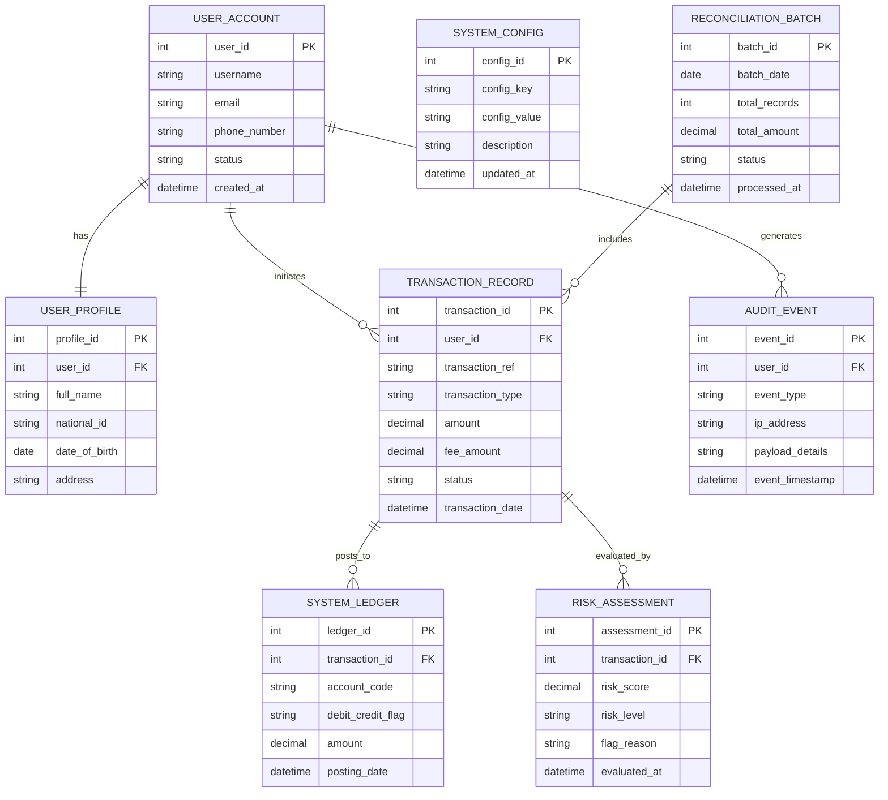

# Conceptual ERD — Bond Issuance Management System

## Mermaid Code

## Entity Description Table | Bảng mô tả Entity

| # | Entity Name | Vietnamese Name | Description | Key Attributes | Main Relationships |
|---|-------------|-----------------|-------------|----------------|-------------------|
| 1 | USER_ACCOUNT | Tài khoản Người dùng | Master user account credentials, authentication state, and operational status | user_id (PK), username, email, status | One-to-One with USER_PROFILE; One-to-Many with TRANSACTION_RECORD |
| 2 | USER_PROFILE | Hồ sơ Người dùng | Detailed KYC demographics, national identity metadata, and address information | profile_id (PK), user_id (FK), full_name, national_id | Belongs to USER_ACCOUNT |
| 3 | TRANSACTION_RECORD | Nhật ký Giao dịch | Master transactional ledger capturing request parameters, amounts, fees, and state | transaction_id (PK), user_id (FK), transaction_ref, amount, status | Belongs to USER_ACCOUNT; One-to-Many with SYSTEM_LEDGER |
| 4 | SYSTEM_LEDGER | Sổ Cái Hệ thống | Double-entry posting line items representing debits and credits for internal accounting | ledger_id (PK), transaction_id (FK), account_code, amount | Belongs to TRANSACTION_RECORD |
| 5 | RISK_ASSESSMENT | Đánh giá Rủi ro | Risk scoring output, anomaly flags, and compliance evaluation results per transaction | assessment_id (PK), transaction_id (FK), risk_score, flag_reason | Belongs to TRANSACTION_RECORD |
| 6 | SYSTEM_CONFIG | Cấu hình Hệ thống | Operational parameters, fee schedules, system limits, and integration configurations | config_id (PK), config_key, config_value, description | Independent reference configuration entity |
| 7 | AUDIT_EVENT | Nhật ký Kiểm toán | Security and operational event logs tracking user actions and administrative changes | event_id (PK), user_id (FK), event_type, ip_address, event_timestamp | Belongs to USER_ACCOUNT |
| 8 | RECONCILIATION_BATCH | Lô Đối soát | Summary records of periodic reconciliation batch jobs and matching settlement metrics | batch_id (PK), batch_date, total_records, total_amount, status | One-to-Many with TRANSACTION_RECORD |

## Relationship Description | Mô tả Quan hệ

| # | From Entity | Cardinality | To Entity | Relationship Label | Business Explanation |
|---|-------------|-------------|-----------|-------------------|----------------------|
| 1 | USER_ACCOUNT | One-to-One | USER_PROFILE | has | Mỗi tài khoản người dùng gắn liền với duy nhất một hồ sơ định danh chi tiết |
| 2 | USER_ACCOUNT | One-to-Many | TRANSACTION_RECORD | initiates | Một tài khoản người dùng có thể thực hiện nhiều giao dịch theo thời gian |
| 3 | TRANSACTION_RECORD | One-to-Many | SYSTEM_LEDGER | posts_to | Mỗi giao dịch tạo ra các dòng bút toán kế toán kép tương ứng trên sổ cái hệ thống |
| 4 | TRANSACTION_RECORD | One-to-Many | RISK_ASSESSMENT | evaluated_by | Mỗi giao dịch được động đính kèm thông số đánh giá rủi ro và tuân thủ |
| 5 | USER_ACCOUNT | One-to-Many | AUDIT_EVENT | generates | Các thao tác của người dùng sinh ra các bản ghi nhật ký an ninh hệ thống |
| 6 | RECONCILIATION_BATCH | One-to-Many | TRANSACTION_RECORD | includes | Mỗi đợt lô đối soát xử lý và kiểm tra tập hợp nhiều giao dịch phát sinh |
