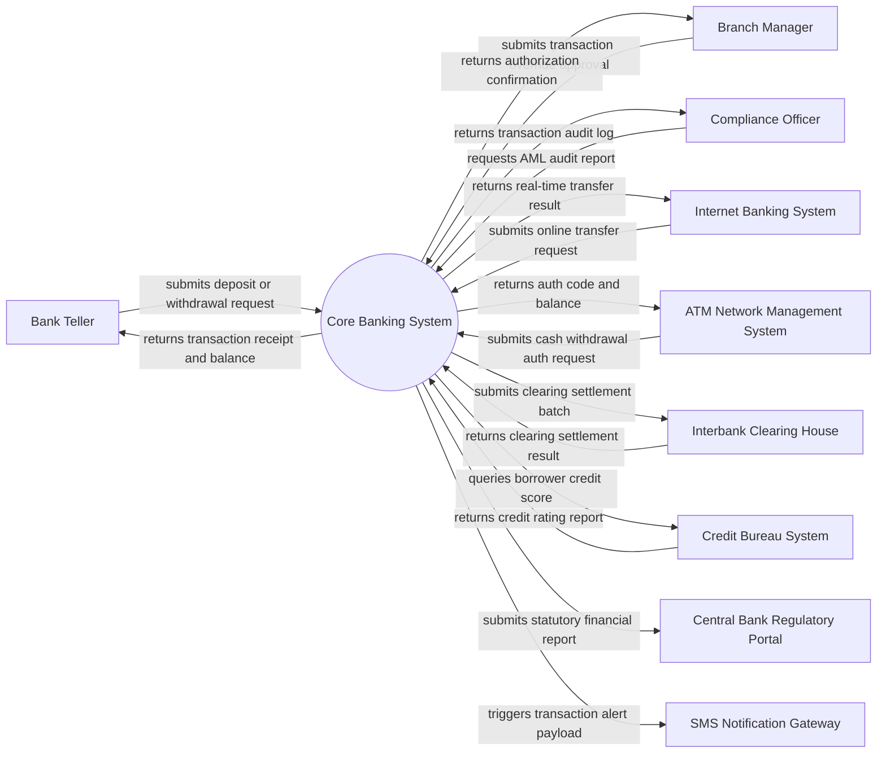

# Context Diagram — Core Banking System

## Mermaid Code

## Actor & Interaction Table | Bảng Actor & Tương tác

| # | Actor | Actor Type | Data Sent TO System | Data Received FROM System | Notes |
|---|-------|------------|---------------------|---------------------------|-------|
| 1 | Bank Teller | Primary | Customer account ID, transaction type, cash amount, identity proof | Transaction confirmation, receipt details, updated account balance | Front-office staff processing counter transactions |
| 2 | Branch Manager | Primary | Manager override credentials, transaction approval/rejection decision | High-value transaction details, risk warning alerts | Authorizes transactions exceeding teller limits |
| 3 | Compliance Officer | Primary | Date range filters, account suspicion flags, AML search criteria | Suspicious transaction reports, AML audit trail logs | Monitors anti-money laundering and regulatory compliance |
| 4 | Internet Banking System | Supporting System | Online transfer requests, bill payments, beneficiary details | Execution status, reference number, updated balance | Core banking backend integration via secure APIs |
| 5 | ATM Network Management System | Supporting System | Card ISO8583 authorization payload, ATM ID, withdrawal amount | Authorization response code (00=Success), updated balance | Processes electronic ATM cash transactions |
| 6 | Interbank Clearing House | Supporting System | Clearing settlement file, return codes, interbank batch status | Outward fund clearing instructions, net settlement totals | Handles ACH and real-time interbank settlements (e.g. NAPAS/SWIFT) |
| 7 | Credit Bureau System | Supporting System | National ID, customer credit query request | Credit score, debt history, default risk indicators | Used during credit evaluation and loan origination |
| 8 | Central Bank Regulatory Portal | Regulatory System | N/A (Receives data from system) | Regulatory acceptance status, compliance validation reports | Receives mandatory daily/monthly statutory reports |
| 9 | SMS Notification Gateway | Supporting System | N/A (Receives data from system) | SMS payload (phone number, message body, transaction timestamp) | Dispatches transaction alerts to customer mobile devices |

## System Boundary Description | Mô tả Phạm vi Hệ thống

The Core Banking System (CBS) serves as the central processing engine for the financial institution, responsible for managing customer accounts, ledger postings, interest accruals, loan servicing, and batch End-of-Day (EOD) financial reconciliations. The internal system boundary encompasses core account lifecycle management, real-time transaction processing, General Ledger (GL) balance updating, risk limit checking, and automated regulatory report generation. External activities such as direct customer web/mobile UI interaction, physical ATM hardware mechanical maintenance, and third-party payment gateway merchant management lie strictly outside the CBS boundary and interact via secure API protocols and messaging queues.
