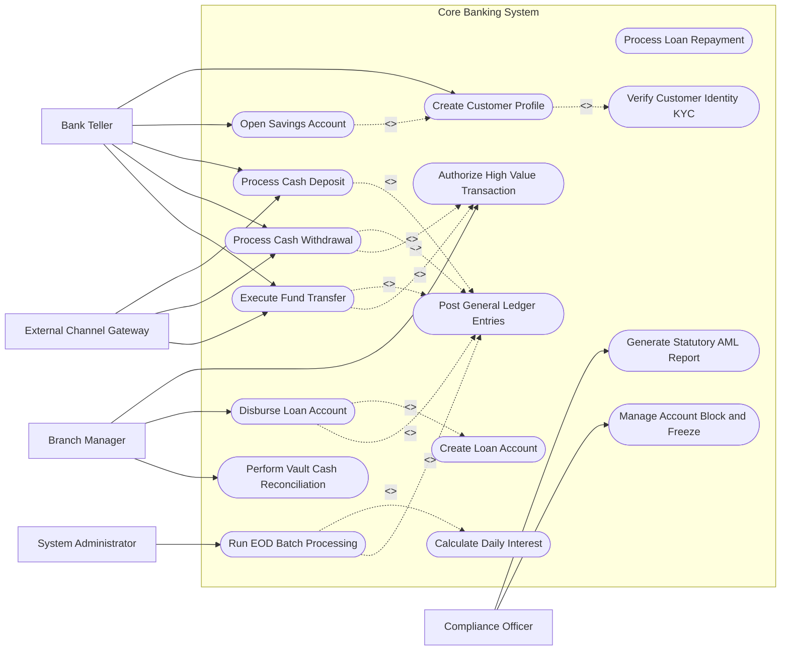

# Use Case Diagram — Core Banking System

## Mermaid Code

## Actor Table | Bảng Actor

| # | Actor | Actor Type | Role Description | Related Use Cases |
|---|-------|------------|------------------|-------------------|
| 1 | Bank Teller | Primary | Front-office counter staff responsible for daily customer account operations and transactions | UC01, UC02, UC03, UC04, UC05 |
| 2 | Branch Manager | Primary | Branch executive responsible for approving high-value transactions, loan disbursements, and branch balancing | UC06, UC08, UC015 |
| 3 | Compliance Officer | Primary | Risk and legal monitoring officer tasked with inspecting suspicious financial transactions and compliance enforcement | UC013, UC014 |
| 4 | System Administrator | Primary | IT operations specialist responsible for maintaining system integrity and launching automated batch jobs | UC012 |
| 5 | External Channel Gateway | Secondary / System | API middleware connecting Internet Banking, Mobile Banking, and ATM networks to the core backend engine | UC03, UC04, UC05 |

## Use Case Table | Bảng Use Case

| # | UC ID | Use Case Name | Primary Actor | Secondary Actor | Description | Priority |
|---|-------|---------------|---------------|-----------------|-------------|----------|
| 1 | UC01 | Create Customer Profile | Bank Teller | N/A | Captures customer personal details, address, national ID, and tax identifier to establish a CIF profile | High |
| 2 | UC02 | Open Savings Account | Bank Teller | N/A | Initializes a new deposit/savings account linked to an existing Customer Information File (CIF) profile | High |
| 3 | UC03 | Process Cash Deposit | Bank Teller | External Channel Gateway | Credits cash received at counter or ATM into a target customer account and updates real-time balance | High |
| 4 | UC04 | Process Cash Withdrawal | Bank Teller | External Channel Gateway | Debits money from customer account after verifying available balance, daily limits, and identity signature | High |
| 5 | UC05 | Execute Fund Transfer | Bank Teller | External Channel Gateway | Transfers funds between intra-bank accounts or routes interbank transfer messages to clearing systems | High |
| 6 | UC06 | Authorize High Value Transaction | Branch Manager | N/A | Reviews and approves counter/online transactions exceeding default teller operation thresholds | High |
| 7 | UC07 | Create Loan Account | Bank Teller | N/A | Configures loan principal amount, interest rate schedule, collateral linkage, and repayment terms | Medium |
| 8 | UC08 | Disburse Loan Account | Branch Manager | N/A | Releases approved loan capital to borrower deposit account upon verifying credit approval and collateral setup | High |
| 9 | UC09 | Process Loan Repayment | Bank Teller | External Channel Gateway | Collects principal and interest payments from customer deposit account to reduce loan balance outstanding | Medium |
| 10 | UC010 | Calculate Daily Interest | System Administrator | N/A | Automated batch calculation of daily accrued deposit interest and loan interest receivable across all accounts | High |
| 11 | UC011 | Post General Ledger Entries | System Administrator | N/A | Generates double-entry accounting balanced ledger postings for all financial transactions executed | High |
| 12 | UC012 | Run EOD Batch Processing | System Administrator | N/A | Executes End-of-Day system balance reconciliations, interest postings, state transitions, and ledger locks | High |
| 13 | UC013 | Generate Statutory AML Report | Compliance Officer | N/A | Compiles anti-money laundering transaction velocity reports for submission to the Central Bank regulatory body | Medium |
| 14 | UC014 | Manage Account Block and Freeze | Compliance Officer | N/A | Places legal hold, debit block, or total freeze on customer accounts flagged for investigation or court order | Medium |
| 15 | UC015 | Perform Vault Cash Reconciliation | Branch Manager | Bank Teller | Reconciles physical cash held in branch vault against system cash ledger counts at end of business day | Medium |
| 16 | UC016 | Verify Customer Identity KYC | Bank Teller | N/A | Performs identity document verification and checks national sanction blacklists before profile approval | High |

## Use Case Specification | Đặc tả Use Case

---

### UC01 — Create Customer Profile

| Field | Detail |
|-------|--------|
| **UC ID** | UC01 |
| **Use Case Name** | Create Customer Profile |
| **Actor(s)** | Primary: Bank Teller / Secondary: None |
| **Description** | Establishes a new Customer Information File (CIF) record containing validated personal demographics, identification details, tax status, and contact information. |
| **Precondition** | 1. Bank Teller is authenticated and logged into the Core Banking system.   2. Customer is physically present or verified via approved digital onboarding channel. |
| **Main Flow** | 1. Bank Teller initiates "Create New Customer Profile" request.   2. System displays customer onboarding input form.   3. Bank Teller inputs customer full name, date of birth, national ID number, tax code, primary address, phone number, and occupation.   4. System performs automated check against existing CIF database and national sanction blacklist (UC016).   5. System verifies no duplicate record exists and generates a unique Customer ID (CIF Number).   6. Bank Teller confirms details and submits the profile.   7. System stores the customer profile record in active status and returns confirmation receipt. |
| **Alternative Flow** | **AF1** — Existing Customer Record Found: If system detects a matching national ID in the database, System notifies Teller and displays the existing CIF profile instead of creating a duplicate.   **AF2** — Minor Onboarding: If customer is under 18 years old, System prompts for legal guardian CIF linkage before completing creation. |
| **Exception Flow** | **EX1** — Sanction List Match: If customer national ID matches a regulatory blacklist, System blocks creation, logs an alert, and notifies the Compliance Officer immediately.   **EX2** — Database Connectivity Error: If database write fails, System aborts transaction, displays error message, and retains form input for retry. |
| **Postcondition** | A new CIF record with unique CIF ID is persisted in active state, ready for account opening. |
| **Business Rule** | **BR1**: Every customer record must possess a valid, non-expired national ID or passport number.   **BR2**: System must enforce mandatory check against AML/sanction list prior to profile activation. |

---

### UC02 — Open Savings Account

| Field | Detail |
|-------|--------|
| **UC ID** | UC02 |
| **Use Case Name** | Open Savings Account |
| **Actor(s)** | Primary: Bank Teller / Secondary: None |
| **Description** | Opens a new savings/deposit account linked to an active customer CIF profile, specifying interest tier, currency, and initial deposit amount. |
| **Precondition** | 1. Customer profile (CIF) exists and is in active status without legal holds.   2. Bank Teller is logged into an authorized branch workstation. |
| **Main Flow** | 1. Bank Teller queries customer by CIF ID or National ID.   2. System retrieves customer profile details and displays existing linked accounts.   3. Bank Teller selects "Open Savings Account" and inputs deposit product type, currency (VND/USD), interest payment frequency, and initial deposit amount.   4. System validates product rules, minimum initial deposit threshold, and currency parameter.   5. System generates a unique 14-digit Account Number adhering to bank IBAN/branch numbering scheme.   6. System credits initial deposit amount into the new account and updates branch cash position ledger.   7. System prints savings passbook / account contract receipt for customer signature. |
| **Alternative Flow** | **AF1** — Joint Account Opening: If opening a joint account, System prompts Teller to link secondary CIF profiles and set sign-off rules (Either or Both).   **AF2** — Term Deposit Selection: If customer chooses fixed term deposit (e.g. 12-month), System records maturity date and locked interest rate. |
| **Exception Flow** | **EX1** — Initial Deposit Below Minimum Threshold: If initial deposit amount is lower than product minimum, System rejects creation and displays policy minimum requirement.   **EX2** — Inactive Customer Status: If customer CIF is suspended or blocked, System prevents account opening and displays restriction reason. |
| **Postcondition** | New savings account record is activated, linked to customer CIF, with initial deposit balance recorded and posted to General Ledger. |
| **Business Rule** | **BR1**: An account number cannot be reused even after account closure.   **BR2**: Minimum initial deposit for standard savings accounts must equal or exceed 100,000 VND. |

---

### UC03 — Process Cash Deposit

| Field | Detail |
|-------|--------|
| **UC ID** | UC03 |
| **Use Case Name** | Process Cash Deposit |
| **Actor(s)** | Primary: Bank Teller / Secondary: External Channel Gateway |
| **Description** | Accepts physical cash at counter or ATM deposit machine, updates customer account balance real-time, and creates balanced accounting journal entries. |
| **Precondition** | 1. Target account number exists and is in active state (not frozen or closed).   2. Teller counter till cash limit has sufficient capacity. |
| **Main Flow** | 1. Bank Teller enters target Account Number and deposit amount into system interface.   2. System retrieves account details, account holder name, and current available balance.   3. Bank Teller verifies customer identity, receives cash notes, and confirms cash counter tally.   4. Bank Teller submits cash deposit transaction.   5. System updates account balance (Balance = Current + Deposit), posts double-entry transaction (Debit Counter Cash Ledger, Credit Customer Deposit Account), and generates unique Transaction Reference Number.   6. System triggers instant SMS alert to account holder's registered mobile number.   7. System prints deposit receipt for customer confirmation. |
| **Alternative Flow** | **AF1** — Third-Party Cash Deposit: If depositor is not the account holder, System prompts Teller to record depositor's full name, phone number, and national ID.   **AF2** — ATM Deposit Machine Input: If transaction comes from ATM, ATM Gateway sends automated XML request to Core Banking to credit account directly upon bill validation. |
| **Exception Flow** | **EX1** — Account Frozen / Blocked: If target account status is Debit/Credit Frozen, System blocks deposit operation and displays legal hold message.   **EX2** — High-Value Limit Exceeded: If deposit exceeds teller authorized limit (e.g., > 500,000,000 VND), System routes transaction to Branch Manager for electronic sign-off before balance update. |
| **Postcondition** | Account available balance is incremented immediately, General Ledger balance is updated, and audit log entry is written. |
| **Business Rule** | **BR1**: Cash deposits exceeding statutory limit (500M VND) require anti-money laundering source-of-funds disclosure.   **BR2**: Double-entry posting must strictly balance (Sum of Debits = Sum of Credits). |

---

### UC04 — Process Cash Withdrawal

| Field | Detail |
|-------|--------|
| **UC ID** | UC04 |
| **Use Case Name** | Process Cash Withdrawal |
| **Actor(s)** | Primary: Bank Teller / Secondary: External Channel Gateway |
| **Description** | Validates account available balance, signature/PIN, debits customer account balance, and authorizes physical cash payout. |
| **Precondition** | 1. Customer account is active and unrestricted.   2. Teller counter vault has adequate physical cash on hand. |
| **Main Flow** | 1. Bank Teller inputs Account Number and requested withdrawal amount.   2. System retrieves account status, available balance, and signature specimen on file.   3. Bank Teller verifies customer signature against system specimen card.   4. Bank Teller submits withdrawal execution request.   5. System checks balance sufficiency (Available Balance >= Requested Amount + Withdrawal Fee).   6. System debits customer account balance, posts ledger entries (Debit Customer Deposit Account, Credit Counter Cash Ledger), and returns transaction receipt code.   7. System dispatches real-time SMS notification to customer.   8. Bank Teller counts and dispenses cash to customer alongside printed withdrawal receipt. |
| **Alternative Flow** | **AF1** — Overdraft Withdrawal: If customer account possesses pre-approved overdraft limit, System permits withdrawal up to Available Balance + Overdraft Ceiling.   **AF2** — ATM Withdrawal Request: ATM Network sends authorization request via ISO8583 message, Core verifies PIN and balance, debits account, and returns approval code 00. |
| **Exception Flow** | **EX1** — Insufficient Funds: If requested amount exceeds available balance, System rejects transaction with error "ERR-104: Insufficient Balance".   **EX2** — Signature Mismatch: If Teller flags signature discrepancy, transaction is halted until secondary identity check is completed. |
| **Postcondition** | Account available balance is decremented immediately, cash till ledger is updated, and transaction logs are archived. |
| **Business Rule** | **BR1**: Accounts cannot be debited below minimum balance requirement unless explicit overdraft agreement exists.   **BR2**: Transactions over 100,000,000 VND require Branch Manager authorization override (UC06). |

---

### UC012 — Run EOD Batch Processing

| Field | Detail |
|-------|--------|
| **UC ID** | UC012 |
| **Use Case Name** | Run EOD Batch Processing |
| **Actor(s)** | Primary: System Administrator / Secondary: None |
| **Description** | Automated End-of-Day batch execution that halts online transactional postings, calculates daily interest accruals, posts ledger balances, reconciles interbank clearing, and advances business date. |
| **Precondition** | 1. All physical branch counters are closed and branch till cash balances are reconciled.   2. System Administrator initiates EOD execution window (typically 23:00 PM). |
| **Main Flow** | 1. System Administrator issues EOD Batch Start command.   2. System switches Core Banking operation mode to Read-Only / Batch Processing state.   3. System runs transaction queue drain to ensure all pending online postings are settled.   4. System executes daily deposit and loan interest calculation job across all active accounts (UC010).   5. System posts daily interest accrual entries into General Ledger accounts (UC011).   6. System performs automated balance sheet matrix balancing check (Total Assets = Total Liabilities + Equity).   7. System generates daily financial reports, trial balance, and regulatory data feeds.   8. System advances system system business date (Date = Date + 1).   9. System unlocks system to Normal Transactional Mode and logs successful EOD completion. |
| **Alternative Flow** | **AF1** — Scheduled Automated Trigger: System launches EOD batch automatically at scheduled CRON time without manual administrator command.   **AF2** — End-of-Month (EOM) Processing: If business date is month-end, System additionally executes monthly interest capitalization, service fee deduction, and tax withholding jobs. |
| **Exception Flow** | **EX1** — General Ledger Out-of-Balance Error: If GL debit/credit total mismatch occurs, EOD batch halts automatically, triggers high-severity alert, and generates imbalance transaction list for IT audit inspection.   **EX2** — Unclosed Branch Till Detected: If a branch till remains open, EOD batch pauses and alerts administrator to force-close or resolve open till sessions. |
| **Postcondition** | Daily interest accruals are posted, ledger books are closed and balanced for current date, and system business date is advanced. |
| **Business Rule** | **BR1**: EOD batch must complete and balance before business date can be advanced.   **BR2**: No manual transaction entry is permitted while EOD batch processing is active. |
