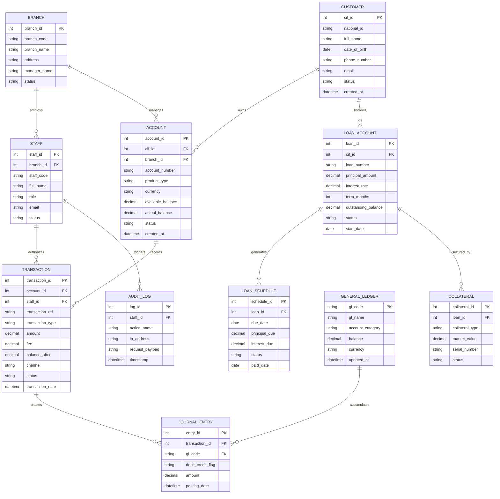

# Conceptual ERD — Core Banking System

## Mermaid Code

## Entity Description Table | Bảng mô tả Entity

| # | Entity Name | Vietnamese Name | Description | Key Attributes | Main Relationships |
|---|-------------|-----------------|-------------|----------------|-------------------|
| 1 | BRANCH | Chi nhánh Ngân hàng | Stores physical bank branch information, administrative details, and operational status | branch_id (PK), branch_code, branch_name, address | One-to-many with STAFF and ACCOUNT |
| 2 | STAFF | Nhân viên Ngân hàng | Represents bank personnel (tellers, managers, administrators) operating the system | staff_id (PK), branch_id (FK), staff_code, role, status | Belongs to BRANCH; One-to-many with TRANSACTION and AUDIT_LOG |
| 3 | CUSTOMER | Khách hàng (CIF) | Central Customer Information File holding legal identity, contact info, and tax registration | cif_id (PK), national_id, full_name, phone_number, status | One-to-many with ACCOUNT and LOAN_ACCOUNT |
| 4 | ACCOUNT | Tài khoản Ngân hàng | Deposit/savings/checking accounts owned by customers containing balance figures | account_id (PK), cif_id (FK), branch_id (FK), account_number, available_balance | Belongs to CUSTOMER and BRANCH; One-to-many with TRANSACTION |
| 5 | TRANSACTION | Giao dịch Ngân hàng | Financial postings executed on customer accounts (deposits, withdrawals, transfers) | transaction_id (PK), account_id (FK), transaction_ref, transaction_type, amount | Belongs to ACCOUNT and STAFF; One-to-many with JOURNAL_ENTRY |
| 6 | LOAN_ACCOUNT | Khoản vay Khách hàng | Credit facility and loan contract details including principal, rate, and tenure | loan_id (PK), cif_id (FK), loan_number, principal_amount, outstanding_balance | Belongs to CUSTOMER; One-to-many with LOAN_SCHEDULE and COLLATERAL |
| 7 | LOAN_SCHEDULE | Lịch Trả nợ | Detailed periodic repayment schedule detailing principal and interest installment amounts | schedule_id (PK), loan_id (FK), due_date, principal_due, interest_due, status | Belongs to LOAN_ACCOUNT |
| 8 | COLLATERAL | Tài sản Đảm bảo | Physical or financial collateral securing a credit account (real estate, vehicle, deposit certificate) | collateral_id (PK), loan_id (FK), collateral_type, market_value, status | Belongs to LOAN_ACCOUNT |
| 9 | GENERAL_LEDGER | Sổ Cái Tổng hợp | Chart of accounts defining asset, liability, equity, income, and expense ledger accounts | gl_code (PK), gl_name, account_category, balance | One-to-many with JOURNAL_ENTRY |
| 10 | JOURNAL_ENTRY | Bút toán Sổ Cái | Double-entry accounting line item (debit or credit) generated from financial transactions | entry_id (PK), transaction_id (FK), gl_code (FK), debit_credit_flag, amount | Belongs to TRANSACTION and GENERAL_LEDGER |
| 11 | AUDIT_LOG | Nhật ký Hệ thống | Security and operational audit trail tracking user actions, timestamps, and system events | log_id (PK), staff_id (FK), action_name, ip_address, timestamp | Belongs to STAFF |

## Relationship Description | Mô tả Quan hệ

| # | From Entity | Cardinality | To Entity | Relationship Label | Business Explanation |
|---|-------------|-------------|-----------|-------------------|----------------------|
| 1 | BRANCH | One-to-Many | STAFF | employs | Một chi nhánh quản lý và tuyển dụng nhiều nhân viên ngân hàng |
| 2 | BRANCH | One-to-Many | ACCOUNT | manages | Một chi nhánh chịu trách nhiệm quản lý danh sách các tài khoản mở tại đó |
| 3 | CUSTOMER | One-to-Many | ACCOUNT | owns | Một khách hàng (CIF) có thể sở hữu một hoặc nhiều tài khoản ngân hàng |
| 4 | CUSTOMER | One-to-Many | LOAN_ACCOUNT | borrows | Một khách hàng có thể đứng tên vay một hoặc nhiều khoản vay |
| 5 | ACCOUNT | One-to-Many | TRANSACTION | records | Một tài khoản lưu trữ lịch sử của nhiều giao dịch gửi, rút, chuyển tiền |
| 6 | STAFF | One-to-Many | TRANSACTION | authorizes | Một nhân viên (giao dịch viên) có thể thực hiện/phê duyệt nhiều giao dịch |
| 7 | LOAN_ACCOUNT | One-to-Many | LOAN_SCHEDULE | generates | Một hợp đồng vay tự động sinh ra một kỳ lịch trả nợ gồm nhiều kỳ thanh toán |
| 8 | LOAN_ACCOUNT | One-to-Many | COLLATERAL | secured_by | Một khoản vay thế chấp có thể được bảo đảm bởi một hoặc nhiều tài sản đảm bảo |
| 9 | TRANSACTION | One-to-Many | JOURNAL_ENTRY | creates | Một giao dịch tài chính tạo ra ít nhất 2 bút toán Kế toán Kép (Nợ & Có) |
| 10 | GENERAL_LEDGER | One-to-Many | JOURNAL_ENTRY | accumulates | Tài khoản Sổ cái tích lũy và tổng hợp các bút toán phát sinh tương ứng |
| 11 | STAFF | One-to-Many | AUDIT_LOG | triggers | Mỗi thao tác của nhân viên trên hệ thống sinh ra các bản ghi nhật ký an ninh |
