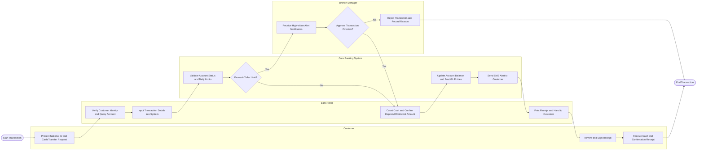

# Swimlane Diagram — Core Banking System

## Mermaid Code

## Flow Description | Mô tả luồng

| Lane | Actor | Role in Flow |
|------|-------|-------------|
| 1 | Customer | Initiates financial request at counter by presenting valid national identity documents, verifies printed receipt terms, signs document, and receives physical cash or digital balance update confirmation |
| 2 | Bank Teller | Inspects customer identity documents, queries target account state, enters operational parameters into Core Banking, counts physical cash banknotes, and prints final customer receipt |
| 3 | Branch Manager | Monitored electronically for high-value counter transactions exceeding standard teller authorization limits (>100M VND), evaluates risk parameters, and executes electronic sign-off or rejection decision |
| 4 | Core Banking System | Performs real-time automated rule checks (account lock status, balance availability, limit validation), computes dynamic fee/interest, posts balanced General Ledger entries, updates database state, and dispatches SMS alerts |
