# Action Tree — Core Banking System

## Mermaid Code

```mermaid
graph TD
    Root["Core Banking System"]

    Root --> M1["Customer Profile Management (CIF)"]
    Root --> M2["Deposit & Account Operations"]
    Root --> M3["Loan & Credit Servicing"]
    Root --> M4["General Ledger & Accounting"]
    Root --> M5["Batch & End-of-Day Processing"]
    Root --> M6["Regulatory & Compliance"]

    M1 --> A1["Create Customer CIF Profile"]
    M1 --> A2["Update Customer Contact Details"]
    M1 --> A3["Verify KYC Documents"]
    M1 --> A4["Search Sanction Blacklists"]

    M2 --> B1["Open Deposit Savings Account"]
    M2 --> B2["Process Cash Deposit"]
    M2 --> B3["Process Cash Withdrawal"]
    M2 --> B4["Execute Inter-Account Transfer"]
    M2 --> B5["Apply Account Freeze Hold"]

    M3 --> C1["Originate New Loan Contract"]
    M3 --> C2["Register Collateral Details"]
    M3 --> C3["Disburse Loan Funds"]
    M3 --> C4["Process Principal Interest Repayment"]
    M3 --> C5["Recalculate Loan Amortization Schedule"]

    M4 --> D1["Maintain Chart of Accounts"]
    M4 --> D2["Post Double-Entry Journal"]
    M4 --> D3["Generate Trial Balance Sheet"]
    M4 --> D4["Reconcile Interbank Clearing Accounts"]

    M5 --> E1["Lock System Transaction Queues"]
    M5 --> E2["Execute Daily Interest Accrual Job"]
    M5 --> E3["Post Monthly Interest Capitalization"]
    M5 --> E4["Advance System Business Date"]

    M6 --> F1["Monitor High-Value Suspicious Transactions"]
    F1 --> F2["Generate Statutory Central Bank AML File"]
    F1 --> F3["Audit System User Action Logs"]
```

## Module Description | Mô tả Module

| # | Module | Description | Actions |
|---|--------|-------------|---------|
| 1 | Customer Profile Management (CIF) | Manages centralized customer demographics, legal identity documents, risk ratings, and compliance checks | Create Customer CIF Profile, Update Customer Contact Details, Verify KYC Documents, Search Sanction Blacklists |
| 2 | Deposit & Account Operations | Controls deposit account lifecycles, over-the-counter and automated cash postings, transfers, and account holds | Open Deposit Savings Account, Process Cash Deposit, Process Cash Withdrawal, Execute Inter-Account Transfer, Apply Account Freeze Hold |
| 3 | Loan & Credit Servicing | Handles end-to-end loan contract administration, collateral asset linkage, capital disbursement, and debt collection | Originate New Loan Contract, Register Collateral Details, Disburse Loan Funds, Process Principal Interest Repayment, Recalculate Loan Amortization Schedule |
| 4 | General Ledger & Accounting | Maintains double-entry accounting integrity, chart of accounts hierarchy, ledger posting rules, and balance sheets | Maintain Chart of Accounts, Post Double-Entry Journal, Generate Trial Balance Sheet, Reconcile Interbank Clearing Accounts |
| 5 | Batch & End-of-Day Processing | Executes off-peak automated batch cycles, computes daily interest accruals, closes ledger books, and advances date | Lock System Transaction Queues, Execute Daily Interest Accrual Job, Post Monthly Interest Capitalization, Advance System Business Date |
| 6 | Regulatory & Compliance | Tracks suspicious activity, formats statutory reports for Central Bank authorities, and maintains tamper-evident audit logs | Monitor High-Value Suspicious Transactions, Generate Statutory Central Bank AML File, Audit System User Action Logs |
