# Action Tree — Financial Dashboard & Analytics Platform

## Mermaid Code

```mermaid
graph TD
    Root["Financial Dashboard & Analytics Platform"]

    Root --> M1["User Profile & KYC Management"]
    Root --> M2["Core Transaction Operations"]
    Root --> M3["Risk Scoring & Compliance"]
    Root --> M4["Accounting & Ledger Postings"]
    Root --> M5["Reconciliation & Settlement"]
    Root --> M6["System Administration & Security"]

    M1 --> A1["Register User Account"]
    M1 --> A2["Update Profile Metadata"]
    M1 --> A3["Verify Identity Documents"]

    M2 --> B1["Initiate Service Request"]
    M2 --> B2["Validate Security Token"]
    M2 --> B3["Execute Transaction Processing"]
    M2 --> B4["Generate Status Receipt"]

    M3 --> C1["Calculate Risk Vector Score"]
    M3 --> C2["Flag Suspicious Anomalies"]
    M3 --> C3["Export Statutory Regulatory Report"]

    M4 --> D1["Maintain Chart of Accounts"]
    M4 --> D2["Generate Double-Entry Postings"]
    M4 --> D3["Produce Financial Balance Sheet"]

    M5 --> E1["Ingest Partner Settlement File"]
    M5 --> E2["Execute Batch Matching Engine"]
    M5 --> E3["Resolve Reconciliation Exceptions"]

    M6 --> F1["Configure System Operational Limits"]
    M6 --> F2["Manage User Role Permissions"]
    M6 --> F3["Audit System Security Event Logs"]
```

## Module Description | Mô tả Module

| # | Module | Description | Actions |
|---|--------|-------------|---------|
| 1 | User Profile & KYC Management | Handles user account registration, identity document verification, and demographic updates | Register User Account, Update Profile Metadata, Verify Identity Documents |
| 2 | Core Transaction Operations | Manages domain transaction lifecycles, security validation, business engine execution, and receipt generation | Initiate Service Request, Validate Security Token, Execute Transaction Processing, Generate Status Receipt |
| 3 | Risk Scoring & Compliance | Evaluates live operations against anti-money laundering and risk fraud rules to ensure statutory compliance | Calculate Risk Vector Score, Flag Suspicious Anomalies, Export Statutory Regulatory Report |
| 4 | Accounting & Ledger Postings | Maintains double-entry accounting integrity and posts balanced journal entries for domain operations | Maintain Chart of Accounts, Generate Double-Entry Postings, Produce Financial Balance Sheet |
| 5 | Reconciliation & Settlement | Executes automated batch reconciliation against external partner files and resolves settlement variances | Ingest Partner Settlement File, Execute Batch Matching Engine, Resolve Reconciliation Exceptions |
| 6 | System Administration & Security | Controls system configuration rules, role-based security access, and audit event monitoring | Configure System Operational Limits, Manage User Role Permissions, Audit System Security Event Logs |
