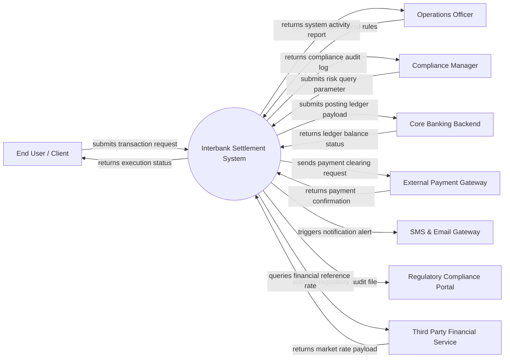

# Context Diagram — Interbank Settlement System

## Mermaid Code

## Actor & Interaction Table | Bảng Actor & Tương tác

| # | Actor | Actor Type | Data Sent TO System | Data Received FROM System | Notes |
|---|-------|------------|---------------------|---------------------------|-------|
| 1 | End User / Client | Primary | Service request credentials, transaction inputs, profile payload | Status receipt, execution confirmation, transaction output | Main retail/corporate user operating the application |
| 2 | Operations Officer | Primary | Configuration parameters, operational rules, workflow approval | Operational dashboards, batch status summaries, override log | Internal staff managing operational workflows |
| 3 | Compliance Manager | Primary | Audit parameters, suspicious search criteria, filter rules | Compliance audit logs, risk flagged alerts, report exports | Oversees regulatory, security and risk guidelines |
| 4 | Core Banking Backend | Supporting System | Ledger account validation, available balance status | Double-entry transaction postings, balance adjust payload | Central accounting backbone of the financial entity |
| 5 | External Payment Gateway | Supporting System | Payment settlement response, authorization tokens | Payment dispatch payload, transaction reference code | External clearing and card network settlement provider |
| 6 | SMS & Email Gateway | Supporting System | N/A (Receives data) | Dispatch notification text, phone recipient payload | Delivers multi-channel alert messaging |
| 7 | Regulatory Compliance Portal | Regulatory System | Statutory validation receipt, compliance token | Periodical audit submission XML/JSON payloads | Central Bank or Government regulatory agency portal |
| 8 | Third Party Financial Service | Supporting System | FX rates, market indices, reference benchmark rates | Benchmark rate query request payload | External API provider for market reference data |

## System Boundary Description | Mô tả Phạm vi Hệ thống

The Interbank Settlement System (Hệ thống Thanh toán Liên Ngân hàng) operates as a specialized enterprise software system designed to automate financial workflows, user transactions, risk compliance, and data processing within its domain. The system boundary encompasses end-user interface processing, business logic execution, data persistence, automated calculation engines, and secure API gateways. Operations outside the direct boundary—such as core ledger double-entry master storage, external card network clearing switches, and external government regulatory databases—are integrated seamlessly via secure RESTful APIs and encrypted message queues.
