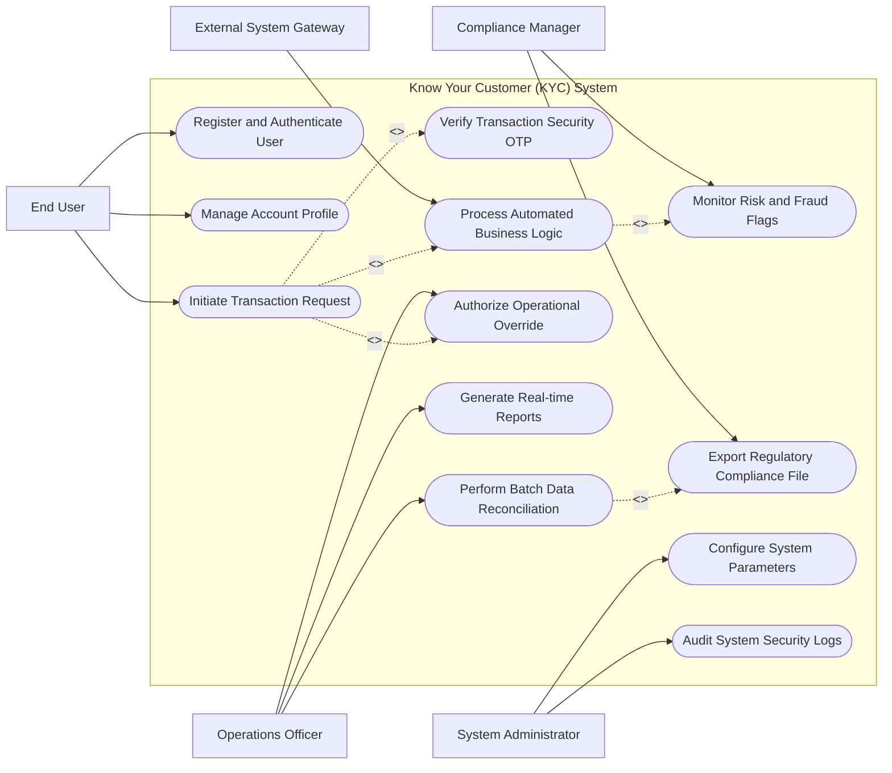

# Use Case Diagram — Know Your Customer (KYC) System

## Mermaid Code

## Actor Table | Bảng Actor

| # | Actor | Actor Type | Role Description | Related Use Cases |
|---|-------|------------|------------------|-------------------|
| 1 | End User | Primary | Individual or corporate user executing primary domain operations | UC01, UC02, UC03, UC04 |
| 2 | Operations Officer | Primary | Operational staff responsible for supervising workflows and processing overrides | UC06, UC07, UC09 |
| 3 | Compliance Manager | Primary | Risk and legal monitoring officer inspecting domain regulatory metrics | UC08, UC10 |
| 4 | System Administrator | Primary | Technical administrator responsible for system configuration and security auditing | UC11, UC12 |
| 5 | External System Gateway | Secondary / System | Automated middleware integrating third-party systems and core engines | UC05 |

## Use Case Table | Bảng Use Case

| # | UC ID | Use Case Name | Primary Actor | Secondary Actor | Description | Priority |
|---|-------|---------------|---------------|-----------------|-------------|----------|
| 1 | UC01 | Register and Authenticate User | End User | N/A | Authenticates user identity via credentials, biometric, or multi-factor tokens | High |
| 2 | UC02 | Manage Account Profile | End User | N/A | Updates user contact preferences, KYC metadata, and notification settings | Medium |
| 3 | UC03 | Initiate Transaction Request | End User | External System Gateway | Submits a domain-specific financial request or operation payload | High |
| 4 | UC04 | Verify Transaction Security OTP | End User | N/A | Validates one-time password or digital token signature prior to transaction posting | High |
| 5 | UC05 | Process Automated Business Logic | External System Gateway | N/A | Executes core calculations, rule validations, and balance updating logic | High |
| 6 | UC06 | Authorize Operational Override | Operations Officer | N/A | Reviews and approves transactions exceeding standard operational limits | High |
| 7 | UC07 | Generate Real-time Reports | Operations Officer | N/A | Compiles interactive operational and transaction summary dashboards | Medium |
| 8 | UC08 | Monitor Risk and Fraud Flags | Compliance Manager | N/A | Evaluates transaction patterns against suspicious activity thresholds | High |
| 9 | UC09 | Perform Batch Data Reconciliation | Operations Officer | N/A | Reconciles daily transaction logs against internal and external ledger totals | High |
| 10 | UC10 | Export Regulatory Compliance File | Compliance Manager | N/A | Formats and transmits statutory data files to government and supervisory portals | High |
| 11 | UC11 | Configure System Parameters | System Administrator | N/A | Sets fee structures, operating limits, integration endpoints, and system rules | Medium |
| 12 | UC12 | Audit System Security Logs | System Administrator | N/A | Inspects system access events, administrative overrides, and security alerts | Medium |

## Use Case Specification | Đặc tả Use Case

---

### UC01 — Register and Authenticate User

| Field | Detail |
|-------|--------|
| **UC ID** | UC01 |
| **Use Case Name** | Register and Authenticate User |
| **Actor(s)** | Primary: End User / Secondary: None |
| **Description** | Authenticates the user's identity using multi-factor credentials and grants secure access to system functions. |
| **Precondition** | 1. User possesses registered access credentials.   2. System authentication service is online. |
| **Main Flow** | 1. End User accesses the authentication interface and inputs username and password.   2. System validates input format and checks credentials against user database.   3. System issues a 2FA OTP prompt to the user's registered phone/email.   4. End User enters the valid OTP code.   5. System verifies OTP code and checks user account status.   6. System generates an encrypted JWT session token and grants access to main dashboard. |
| **Alternative Flow** | **AF1** — Biometric Login: End User authenticates using fingerprint/FaceID token issued by mobile device.   **AF2** — Password Reset Request: User selects "Forgot Password", system sends verification link to registered email. |
| **Exception Flow** | **EX1** — Invalid Credentials: If password check fails 3 consecutive times, system locks account for 15 minutes.   **EX2** — Expired Session Token: If session expires during activity, system prompts user to re-authenticate. |
| **Postcondition** | User session is securely established and logged in security audit table. |
| **Business Rule** | **BR1**: Passwords must meet minimum complexity policy (12+ characters, special symbols).   **BR2**: Multi-factor authentication is mandatory for all administrative and operational roles. |

---

### UC03 — Initiate Transaction Request

| Field | Detail |
|-------|--------|
| **UC ID** | UC03 |
| **Use Case Name** | Initiate Transaction Request |
| **Actor(s)** | Primary: End User / Secondary: External System Gateway |
| **Description** | Captures, validates, and processes a domain-specific financial transaction request submitted by the user. |
| **Precondition** | 1. End User is authenticated with active session token.   2. Source account/wallet is active and unrestricted. |
| **Main Flow** | 1. End User selects target transaction type and fills in parameter details (amount, beneficiary, reference).   2. System validates input data parameters and performs preliminary fee calculation.   3. System displays summary screen with transaction breakdown for user confirmation.   4. End User confirms request and enters OTP verification (UC04).   5. System invokes business logic engine (UC05) to execute balance deduction and target posting.   6. System generates unique transaction reference code and returns success receipt. |
| **Alternative Flow** | **AF1** — Scheduled Future Transaction: User specifies future execution date, system queues transaction for batch executor.   **AF2** — Recurring Transaction Setup: User marks transaction as monthly recurring, system creates auto-debit schedule. |
| **Exception Flow** | **EX1** — Balance Insufficient: System aborts transaction, displaying error code "ERR-301: Balance Insufficient".   **EX2** — Operation Threshold Exceeded: If amount exceeds user limit, system routes request to Operations Officer for override (UC06). |
| **Postcondition** | Transaction is processed, account balances updated, and immutable record created. |
| **Business Rule** | **BR1**: All transactions must be validated against real-time anti-fraud rules before settlement.   **BR2**: System must enforce daily cumulative velocity limits per user profile. |

---

### UC05 — Process Automated Business Logic

| Field | Detail |
|-------|--------|
| **UC ID** | UC05 |
| **Use Case Name** | Process Automated Business Logic |
| **Actor(s)** | Primary: External System Gateway / Secondary: None |
| **Description** | Executes automated core computational algorithms, state transitions, and ledger posting rules. |
| **Precondition** | 1. Validated transaction payload is received by business engine.   2. System rules database is fully loaded. |
| **Main Flow** | 1. Business engine parses transaction payload parameters.   2. System evaluates business business rules, tax calculations, and fee tiers.   3. System checks target account validity and lock status.   4. System executes atomic state transaction, debiting source and crediting destination records.   5. System generates double-entry accounting journal payload for core ledger synchronization.   6. System outputs success status response code. |
| **Alternative Flow** | **AF1** — Multi-Currency Conversion: If source and destination currencies differ, system fetches real-time FX rate and applies margin.   **AF2** — Fee Exemption Rule: If customer profile qualifies for fee waiver, system sets transaction fee to 0. |
| **Exception Flow** | **EX1** — Concurrent Record Lock: If target record is locked by another thread, system retries 3 times before returning timeout error.   **EX2** — Accounting Mismatch: If generated debits do not equal credits, system aborts and logs critical alert. |
| **Postcondition** | Database state transitioned cleanly, audit log updated, and posting response emitted. |
| **Business Rule** | **BR1**: Business logic processing must satisfy ACID database transaction guarantees.   **BR2**: System calculation accuracy must adhere to standard financial rounding rules. |

---

### UC08 — Monitor Risk and Fraud Flags

| Field | Detail |
|-------|--------|
| **UC ID** | UC08 |
| **Use Case Name** | Monitor Risk and Fraud Flags |
| **Actor(s)** | Primary: Compliance Manager / Secondary: None |
| **Description** | Scans live transaction streams against predefined risk scoring rules and flags suspicious operations for investigation. |
| **Precondition** | 1. Risk scoring engine is active.   2. Compliance Manager is logged into monitoring dashboard. |
| **Main Flow** | 1. Risk engine intercepts transaction request payload.   2. System evaluates velocity, location anomalies, amount thresholds, and blacklisted entities.   3. System computes composite risk score (0 to 100).   4. If risk score exceeds threshold (>=75), system flags transaction status as "Suspicious - Under Review".   5. System displays alert item on Compliance Manager dashboard with full risk vector breakdown.   6. Compliance Manager inspects details and chooses to "Approve", "Block", or "Escalate".   7. System executes selected decision and updates audit database. |
| **Alternative Flow** | **AF1** — Automated Instant Blocking: If transaction score hits high-risk limit (>=90), system automatically blocks transaction without waiting for manual manager review.   **AF2** — Whitelist Exemption: If entity is on verified VIP whitelist, system bypasses secondary friction checks. |
| **Exception Flow** | **EX1** — Rule Service Timeout: If risk engine times out, system defaults to conservative fail-safe holding pattern.   **EX2** — False Positive Overrule: If manager marks flag as false positive, system updates ML model training feedback. |
| **Postcondition** | Risk score recorded, suspicious transaction flagged or cleared, and compliance record persisted. |
| **Business Rule** | **BR1**: High-risk flagged transactions must be reviewed within statutory regulatory SLAs.   **BR2**: Anti-money laundering rule updates must be logged with administrator signature. |

---

### UC09 — Perform Batch Data Reconciliation

| Field | Detail |
|-------|--------|
| **UC ID** | UC09 |
| **Use Case Name** | Perform Batch Data Reconciliation |
| **Actor(s)** | Primary: Operations Officer / Secondary: None |
| **Description** | Executes automated end-of-period reconciliation between domain system transaction logs and external partner/ledger totals. |
| **Precondition** | 1. External clearing settlement files are ingested.   2. Daily transaction window is closed. |
| **Main Flow** | 1. Operations Officer triggers "Batch Reconciliation Job" from administrative control panel.   2. System reads internal transaction database logs for target date window.   3. System parses external partner settlement file (CSV/XML).   4. System executes record-by-record matching based on transaction reference code, amount, and timestamp.   5. System identifies matching records, missing items, and amount discrepancies.   6. System generates Reconciliation Exception Report detailing balanced vs un-reconciled items.   7. Operations Officer reviews exceptions and approves final daily settlement closure. |
| **Alternative Flow** | **AF1** — Auto-Resolution of Minor Variance: System automatically creates adjustment entry for rounding variances under $1.00.   **AF2** — Automated Scheduled Execution: Reconciliation job executes automatically via CRON schedule at 01:00 AM daily. |
| **Exception Flow** | **EX1** — External Settlement File Missing: If partner file is not ingested, system halts execution and alerts operations team.   **EX2** — Unbalanced Total Threshold Exceeded: If total mismatch exceeds alert limit, system locks batch settlement. |
| **Postcondition** | Daily transaction ledger reconciled, exception report generated, and business period closed. |
| **Business Rule** | **BR1**: Un-reconciled exceptions must be resolved within 48 hours of detection.   **BR2**: Reconciliation reports must be retained for minimum 5-year statutory audit period. |
