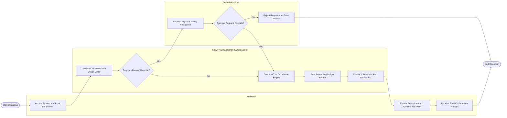

# Swimlane Diagram — Know Your Customer (KYC) System

## Mermaid Code

## Flow Description | Mô tả luồng

| Lane | Actor | Role in Flow |
|------|-------|-------------|
| 1 | End User | Submits domain service request parameters, inputs authentication tokens (OTP/Biometrics), and receives execution status receipts |
| 2 | Operations Staff | Supervises system queue alerts, reviews operational exception requests, and grants or denies administrative overrides |
| 3 | Know Your Customer (KYC) System | Performs automated parameter validation, computes business logic, coordinates balance postings, dispatches alert notifications, and records audit logs |
