# Action Tree — Intermodal Transport Management System

## Mermaid Code

```mermaid
graph TD
    Root["Intermodal Transport Management System"]

    Root --> M1["Request & Order Management"]
    Root --> M2["Route & Schedule Optimization"]
    Root --> M3["Dispatch & Fleet Operations"]
    Root --> M4["Real-time Telematics & Tracking"]
    Root --> M5["Billing & Settlement"]
    Root --> M6["System & Master Data Admin"]

    M1 --> A11["Create Transport Request"]
    M1 --> A12["Modify Request Details"]
    M1 --> A13["Cancel Pending Request"]
    M1 --> A14["View Order History"]

    M2 --> A21["Calculate Optimal Path"]
    M2 --> A22["Consolidate Payload Loads"]
    M2 --> A23["Set Delivery Time Windows"]
    M2 --> A24["Re-route Traffic Congestion"]

    M3 --> A31["Assign Driver & Vehicle"]
    M3 --> A32["Broadcast Dispatch Alert"]
    M3 --> A33["Manage Driver Shift Duty"]
    M3 --> A34["Handle Maintenance Overrides"]

    M4 --> A41["Stream Real-time GPS Location"]
    M4 --> A42["Monitor Geofence Alerts"]
    M4 --> A43["Log Speed & Sensor Telematics"]
    M4 --> A44["Capture Digital ePOD Proof"]

    M5 --> A51["Generate Transport Invoice"]
    M5 --> A52["Process Payment Gateway Token"]
    M5 --> A53["Calculate Toll & Fuel Rebate"]
    M5 --> A54["Export Financial Summary"]

    M6 --> A61["Manage User Roles & Access"]
    M6 --> A62["Register Fleet & Asset Master"]
    M6 --> A63["Configure SLA & Thresholds"]
    M6 --> A64["View System Audit Logs"]
```

## Module Description | Mô tả Module

| # | Module | Description | Actions |
|---|--------|-------------|---------|
| 1 | Request & Order Management | Quản lý tiếp nhận, khởi tạo, chỉnh sửa và tra cứu thông tin các đơn vận chuyển / yêu cầu dịch vụ | Create Request, Modify Details, Cancel Request, View Order History |
| 2 | Route & Schedule Optimization | Thuật toán tối ưu hóa đường đi, gom chuyến, tính toán tải trọng và tự động điều chỉnh lộ trình | Calculate Path, Consolidate Loads, Set Time Windows, Re-route Traffic |
| 3 | Dispatch & Fleet Operations | Điều phối tài xế, phân công phương tiện, quản lý ca làm việc và điều động phương tiện thay thế | Assign Driver/Vehicle, Broadcast Alert, Manage Shift Duty, Maintenance Overrides |
| 4 | Real-time Telematics & Tracking | Giám sát vị trí GPS thời gian thực, cảnh báo vùng địa lý geofence, ghi nhận cảm biến và ePOD | Stream GPS, Monitor Geofence, Log Telematics, Capture ePOD Proof |
| 5 | Billing & Settlement | Tính toán giá cước vận chuyển, phát hành hóa đơn, xử lý thanh toán và đối soát phí đường bộ/nhiên liệu | Generate Invoice, Process Payment, Calculate Toll/Fuel, Export Summary |
| 6 | System & Master Data Admin | Quản trị hệ thống, phân quyền người dùng, quản lý hồ sơ phương tiện, cấu hình SLA và audit log | Manage Roles, Register Fleet Assets, Configure SLA, View Audit Logs |
