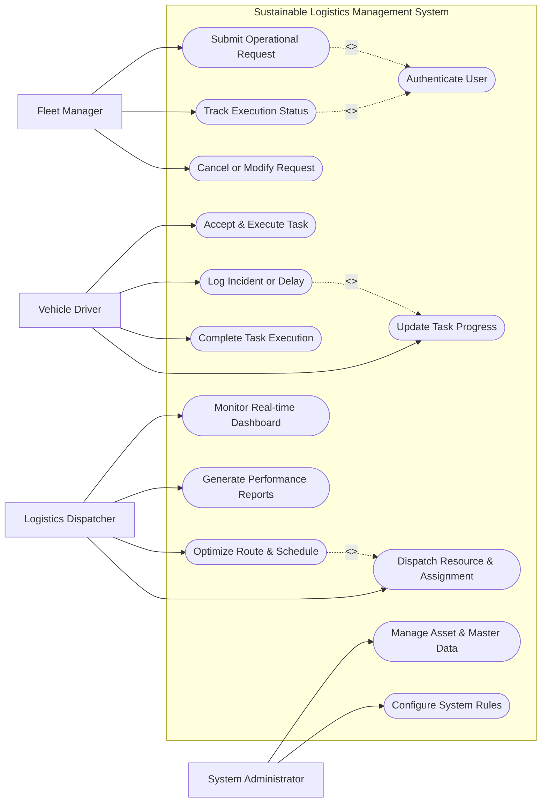

# Use Case Diagram — Sustainable Logistics Management System

## Mermaid Code

## Actor Table | Bảng Actor

| # | Actor | Actor Type | Role Description | Related Use Cases |
|---|-------|------------|------------------|-------------------|
| 1 | Fleet Manager | Primary | Initiates operational requests, monitors real-time progress, manages bookings/orders | UC01, UC02, UC03, UC04 |
| 2 | Vehicle Driver | Primary | Receives dispatch assignments, executes physical operations, reports progress and issues | UC05, UC06, UC07, UC08 |
| 3 | Logistics Dispatcher | Primary | Oversees route planning, resource allocation, real-time tracking, and analytics | UC09, UC10, UC11, UC14 |
| 4 | System Administrator | Primary | Configures system parameters, manages asset registries, provisions user roles | UC12, UC13 |

## Use Case Table | Bảng Use Case

| # | UC ID | Use Case Name | Primary Actor | Secondary Actor | Description | Priority |
|---|-------|---------------|---------------|-----------------|-------------|----------|
| 1 | UC01 | Submit Operational Request | Fleet Manager | System | Creates a new transport, dispatch, or operational order | High |
| 2 | UC02 | Track Execution Status | Fleet Manager | Telematics Gateway | Provides real-time visibility and status tracking for active requests | High |
| 3 | UC03 | Cancel or Modify Request | Fleet Manager | Dispatcher | Allows updating or cancelling pending requests prior to execution | Medium |
| 4 | UC04 | Authenticate User | System | Auth Gateway | Validates user identity, credentials, and role permissions | High |
| 5 | UC05 | Accept & Execute Task | Vehicle Driver | System | Acknowledges assigned operational task and marks start of execution | High |
| 6 | UC06 | Update Task Progress | Vehicle Driver | Telematics Gateway | Records status milestones, timestamps, and GPS checkpoints | High |
| 7 | UC07 | Log Incident or Delay | Vehicle Driver | Dispatcher | Reports traffic congestion, vehicle breakdown, or cargo exceptions | Medium |
| 8 | UC08 | Complete Task Execution | Vehicle Driver | Customer | Finalizes task, captures proof of delivery/execution, closes assignment | High |
| 9 | UC09 | Optimize Route & Schedule | Logistics Dispatcher | Map API | Calculates optimal paths, schedules, and load distributions | High |
| 10 | UC10 | Dispatch Resource & Assignment | Logistics Dispatcher | Field Agent | Assigns vehicles, drivers, or equipment to scheduled tasks | High |
| 11 | UC11 | Monitor Real-time Dashboard | Logistics Dispatcher | Telematics Gateway | Displays live fleet/asset map, active jobs, and SLA alerts | High |
| 12 | UC12 | Manage Asset & Master Data | System Administrator | System | Registers vehicles, drivers, locations, and rate cards | Medium |
| 13 | UC13 | Configure System Rules | System Administrator | System | Sets dispatch algorithms, notification triggers, and threshold limits | Medium |
| 14 | UC14 | Generate Performance Reports | Logistics Dispatcher | Audit System | Compiles operational efficiency, fuel, SLA compliance, and cost analytics | Medium |

## Use Case Specification | Đặc tả Use Case

---

### UC01 — Submit Operational Request

| Field | Detail |
|-------|--------|
| **UC ID** | UC01 |
| **Use Case Name** | Submit Operational Request |
| **Actor(s)** | Primary: Fleet Manager   Secondary: System |
| **Description** | Allows the user to submit a new transport order, dispatch booking, or service request into the system. |
| **Precondition** | 1. User must be logged in with valid authorization.   2. Origin, destination, and payload specs must be defined. |
| **Main Flow** | 1. User selects "Create New Request" from the main application dashboard.   2. System presents the request entry form with mandatory fields (Origin, Destination, Time Window, Cargo/Passenger Type).   3. User enters request details and specifies special constraints (e.g. temperature, weight limit).   4. System validates address coordinates using Map API and verifies resource availability.   5. System calculates estimated service cost and distance, displaying confirmation summary.   6. User confirms submission. System generates unique Request ID (e.g. REQ-2026-329), saves status as "Submitted", and triggers automated dispatch engine. |
| **Alternative Flow** | **AF1** — Saved Template Usage: User selects a pre-saved route template, auto-populating origin and destination fields.   **AF2** — Batch Request Import: User uploads a CSV/Excel file containing multiple order requests; System validates all rows concurrently. |
| **Exception Flow** | **EX1** — Unreachable Location: System flags location coordinates as out-of-service area and displays "Location unsupported" error message.   **EX2** — Capacity Overload: If no fleet capacity exists for selected time window, System prompts user to select an alternative dispatch time. |
| **Postcondition** | Request is recorded in database with status "Submitted", placed in dispatch queue, and confirmation notification is sent. |
| **Business Rule** | **BR1**: Requests must be submitted at least 30 minutes prior to requested pickup window unless express tier is selected. |

---

### UC05 — Accept & Execute Task

| Field | Detail |
|-------|--------|
| **UC ID** | UC05 |
| **Use Case Name** | Accept & Execute Task |
| **Actor(s)** | Primary: Vehicle Driver |
| **Description** | Enables the field operator/driver to receive assignment notifications and accept tasks for execution. |
| **Precondition** | 1. Operator account must be active and marked as "Available/On-Duty".   2. A task assignment has been dispatched to the operator. |
| **Main Flow** | 1. System dispatches a new assignment notification to operator's mobile/terminal application.   2. Operator reviews task summary (Pickup location, delivery destination, deadline, instructions).   3. Operator taps "Accept Task".   4. System updates task status from "Dispatched" to "Accepted", locks assignment to operator, and calculates turn-by-turn navigation.   5. Operator arrives at origin location and taps "Arrived at Pickup".   6. System records arrival timestamp, sends notification to customer/dispatcher, and unlocks task execution screen. |
| **Alternative Flow** | **AF1** — Task Rejection: Operator declines task within 60 seconds with reason code; System auto-reassigns task to next nearest operator.   **AF2** — Multi-Leg Staging: Task involves multiple pickup points; System displays sequential stop list. |
| **Exception Flow** | **EX1** — Acceptance Timeout: Operator does not respond within 120 seconds; System revokes assignment and flags operator as "Unresponsive".   **EX2** — GPS Mismatch: Operator attempts to tap "Arrived" when GPS distance exceeds 500m; System prompts "You have not reached the location". |
| **Postcondition** | Task status changes to "In Execution", operator location tracking is elevated to high-frequency mode, and audit log is recorded. |
| **Business Rule** | **BR1**: Operators cannot accept new main tasks if currently holding an overdue active assignment. |

---

### UC06 — Update Task Progress

| Field | Detail |
|-------|--------|
| **UC ID** | UC06 |
| **Use Case Name** | Update Task Progress |
| **Actor(s)** | Primary: Vehicle Driver   Secondary: Telematics Gateway |
| **Description** | Records real-time execution milestones, location updates, and operational status changes. |
| **Precondition** | 1. Task must be in "In Execution" status.   2. Mobile device GPS telematics must be enabled. |
| **Main Flow** | 1. Operator proceeds along optimized route towards destination.   2. Telematics Gateway automatically streams GPS coordinates every 10 seconds to central system.   3. System checks location against geofence boundaries and updates ETA dynamically.   4. Operator arrives at destination and selects "Arrived at Destination".   5. Operator performs verification (scan barcode, capture signature, inspect cargo).   6. System saves milestone timestamp, updates status to "Arrived", and notifies monitoring dashboard. |
| **Alternative Flow** | **AF1** — Manual Milestone Entry: In offline cellular dead-zones, application stores milestones locally and syncs upon reconnection.   **AF2** — Partial Unload Update: Operator records partial quantity delivery at intermediate waypoint. |
| **Exception Flow** | **EX1** — Route Deviation Warning: Telematics detects vehicle off-route by >2km; System triggers automated alert to dispatcher.   **EX2** — Telematics Signal Lost: GPS stream interrupted for >5 minutes; System flags connection warning on dispatch dashboard. |
| **Postcondition** | Milestone logs, ETA updates, and tracking data are updated in database and visible on tracking portal. |
| **Business Rule** | **BR1**: Milestone updates must be timestamped using UTC server time synchronized with GPS atomic clock. |

---

### UC08 — Complete Task Execution

| Field | Detail |
|-------|--------|
| **UC ID** | UC08 |
| **Use Case Name** | Complete Task Execution |
| **Actor(s)** | Primary: Vehicle Driver   Secondary: Customer |
| **Description** | Finalizes the operational task, records digital proof of execution/delivery (ePOD), and settles completion status. |
| **Precondition** | 1. Operator must be at destination with cargo/passenger verified.   2. Inspection/delivery checklist items must be filled. |
| **Main Flow** | 1. Operator opens "Complete Task" prompt on mobile device.   2. System prompts for Proof of Delivery (e.g. Digital Signature, photo attachment, OTP code validation).   3. Customer or recipient inputs OTP code or signs directly on terminal touchscreen.   4. Operator submits proof of completion.   5. System validates OTP/signature, marks task status as "Completed", and generates digital Completion Certificate.   6. System dispatches completion summary notification to requester, updates vehicle status to "Available", and triggers billing workflow. |
| **Alternative Flow** | **AF1** — Contactless Completion: Recipient verifies completion via SMS link on own smartphone; System auto-closes task upon web confirmation.   **AF2** — COD Payment Collection: Task requires Cash-On-Delivery; Operator collects payment and enters receipt transaction ID before closing task. |
| **Exception Flow** | **EX1** — Invalid OTP Code: Entered OTP does not match system token; System displays "Authentication failed" and allows 2 retries.   **EX2** — Recipient Refusal: Recipient refuses delivery; Operator selects "Customer Refused", captures photo proof, and initiates return workflow. |
| **Postcondition** | Task status is set to "Completed", proof document is stored in cloud repository, and asset is released for next dispatch. |
| **Business Rule** | **BR1**: Completed tasks cannot be modified; any post-completion discrepancies must be handled via formal claims management. |

---

### UC09 — Optimize Route & Schedule

| Field | Detail |
|-------|--------|
| **UC ID** | UC09 |
| **Use Case Name** | Optimize Route & Schedule |
| **Actor(s)** | Primary: Logistics Dispatcher   Secondary: Map API |
| **Description** | Calculates optimal sequence, paths, and schedules for multi-stop transport orders to minimize distance, time, and fuel. |
| **Precondition** | 1. Batch of pending orders must be selected in dispatch queue.   2. Fleet availability and constraints (vehicle capacity, working hours, speed limits) must be configured. |
| **Main Flow** | 1. Operations Manager opens "Route Optimization Engine" tab.   2. Manager selects pending order batch and available vehicle fleet.   3. Manager sets optimization objectives (Minimize Total Distance, Balance Driver Workload, Avoid Tolls).   4. Manager clicks "Run Optimization".   5. System invokes Routing Engine API, analyzing traffic patterns, vehicle capacities, time windows, and road restrictions.   6. System generates optimized route itineraries, displaying total distance, projected fuel consumption, and ETA timeline.   7. Manager reviews visual route map and clicks "Approve & Dispatch". System assigns generated routes to respective drivers. |
| **Alternative Flow** | **AF1** — Automated Dynamic Re-routing: System automatically re-optimizes active route when live traffic accident report is received from Traffic API.   **AF2** — Manual Route Tweak: Manager manually drags-and-drops stops on interactive map; System recalculates route metrics instantly. |
| **Exception Flow** | **EX1** — Unfillable Time Window: Optimization engine flags 2 orders as "Unscheduled - Time Window Violation"; System prompts manager to adjust constraints.   **EX2** — Vehicle Overcapacity: Total weight exceeds available fleet capacity; System recommends adding extra vehicle to pool. |
| **Postcondition** | Optimized route plans are generated, linked to vehicle dispatch records, and pushed to driver mobile terminals. |
| **Business Rule** | **BR1**: Optimization algorithm must enforce legal driver rest break mandates every 4 hours of continuous driving. |
