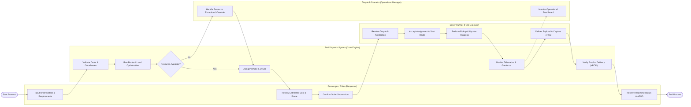

# Swimlane Diagram — Taxi Dispatch System

## Mermaid Code

## Flow Description | Mô tả luồng

| Lane | Actor | Role in Flow |
|------|-------|-------------|
| 1 | Passenger / Rider (Requester) | Khởi tạo đơn vận tải, xem chi phí dự kiến, xác nhận đặt chỗ và nhận thông báo theo dõi cùng bằng chứng giao hàng ePOD. |
| 2 | Taxi Dispatch System (Core Engine) | Đóng vai trò hệ thống trung tâm: kiểm tra tính hợp lệ, chạy thuật toán tối ưu hóa lộ trình, phân công tài nguyên, giám sát GPS và xác thực ePOD. |
| 3 | Driver Partner (Field Executor) | Nhận lệnh điều động, xác nhận ca làm việc, di chuyển theo lộ trình, cập nhật tiến độ và thu thập chữ ký/mã OTP khi hoàn thành. |
| 4 | Dispatch Operator (Operations Manager) | Giám sát toàn bộ luồng vận hành trên màn hình Real-time Dashboard và can thiệp xử lý khi có ngoại lệ thiếu tài nguyên hoặc sự cố. |
