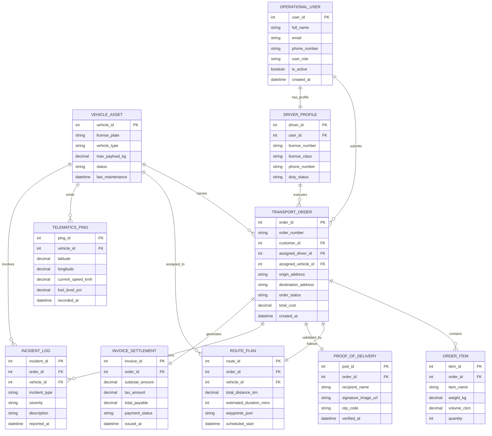

# Conceptual ERD — Vehicle Registration & Licensing System

## Mermaid Code

## Entity Description Table | Bảng mô tả Entity

| # | Entity Name | Vietnamese Name | Description | Key Attributes | Main Relationships |
|---|-------------|-----------------|-------------|----------------|-------------------|
| 1 | OPERATIONAL_USER | Người dùng Hệ thống | Quản lý thông tin tài khoản người dùng, quản trị viên và khách hàng | user_id (PK), full_name, email, phone_number, user_role | Submits TRANSPORT_ORDER, has DRIVER_PROFILE |
| 2 | VEHICLE_ASSET | Phương tiện / Tài sản | Lưu thông tin chi tiết các xe, tải trọng, loại phương tiện và trạng thái | vehicle_id (PK), license_plate, vehicle_type, max_payload_kg | Carries TRANSPORT_ORDER, emits TELEMATICS_PING |
| 3 | DRIVER_PROFILE | Hồ sơ Tài xế | Lưu trữ bằng lái, chứng chỉ, trạng thái ca làm việc của tài xế | driver_id (PK), user_id (FK), license_number, duty_status | Belongs to OPERATIONAL_USER, executes TRANSPORT_ORDER |
| 4 | TRANSPORT_ORDER | Đơn hàng Vận tải | Đơn hàng trung tâm lưu vị trí đi/đến, trạng thái và chi phí vận chuyển | order_id (PK), order_number, customer_id (FK), order_status | Belongs to OPERATIONAL_USER, contains ORDER_ITEM, has ROUTE_PLAN |
| 5 | ORDER_ITEM | Chi tiết Hàng hóa | Chi tiết từng mặt hàng, khối lượng, thể tích thuộc đơn vận chuyển | item_id (PK), order_id (FK), item_name, weight_kg, quantity | Belongs to TRANSPORT_ORDER |
| 6 | ROUTE_PLAN | Kế hoạch Lộ trình | Lộ trình đã được tối ưu hóa bao gồm chuỗi tọa độ và thời gian dự kiến | route_id (PK), order_id (FK), vehicle_id (FK), total_distance_km | Belongs to TRANSPORT_ORDER & VEHICLE_ASSET |
| 7 | TELEMATICS_PING | Dữ liệu Định vị Telematics | Nhật ký GPS thời gian thực bao gồm tọa độ, vận tốc và mức nhiên liệu | ping_id (PK), vehicle_id (FK), latitude, longitude, current_speed_kmh | Generated by VEHICLE_ASSET |
| 8 | PROOF_OF_DELIVERY | Bằng chứng Giao nhận (ePOD) | Lưu chữ ký số, mã xác thực OTP và hình ảnh xác nhận hoàn thành | pod_id (PK), order_id (FK), recipient_name, signature_image_url | Validates TRANSPORT_ORDER |
| 9 | INCIDENT_LOG | Báo cáo Sự cố Vận hành | Ghi nhận sự cố giao thông, hư hỏng xe hoặc trễ chuyến | incident_id (PK), order_id (FK), vehicle_id (FK), incident_type, severity | Belongs to TRANSPORT_ORDER & VEHICLE_ASSET |
| 10 | INVOICE_SETTLEMENT | Hóa đơn & Thanh toán | Lưu chi tiết chi phí, thuế, trạng thái thanh toán đơn vận tải | invoice_id (PK), order_id (FK), total_payable, payment_status | Belongs to TRANSPORT_ORDER |

## Relationship Description | Mô tả Quan hệ

| # | From Entity | Cardinality | To Entity | Relationship Label | Business Explanation |
|---|-------------|-------------|-----------|-------------------|----------------------|
| 1 | OPERATIONAL_USER | 1 to Many | TRANSPORT_ORDER | submits | Một khách hàng/người dùng có thể tạo nhiều đơn vận tải. |
| 2 | OPERATIONAL_USER | 1 to 1 | DRIVER_PROFILE | has_profile | Một tài khoản người dùng có thể là tài xế vận hành. |
| 3 | DRIVER_PROFILE | 1 to Many | TRANSPORT_ORDER | executes | Một tài xế có thể thực hiện nhiều đơn vận tải theo thời gian. |
| 4 | VEHICLE_ASSET | 1 to Many | TRANSPORT_ORDER | carries | Một phương tiện được phân công chở một hoặc nhiều đơn vận tải. |
| 5 | TRANSPORT_ORDER | 1 to Many | ORDER_ITEM | contains | Một đơn vận tải chứa danh sách các mặt hàng chi tiết. |
| 6 | TRANSPORT_ORDER | 1 to 1 | ROUTE_PLAN | follows | Mỗi đơn vận tải được gắn với 1 lộ trình di chuyển tối ưu. |
| 7 | VEHICLE_ASSET | 1 to Many | TELEMATICS_PING | emits | Phương tiện liên tục phát dữ liệu tọa độ định vị GPS. |
| 8 | TRANSPORT_ORDER | 1 to 1 | PROOF_OF_DELIVERY | validated_by | Đơn hàng hoàn thành được xác thực bằng 1 biên bản ePOD. |
| 9 | TRANSPORT_ORDER | 1 to Many | INCIDENT_LOG | reports | Một chuyến vận tải có thể phát sinh các sự cố vận hành. |
| 10 | TRANSPORT_ORDER | 1 to 1 | INVOICE_SETTLEMENT | generates | Mỗi đơn vận tải hoàn tất sẽ sinh ra 1 hóa đơn thanh toán. |
