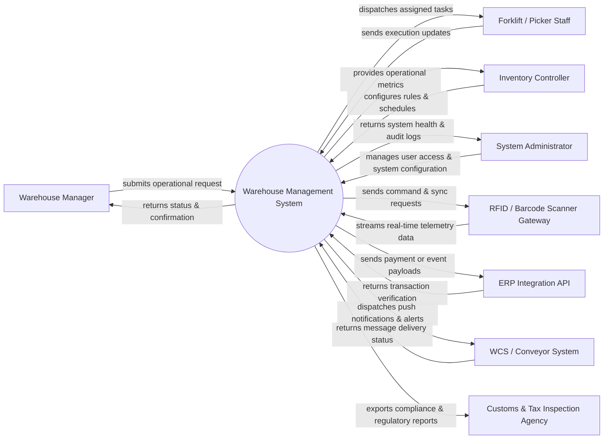

# Context Diagram — Warehouse Management System

## Mermaid Code

## Actor & Interaction Table | Bảng Actor & Tương tác

| # | Actor | Actor Type | Data Sent TO System | Data Received FROM System | Notes |
|---|-------|------------|---------------------|---------------------------|-------|
| 1 | Warehouse Manager | Primary | Submits operational booking/request, updates preferences, inputs criteria | Real-time status updates, execution confirmation, digital receipt | Main service requester / operator |
| 2 | Forklift / Picker Staff | Primary | Task progress updates, GPS location data, exception notes | Assigned dispatch tasks, route details, schedule updates | Field execution personnel / vehicle unit |
| 3 | Inventory Controller | Primary | Workflow configurations, dispatch rules, threshold parameters | Operational dashboards, SLA breach alerts, KPI analytics | Operational management & planning role |
| 4 | System Administrator | Primary | System permissions, master data, system parameters | Audit logs, security alerts, diagnostic status | System administrator |
| 5 | RFID / Barcode Scanner Gateway | Supporting | Sensor telemetry, location coordinates, status pings | Synchronization requests, configuration commands | External IoT / sensor / tracking gateway |
| 6 | ERP Integration API | Supporting | Transaction approval tokens, status webhooks | Payment requests, billing payloads, API queries | Financial / external integration partner |
| 7 | WCS / Conveyor System | Supporting | Delivery verification receipts, bounce logs | Email / SMS / Push alert payloads | Communication gateway service |
| 8 | Customs & Tax Inspection Agency | Regulatory | Compliance guidelines, regulatory standards | Audit logs, safety compliance reports, inspection records | Government / Industry oversight agency |

## System Boundary Description | Mô tả Scope Hệ thống

Hệ thống **Warehouse Management System (Hệ thống Quản lý Kho hàng)** đóng vai trò là nền tảng điều hành trung tâm cho các hoạt động nghiệp vụ trong lĩnh vực vận tải & logistics.

- **Phạm vi bên trong hệ thống (In-Scope)**:
  - Tiếp nhận, phân luồng và quản lý toàn bộ vòng đời của giao dịch/lệnh vận hành từ khởi tạo đến hoàn thành.
  - Tự động hóa tính toán lộ trình, điều phối tài nguyên, theo dõi trạng thái thời gian thực và quản lý tài xế/phương tiện/tài sản.
  - Cung cấp cổng giao tiếp người dùng, cấu hình quy tắc nghiệp vụ, giám sát SLA và lập báo cáo phân tích hiệu năng.
  - Lưu trữ nhật ký kiểm toán, quản lý phân quyền theo vai trò và đồng bộ dữ liệu với các đối tác liên quan.

- **Bên ngoài phạm vi hệ thống (Out-of-Scope)**:
  - Trực tiếp sản xuất thiết bị phần cứng GPS/IoT hoặc duy trì hạ tầng viễn thông di động.
  - Xử lý các giao dịch ngân hàng gốc mà phải thông qua Cổng thanh toán (Payment Gateway) đối tác.
  - Đảm nhận chức năng kế toán tổng hợp cấp doanh nghiệp (thuộc phạm vi của hệ thống ERP tổng).
