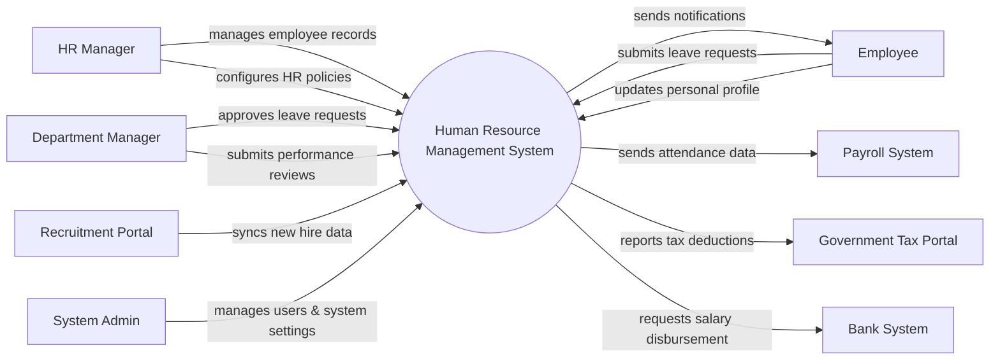

# Context Diagram — Human Resource Management System

## Mermaid Code

## Actor & Interaction Table | Bang Actor & Tuong tac

| # | Actor | Actor Type | Data Sent TO System | Data Received FROM System | Notes |
|---|-------|------------|---------------------|---------------------------|-------|
| 1 | HR Manager | Primary | Employee records, HR policies, system configurations | Reports, alerts | Quan tri vien nhan su |
| 2 | Employee | Primary | Leave requests, personal information updates | Notifications, payslip details | Nhan vien thong thuong |
| 3 | Department Manager | Primary | Leave approvals, performance evaluations | Department reports, team leave schedules | Quan ly bo phan |
| 4 | Recruitment Portal | Supporting | New hire profiles, candidate statuses | Vacancy updates | He thong tuyen dung |
| 5 | Payroll System | Supporting | Payroll confirmation status | Attendance data, deduction details | He thong tinh luong |
| 6 | Government Tax Portal | Regulatory | Tax policy updates | Employee tax deduction reports | Cong thue chinh phu |
| 7 | Bank System | Supporting | Transaction statuses | Salary disbursement requests | He thong ngan hang |
| 8 | System Admin | Primary | System configurations, user roles | System logs, audit reports | Quan tri he thong |

## System Boundary Description | Mo ta Pham vi He thong

The Human Resource Management System (HRMS) is responsible for managing core HR operations, including employee information, leave, attendance, and performance tracking. It serves as the central hub for HR Managers and employees to interact regarding organizational policies. The system does not directly process payroll or financial transactions; instead, it integrates with external Payroll Systems and Bank Systems. Additionally, recruitment processes are handled externally, with the HRMS only receiving data for successful candidates.
