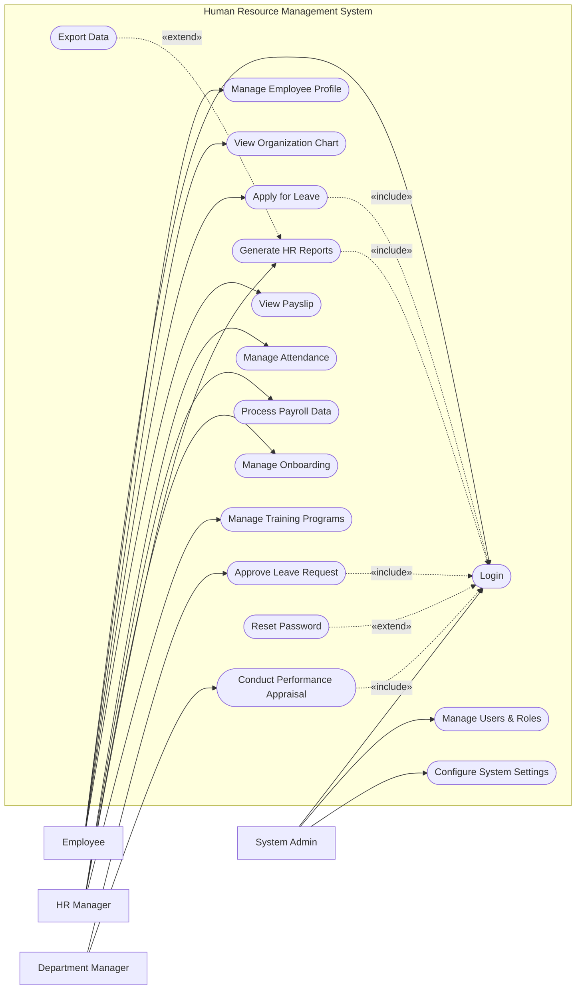

# Use Case Diagram — Human Resource Management System

## Mermaid Code

## Actor Table | Bang Actor

| # | Actor | Actor Type | Role Description | Related Use Cases |
|---|-------|------------|------------------|-------------------|
| 1 | Employee | Primary | Nhan vien thong thuong trong cong ty | UC01, UC02, UC03, UC04, UC11 |
| 2 | Department Manager | Primary | Nguoi quan ly truc tiep cua cac nhan vien | UC05, UC08 |
| 3 | HR Manager | Primary | Nhan su chuyen trach quan ly toan bo he thong | UC06, UC07, UC09, UC10, UC12 |
| 4 | System Admin | Primary | Quan tri vien he thong, phan quyen va cai dat | UC01, UC15, UC16 |

## Use Case Table | Bang Use Case

| # | UC ID | Use Case Name | Primary Actor | Secondary Actor | Description | Priority |
|---|-------|---------------|---------------|-----------------|-------------|----------|
| 1 | UC01 | Login | Employee | | Authenticate user access | High |
| 2 | UC02 | Manage Employee Profile | Employee | HR Manager | Update and maintain personal information | Medium |
| 3 | UC03 | View Organization Chart | Employee | | View company hierarchy | Low |
| 4 | UC04 | Apply for Leave | Employee | | Submit a request for time off | High |
| 5 | UC05 | Approve Leave Request | Department Manager | | Review and process leave requests | High |
| 6 | UC06 | Manage Attendance | HR Manager | | Track employee working hours | High |
| 7 | UC07 | Process Payroll Data | HR Manager | Payroll System | Consolidate data for payroll | High |
| 8 | UC08 | Conduct Performance Appraisal | Department Manager| | Evaluate employee performance | Medium |
| 9 | UC09 | Manage Onboarding | HR Manager | | Handle new hire integration | Medium |
| 10| UC10 | Generate HR Reports | HR Manager | | Create statistical HR reports | Medium |
| 11| UC11 | View Payslip | Employee | | Check monthly salary details | High |
| 12| UC12 | Manage Training Programs | HR Manager | | Organize training sessions | Low |
| 13| UC13 | Reset Password | Employee | | Recover account access | High |
| 14| UC14 | Export Data | HR Manager | | Download reports as files | Low |
| 15| UC15 | Manage Users & Roles | System Admin | | Create, update, or deactivate user accounts | High |
| 16| UC16 | Configure System Settings | System Admin | | Update system-wide preferences and parameters | Medium |

## Use Case Specification | Dac ta Use Case

---

### UC01 — Login

| Field | Detail |
|-------|--------|
| **UC ID** | UC01 |
| **Use Case Name** | Login |
| **Actor(s)** | Primary: Employee, HR Manager, Department Manager, System Admin |
| **Description** | Cho phep nguoi dung xac thuc de dang nhap vao he thong. |
| **Precondition** | 1. Nguoi dung phai co tai khoan hop le tren he thong.  2. He thong dang hoat dong binh thuong. |
| **Main Flow** | 1. Actor mo trang dang nhap.  2. System hien thi form dang nhap.  3. Actor nhap username va password.  4. Actor nhan nut Submit.  5. System xac thuc thong tin.  6. System chuyen huong den trang chu tuong ung quyen han. |
| **Alternative Flow** | **AF1** — Quen mat khau: Neu Actor chon "Forgot Password", System kich hoat UC13 Reset Password. |
| **Exception Flow** | **EX1** — Sai thong tin: Neu xac thuc that bai, System hien thi thong bao loi va yeu cau nhap lai.  **EX2** — Tai khoan bi khoa: Neu nhap sai qua 5 lan, System khoa tai khoan va thong bao lien he Admin. |
| **Postcondition** | Nguoi dung duoc dang nhap va phien lam viec duoc khoi tao. |
| **Business Rule** | **BR1**: Mat khau phai duoc ma hoa.  **BR2**: Phien dang nhap tu dong het han sau 30 phut khong hoat dong. |

---

### UC04 — Apply for Leave

| Field | Detail |
|-------|--------|
| **UC ID** | UC04 |
| **Use Case Name** | Apply for Leave |
| **Actor(s)** | Primary: Employee |
| **Description** | Cho phep nhan vien nop don xin nghi phep. |
| **Precondition** | 1. Nhan vien da dang nhap (Include UC01).  2. Nhan vien con du so ngay phep nam. |
| **Main Flow** | 1. Actor chon chuc nang "Apply Leave".  2. System hien thi so ngay phep con lai va form dang ky.  3. Actor chon loai phep, chon ngay bat dau/ket thuc va nhap ly do.  4. Actor nhan Submit.  5. System kiem tra tinh hop le cua don.  6. System luu don va gui thong bao den Department Manager. |
| **Alternative Flow** | **AF1** — Huy don: Neu truoc buoc 4, Actor chon "Cancel", System quay lai trang truoc do ma khong luu. |
| **Exception Flow** | **EX1** — Khong du phep: Neu so ngay chon lon hon so phep con lai, System bao loi va chan Submit.  **EX2** — Trung lich: Neu ngay chon trung voi don da nop, System thong bao va chan Submit. |
| **Postcondition** | Don nghi phep luu o trang thai "Pending" va thong bao duoc gui di. |
| **Business Rule** | **BR1**: Nghi phep tren 3 ngay phai nop don truoc 1 tuan.  **BR2**: Khong duoc chon ngay le vao thoi gian nghi. |

---

### UC05 — Approve Leave Request

| Field | Detail |
|-------|--------|
| **UC ID** | UC05 |
| **Use Case Name** | Approve Leave Request |
| **Actor(s)** | Primary: Department Manager |
| **Description** | Quan ly phong ban xem xet va phe duyet/tu choi don nghi phep. |
| **Precondition** | 1. Manager da dang nhap (Include UC01).  2. Co it nhat 1 don nghi phep dang cho duyet (Pending). |
| **Main Flow** | 1. Actor vao man hinh "Leave Approvals".  2. System hien thi danh sach don dang cho.  3. Actor chon xem chi tiet mot don.  4. System hien thi chi tiet don va lich cua team.  5. Actor nhan "Approve" (Dong y).  6. System cap nhat trang thai, tru phep cua nhan vien va gui thong bao. |
| **Alternative Flow** | **AF1** — Tu choi: O buoc 5, Actor chon "Reject" va nhap ly do. System cap nhat trang thai "Rejected" va gui thong bao. |
| **Exception Flow** | **EX1** — Don da xu ly: Neu don da bi huy hoac duyet boi nguoi khac, System hien thi loi "Request no longer pending" va tai lai trang. |
| **Postcondition** | Trang thai don chuyen thanh "Approved" hoac "Rejected". |
| **Business Rule** | **BR1**: Manager chi xem duoc don cua nhan vien trong phong ban minh.  **BR2**: Don "Approved" se tu dong cap nhat vao bang cham cong (Attendance). |

---

### UC06 — Manage Attendance

| Field | Detail |
|-------|--------|
| **UC ID** | UC06 |
| **Use Case Name** | Manage Attendance |
| **Actor(s)** | Primary: HR Manager |
| **Description** | HR Manager quan ly va dieu chinh du lieu cham cong cua nhan vien. |
| **Precondition** | 1. HR Manager da dang nhap (Include UC01).  2. Du lieu cham cong goc da duoc he thong ghi nhan. |
| **Main Flow** | 1. Actor chon module "Attendance Management".  2. System hien thi bang cham cong tong hop cua thang.  3. Actor tim kiem nhan vien hoac phong ban cu the.  4. Actor chon chinh sua mot ban ghi loi (vi du: quen cham cong).  5. Actor cap nhat gio vao/ra va nhap ly do dieu chinh.  6. System luu lai su thay doi va danh dau ban ghi la "Manual Edit". |
| **Alternative Flow** | **AF1** — Xuat file: Actor chon "Export", System tai ve file Excel du lieu cham cong. |
| **Exception Flow** | **EX1** — Du lieu da chot luong: Neu thang cham cong da bi khoa de tinh luong, System bao loi "Cannot edit closed period". |
| **Postcondition** | Du lieu cham cong duoc cap nhat chinh xac. |
| **Business Rule** | **BR1**: Moi lan chinh sua thu cong phai co ly do ro rang.  **BR2**: Du lieu cham cong la co so de tinh luong (Payroll). |
