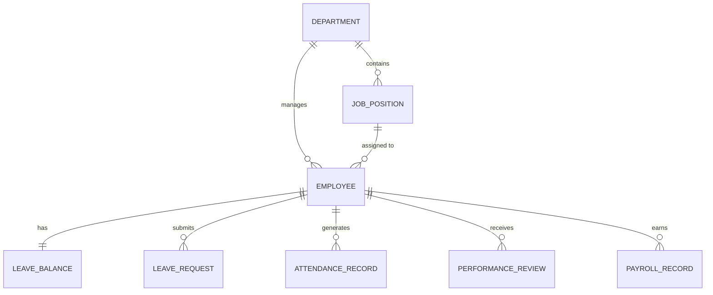

# Conceptual ERD — Human Resource Management System
## Mermaid Code

## Entity Description Table | Bang mo ta Entity
| # | Entity Name | Vietnamese Name | Description | Key Attributes | Main Relationships |
|---|-------------|-----------------|-------------|----------------|-------------------|
| 1 | DEPARTMENT | Phong ban | Thong tin cac phong ban trong cong ty | department_id, name | contains JOB_POSITION |
| 2 | JOB_POSITION | Vi tri cong viec | Thong tin chuc danh va luong co ban | job_id, title, level | assigned to EMPLOYEE |
| 3 | EMPLOYEE | Nhan vien | Ho so ca nhan cua nhan vien | employee_id, name, email | belongs to DEPARTMENT |
| 4 | LEAVE_BALANCE | Quy phep | So ngay phep cua nhan vien theo nam | balance_id, total_days | belongs to EMPLOYEE |
| 5 | LEAVE_REQUEST | Don xin nghi phep | Yeu cau nghi phep cua nhan vien | request_id, dates, status | belongs to EMPLOYEE |
| 6 | ATTENDANCE_RECORD | Lich su cham cong | Ban ghi gio ra/vao hang ngay | attendance_id, times | belongs to EMPLOYEE |
| 7 | PERFORMANCE_REVIEW| Danh gia nang luc | Phieu danh gia hieu suat dinh ky | review_id, score, comments | belongs to EMPLOYEE |
| 8 | PAYROLL_RECORD | Ban ghi tinh luong | Du lieu luong hang thang | payroll_id, net_salary | belongs to EMPLOYEE |
## Relationship Description | Mo ta Quan he
| # | From Entity | Cardinality | To Entity | Relationship Label | Business Explanation |
|---|-------------|-------------|-----------|-------------------|----------------------|
| 1 | DEPARTMENT | one-to-many | JOB_POSITION | contains | Mot phong ban bao gom nhieu vi tri cong viec. |
| 2 | DEPARTMENT | one-to-many | EMPLOYEE | manages | Mot phong ban quan ly nhieu nhan vien. |
| 3 | JOB_POSITION | one-to-many | EMPLOYEE | assigned to | Mot vi tri co the duoc gan cho nhieu nhan vien. |
| 4 | EMPLOYEE | one-to-one | LEAVE_BALANCE | has | Moi nhan vien co mot quy phep trong mot nam. |
| 5 | EMPLOYEE | one-to-many | LEAVE_REQUEST | submits | Mot nhan vien co the nop nhieu don nghi phep. |
| 6 | EMPLOYEE | one-to-many | ATTENDANCE_RECORD | generates | Mot nhan vien co nhieu ban ghi cham cong. |
| 7 | EMPLOYEE | one-to-many | PERFORMANCE_REVIEW | receives | Mot nhan vien nhan nhieu ban danh gia qua cac ky. |
| 8 | EMPLOYEE | one-to-many | PAYROLL_RECORD | earns | Mot nhan vien co nhieu ky nhan luong khac nhau. |

