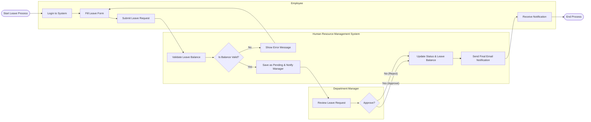

# Swimlane Diagram — Human Resource Management System

## Mermaid Code

## Flow Description | Mo ta luong

| Lane | Actor | Role in Flow |
|------|-------|-------------|
| 1 | Employee | Nguoi chu dong nop don xin nghi phep tren he thong va nhan ket qua cuoi cung. |
| 2 | Human Resource Management System | He thong kiem tra tinh hop le, luu tru trang thai, tru ngay phep va gui email thong bao cac ben. |
| 3 | Department Manager | Nguoi quan ly nhan duoc thong bao, vao he thong de xem xet va ra quyet dinh phe duyet hoac tu choi don. |
