# Action Tree — Human Resource Management System

## Mermaid Code

```mermaid
%%{init: {'theme': 'default'}}%%
graph TD
    Root["Human Resource Management System"]

    Root --> M1["Employee Management"]
    Root --> M2["Leave Management"]
    Root --> M3["Attendance & Time"]
    Root --> M4["Performance Appraisal"]
    Root --> M5["Payroll & Benefits"]

    M1 --> A11["Onboard New Employee"]
    M1 --> A12["Update Employee Profile"]
    M1 --> A13["Manage Org Chart"]
    M1 --> A14["Offboard Employee"]

    M2 --> A21["Apply for Leave"]
    M2 --> A22["Approve Leave Requests"]
    M2 --> A23["Configure Leave Policies"]
    M2 --> A24["Check Leave Balance"]

    M3 --> A31["Record Check-in/out"]
    M3 --> A32["Adjust Attendance Data"]
    M3 --> A33["Generate Timesheets"]

    M4 --> A41["Set OKR/KPI Targets"]
    M4 --> A42["Submit Self-Review"]
    M4 --> A43["Conduct Manager Evaluation"]
    M4 --> A44["Generate Performance Report"]

    M5 --> A51["Configure Salary Structures"]
    M5 --> A52["Calculate Monthly Payroll"]
    M5 --> A53["Manage Tax & Deductions"]
    M5 --> A54["Distribute Digital Payslips"]
```

## Module Description | Mo ta Module

| # | Module | Description | Actions |
|---|--------|-------------|---------|
| 1 | Employee Management | Quan ly ho so nhan su xuyen suot vong doi | Onboard New Employee, Update Employee Profile, Manage Org Chart, Offboard Employee |
| 2 | Leave Management | Quan ly ngay phep va quy trinh xin/duyet phep | Apply for Leave, Approve Leave Requests, Configure Leave Policies, Check Leave Balance |
| 3 | Attendance & Time | Ghi nhan thoi gian lam viec thuc te | Record Check-in/out, Adjust Attendance Data, Generate Timesheets |
| 4 | Performance Appraisal | Danh gia nang luc nhan vien dinh ky | Set OKR/KPI Targets, Submit Self-Review, Conduct Manager Evaluation, Generate Performance Report |
| 5 | Payroll & Benefits | Xu ly tinh luong va phuc loi hang thang | Configure Salary Structures, Calculate Monthly Payroll, Manage Tax & Deductions, Distribute Digital Payslips |
