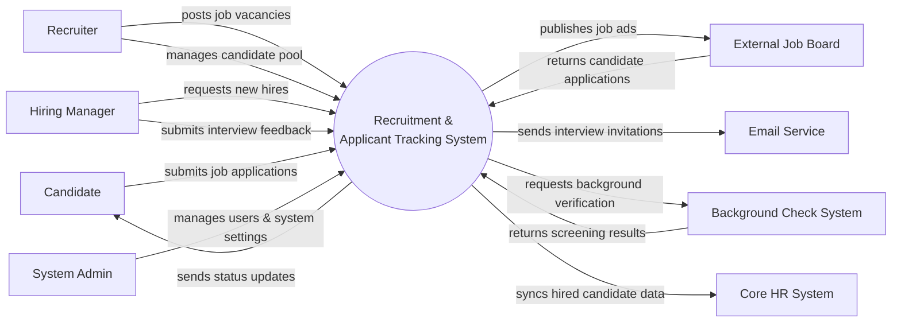

# Context Diagram — Recruitment & Applicant Tracking System

## Mermaid Code

## Actor & Interaction Table | Bang Actor & Tuong tac

| # | Actor | Actor Type | Data Sent TO System | Data Received FROM System | Notes |
|---|-------|------------|---------------------|---------------------------|-------|
| 1 | Candidate | Primary | Applications, resumes, interview availability | Job alerts, application statuses, offers | Ung vien |
| 2 | Recruiter | Primary | Job postings, candidate evaluations, schedules | Applicant lists, system analytics | Chuyen vien tuyen dung |
| 3 | Hiring Manager | Primary | Job requisitions, interview feedback, offer approvals | Shortlisted resumes, interview schedules | Quan ly tuyen dung |
| 4 | External Job Board | Supporting | Sourced candidate profiles | Job advertisement details | Cac trang tuyen dung |
| 5 | Email Service | Supporting | Delivery statuses | Email contents (invitations, offers) | Dich vu gui mail |
| 6 | Background Check System | Supporting | Verification reports | Candidate details for checking | He thong kiem tra ly lich |
| 7 | Core HR System | Supporting | Confirmation of data sync | Hired candidate information | He thong nhan su loi |
| 8 | System Admin | Primary | System configurations, user roles | System logs, audit reports | Quan tri he thong |

## System Boundary Description | Mo ta Pham vi He thong

The Recruitment & Applicant Tracking System (ATS) handles the entire hiring lifecycle from job requisition to job offer acceptance. It is responsible for publishing jobs, collecting applications, tracking interview stages, and facilitating evaluations. It does NOT manage employee records post-hire or payroll, which are handled by the Core HR System. It relies on external Background Check Systems for candidate verification and Job Boards for sourcing.
