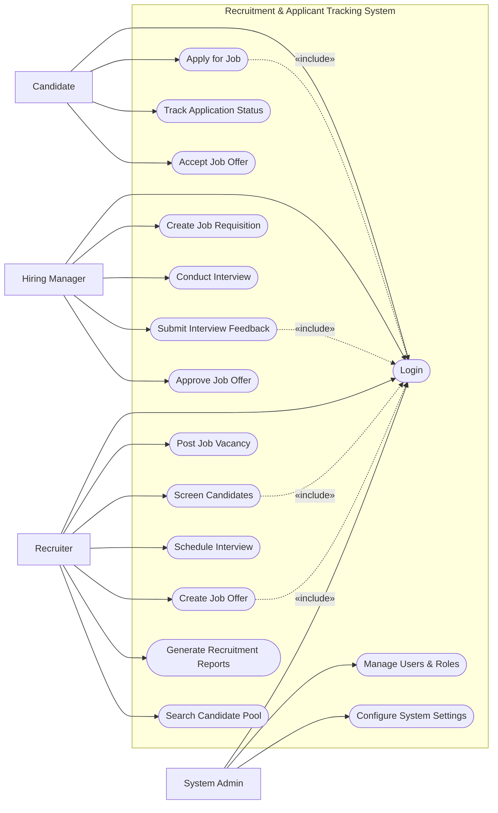

# Use Case Diagram — Recruitment & Applicant Tracking System

## Mermaid Code

## Actor Table | Bang Actor

| # | Actor | Actor Type | Role Description | Related Use Cases |
|---|-------|------------|------------------|-------------------|
| 1 | Candidate | Primary | Nguoi tim viec, ung tuyen vao cac vi tri | UC01, UC04, UC05, UC12 |
| 2 | Recruiter | Primary | Chuyen vien HR phu trach tim kiem va loc ung vien | UC01, UC03, UC06, UC07, UC10, UC13, UC14 |
| 3 | Hiring Manager | Primary | Quan ly bo phan co nhu cau tuyen dung | UC01, UC02, UC08, UC09, UC11 |
| 4 | System Admin | Primary | Quan tri vien he thong, phan quyen va cai dat | UC01, UC15, UC16 |

## Use Case Table | Bang Use Case

| # | UC ID | Use Case Name | Primary Actor | Secondary Actor | Description | Priority |
|---|-------|---------------|---------------|-----------------|-------------|----------|
| 1 | UC01 | Login | Candidate | | Authenticate user access | High |
| 2 | UC02 | Create Job Requisition | Hiring Manager | | Request a new job opening | High |
| 3 | UC03 | Post Job Vacancy | Recruiter | | Publish job ad to portals | High |
| 4 | UC04 | Apply for Job | Candidate | | Submit resume for a job | High |
| 5 | UC05 | Track Application Status | Candidate | | View current stage of application | Medium |
| 6 | UC06 | Screen Candidates | Recruiter | | Review resumes and shortlist | High |
| 7 | UC07 | Schedule Interview | Recruiter | | Set up time for interview | High |
| 8 | UC08 | Conduct Interview | Hiring Manager | Recruiter | Perform the interview | Medium |
| 9 | UC09 | Submit Interview Feedback| Hiring Manager | | Provide notes and score | High |
| 10| UC10 | Create Job Offer | Recruiter | | Draft offer letter and terms | High |
| 11| UC11 | Approve Job Offer | Hiring Manager | | Finalize offer details | High |
| 12| UC12 | Accept Job Offer | Candidate | | Sign and accept offer | High |
| 13| UC13 | Generate Recruitment Reports| Recruiter | | Report on hiring metrics | Medium |
| 14| UC14 | Search Candidate Pool | Recruiter | | Search past candidates | Low |
| 15| UC15 | Manage Users & Roles | System Admin | | Create, update, or deactivate user accounts | High |
| 16| UC16 | Configure System Settings | System Admin | | Update system-wide preferences and parameters | Medium |

## Use Case Specification | Dac ta Use Case

---

### UC04 — Apply for Job

| Field | Detail |
|-------|--------|
| **UC ID** | UC04 |
| **Use Case Name** | Apply for Job |
| **Actor(s)** | Primary: Candidate |
| **Description** | Cho phep ung vien nop ho so (resume/CV) cho mot vi tri dang mo. |
| **Precondition** | 1. Vi tri tuyen dung (Job Vacancy) dang o trang thai "Active".  2. Ung vien da dang nhap (Include UC01). |
| **Main Flow** | 1. Actor chon mot vi tri cong viec dang mo tuyen.  2. System hien thi form ung tuyen.  3. Actor dien thong tin ca nhan, tai len CV va Cover Letter.  4. Actor nhan Submit.  5. System kiem tra tinh hop le cua file va thong tin.  6. System luu ho so, tao Application ID va gui email xac nhan. |
| **Alternative Flow** | **AF1** — Ung tuyen bang ho so co san: O buoc 3, Actor chon dung CV da luu trong he thong ma khong can tai len file moi. |
| **Exception Flow** | **EX1** — File qua lon hoac sai dinh dang: System thong bao loi va yeu cau tai lai file (vi du: chi nhan PDF, max 5MB). |
| **Postcondition** | Ho so ung vien duoc luu vao he thong voi trang thai "New". |
| **Business Rule** | **BR1**: Mot ung vien khong the nop nhieu lan cho cung mot vi tri trong vong 30 ngay.  **BR2**: CV tai len phai o dinh dang cho phep (.pdf, .doc, .docx). |

---

### UC06 — Screen Candidates

| Field | Detail |
|-------|--------|
| **UC ID** | UC06 |
| **Use Case Name** | Screen Candidates |
| **Actor(s)** | Primary: Recruiter |
| **Description** | Recruiter xem xet danh sach ho so ung vien va quyet dinh loai hay chuyen tiep sang vong phong van. |
| **Precondition** | 1. Recruiter da dang nhap (Include UC01).  2. Co ho so ung vien o trang thai "New" cho vi tri cong viec do. |
| **Main Flow** | 1. Actor mo danh sach ung vien cua mot vi tri.  2. System hien thi danh sach ho so dang cho.  3. Actor xem CV va thong tin ung tuyen cua tung nguoi.  4. Actor danh gia va chon "Shortlist" hoac "Reject".  5. System cap nhat trang thai ung vien tuong ung.  6. Neu Reject, System tu dong gui email tu choi (Thanks but no thanks). |
| **Alternative Flow** | **AF1** — Chuyen hoang sang vi tri khac: Actor thay ung vien phu hop vi tri khac, chon "Move to Job", System cap nhat ung vien sang job do. |
| **Exception Flow** | **EX1** — Vi tri da dong: Neu vi tri tuyen dung vua bi khoa hoac huy, System chan viec Shortlist va thong bao "Job is closed". |
| **Postcondition** | Ho so ung vien chuyen sang trang thai "Shortlisted" hoac "Rejected". |
| **Business Rule** | **BR1**: Ho so bi Reject sau do 24h moi duoc he thong tu dong gui email de tranh phan hoi qua nhanh. |

---

### UC07 — Schedule Interview

| Field | Detail |
|-------|--------|
| **UC ID** | UC07 |
| **Use Case Name** | Schedule Interview |
| **Actor(s)** | Primary: Recruiter |
| **Description** | Recruiter sap xep thoi gian, dia diem phong van giua ung vien va quan ly tuyen dung. |
| **Precondition** | 1. Ung vien phai o trang thai "Shortlisted".  2. Recruiter da dang nhap. |
| **Main Flow** | 1. Actor chon ung vien tu danh sach Shortlisted.  2. Actor chon "Schedule Interview".  3. System hien thi form xep lich.  4. Actor chon ngay, gio, phong phong van (hoac link online), va nguoi phong van (Hiring Manager).  5. Actor luu thong tin.  6. System gui email moi phong van toi ung vien va them lich vao calendar cua Hiring Manager. |
| **Alternative Flow** | **AF1** — Thay doi lich: Actor cap nhat lai thoi gian/dia diem cho mot lich da tao, System gui lai email Update. |
| **Exception Flow** | **EX1** — Trung lich: Neu phong hoac Hiring Manager da co lich ban trong khung gio do, System thong bao "Time slot conflicted". |
| **Postcondition** | Lich phong van duoc tao va trang thai ung vien chuyen thanh "Interview Scheduled". |
| **Business Rule** | **BR1**: Lich phong van phai duoc tao truoc it nhat 24 gio so voi thoi gian dien ra. |

---

### UC10 — Create Job Offer

| Field | Detail |
|-------|--------|
| **UC ID** | UC10 |
| **Use Case Name** | Create Job Offer |
| **Actor(s)** | Primary: Recruiter |
| **Description** | Soan thao va gui thu moi nhan viec (Offer Letter) cho ung vien da vuot qua phong van. |
| **Precondition** | 1. Ung vien co trang thai "Interview Passed".  2. Recruiter da dang nhap. |
| **Main Flow** | 1. Actor chon ung vien da dau phong van.  2. Actor chon "Create Offer".  3. System hien thi template Offer Letter.  4. Actor nhap muc luong, chuc danh, ngay bat dau va phuc loi.  5. Actor nhan "Submit for Approval".  6. System gui thong bao phe duyet den Hiring Manager. |
| **Alternative Flow** | **AF1** — Gui truc tiep: Neu vi tri khong can phe duyet, Actor chon "Send to Candidate", System chuyen truc tiep email den ung vien. |
| **Exception Flow** | **EX1** — Thieu thong tin luong: Neu truong muc luong bi bo trong, System bao loi "Salary is required" va yeu cau nhap lai. |
| **Postcondition** | Thu moi duoc tao va luu trang thai "Pending Approval" hoac "Sent to Candidate". |
| **Business Rule** | **BR1**: Muc luong de xuat khong duoc vuot qua ngan sach da phe duyet cua vi tri do neu khong co su cho phep cua giam doc. |
