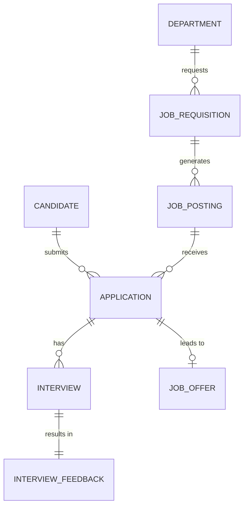

# Conceptual ERD — Recruitment & Applicant Tracking System
## Mermaid Code

## Entity Description Table | Bang mo ta Entity
| # | Entity Name | Vietnamese Name | Description | Key Attributes | Main Relationships |
|---|-------------|-----------------|-------------|----------------|-------------------|
| 1 | DEPARTMENT | Phong ban | Thong tin phong ban co nhu cau tuyen dung | department_id, name | requests JOB_REQUISITION |
| 2 | JOB_REQUISITION| Yeu cau tuyen dung| Phieu yeu cau mo vi tri moi tu quan ly | requisition_id, job_title | generates JOB_POSTING |
| 3 | JOB_POSTING | Tin tuyen dung | Tin dang tuyen tren cac kenh public | posting_id, platforms | receives APPLICATION |
| 4 | CANDIDATE | Ung vien | Thong tin ca nhan cua nguoi tim viec | candidate_id, email, resume | submits APPLICATION |
| 5 | APPLICATION | Don ung tuyen | Ho so ung tuyen vao mot vi tri nhat dinh | application_id, status | has INTERVIEW |
| 6 | INTERVIEW | Lich phong van | Thong tin buoi phong van duoc len lich | interview_id, scheduled_at | results in INTERVIEW_FEEDBACK |
| 7 | INTERVIEW_FEEDBACK| Danh gia phong van| Diem so va nhan xet tu nguoi phong van | feedback_id, score, comments | belongs to INTERVIEW |
| 8 | JOB_OFFER | Thu moi nhan viec| Thoa thuan cong viec gui cho ung vien | offer_id, offered_salary | belongs to APPLICATION |
## Relationship Description | Mo ta Quan he
| # | From Entity | Cardinality | To Entity | Relationship Label | Business Explanation |
|---|-------------|-------------|-----------|-------------------|----------------------|
| 1 | DEPARTMENT | one-to-many | JOB_REQUISITION | requests | Mot phong ban co the tao nhieu yeu cau tuyen dung. |
| 2 | JOB_REQUISITION| one-to-many | JOB_POSTING | generates | Mot yeu cau the duoc dang tren nhieu noi tao ra nhieu posting. |
| 3 | CANDIDATE | one-to-many | APPLICATION | submits | Mot ung vien co the nop don vao nhieu vi tri. |
| 4 | JOB_POSTING | one-to-many | APPLICATION | receives | Mot tin dang co the nhan nhieu ho so ung tuyen. |
| 5 | APPLICATION | one-to-many | INTERVIEW | has | Mot don ung tuyen co the qua nhieu vong phong van. |
| 6 | INTERVIEW | one-to-one | INTERVIEW_FEEDBACK| results in | Moi buoi phong van sinh ra mot ban danh gia. |
| 7 | APPLICATION | one-to-zero-or-one| JOB_OFFER | leads to | Mot don ung tuyen thanh cong se nhan duoc mot thu moi. |

