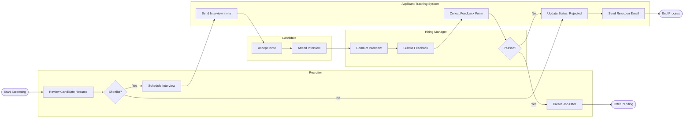

# Swimlane Diagram — Recruitment & Applicant Tracking System

## Mermaid Code

## Flow Description | Mo ta luong

| Lane | Actor | Role in Flow |
|------|-------|-------------|
| 1 | Recruiter | Danh gia CV, quyet dinh loai hoac chon ung vien, sap xep lich phong van va len don Offer. |
| 2 | Applicant Tracking System | Tu dong hoa luong cong viec, cap nhat trang thai va gui email lien lac toi ung vien. |
| 3 | Candidate | Nhan email xac nhan, tham gia phong van cung phia cong ty. |
| 4 | Hiring Manager | Truc tiep phong van, ghi nhan danh gia/diem so len he thong de ra quyet dinh cuoi cung. |
