# Action Tree — Recruitment & Applicant Tracking System

## Mermaid Code

```mermaid
%%{init: {'theme': 'default'}}%%
graph TD
    Root["Recruitment & Applicant Tracking System"]

    Root --> M1["Job Requisition & Posting"]
    Root --> M2["Candidate Sourcing"]
    Root --> M3["Interview Management"]
    Root --> M4["Offer Management"]
    Root --> M5["Analytics & Reporting"]

    M1 --> A11["Create Requisition"]
    M1 --> A12["Approve Budget"]
    M1 --> A13["Publish to Job Boards"]

    M2 --> A21["Receive Applications"]
    M2 --> A22["Parse Resumes (CV)"]
    M2 --> A23["Screen Candidates"]
    M2 --> A24["Search Candidate Pool"]

    M3 --> A31["Schedule Interviews"]
    M3 --> A32["Send Calendar Invites"]
    M3 --> A33["Submit Evaluation Forms"]

    M4 --> A41["Draft Job Offer"]
    M4 --> A42["Get Offer Approval"]
    M4 --> A43["Send Offer to Candidate"]
    M4 --> A44["Track E-Signatures"]

    M5 --> A51["View Time-to-Hire"]
    M5 --> A52["Analyze Sourcing Channels"]
    M5 --> A53["Export Hiring Data"]
```

## Module Description | Mo ta Module

| # | Module | Description | Actions |
|---|--------|-------------|---------|
| 1 | Job Requisition & Posting | Quan ly yeu cau tuyen dung va viec dang tin len cac kenh tuyen dung. | Create Requisition, Approve Budget, Publish to Job Boards |
| 2 | Candidate Sourcing | Thu thap, luu tru, va sang loc ho so ung vien tu nhieu nguon. | Receive Applications, Parse Resumes, Screen Candidates, Search Candidate Pool |
| 3 | Interview Management | To chuc va quan ly cac vong phong van va thu thap danh gia. | Schedule Interviews, Send Calendar Invites, Submit Evaluation Forms |
| 4 | Offer Management | Tao lap thu moi nhan viec, duyet va gui cho ung vien, theo doi trang thai. | Draft Job Offer, Get Offer Approval, Send Offer to Candidate, Track E-Signatures |
| 5 | Analytics & Reporting | Cung cap cac chi so tuyen dung (Time-to-hire, chi phi tuyen dung,...). | View Time-to-Hire, Analyze Sourcing Channels, Export Hiring Data |
