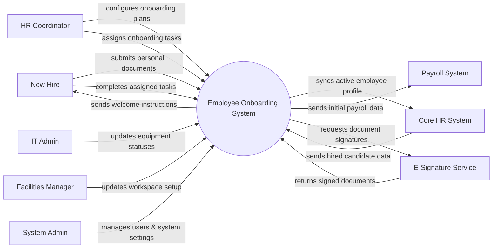

# Context Diagram — Employee Onboarding System

## Mermaid Code

## Actor & Interaction Table | Bang Actor & Tuong tac

| # | Actor | Actor Type | Data Sent TO System | Data Received FROM System | Notes |
|---|-------|------------|---------------------|---------------------------|-------|
| 1 | New Hire | Primary | Signed documents, personal information, task updates | Task lists, company policies, welcome messages | Nhan vien moi |
| 2 | HR Coordinator | Primary | Onboarding plans, task assignments, orientation schedules | Task completion reports, document statuses | Nhan su phu trach onboarding |
| 3 | IT Admin | Primary | IT provisioning statuses, account details | IT equipment requests | Quan tri vien IT |
| 4 | Facilities Manager | Primary | Workspace setup statuses | Desk and access card requests | Quan tri CSVC |
| 5 | Core HR System | Supporting | Hired candidate profiles | Completed employee profiles | He thong nhan su loi |
| 6 | Payroll System | Supporting | Confirmation of data receipt | Bank details, tax forms of new hire | He thong luong |
| 7 | E-Signature Service | Supporting | Signed PDFs | Documents requiring digital signatures | Dich vu ky so (vi du DocuSign) |
| 8 | System Admin | Primary | System configurations, user roles | System logs, audit reports | Quan tri he thong |

## System Boundary Description | Mo ta Pham vi He thong

The Employee Onboarding System handles the transition of a hired candidate into a full employee. It manages pre-boarding document collection, cross-departmental task assignments (like IT setup and facilities), and orientation scheduling. It does not handle recruitment or long-term performance management. Once onboarding is complete, the finalized data is pushed to the Core HR System and Payroll System.
