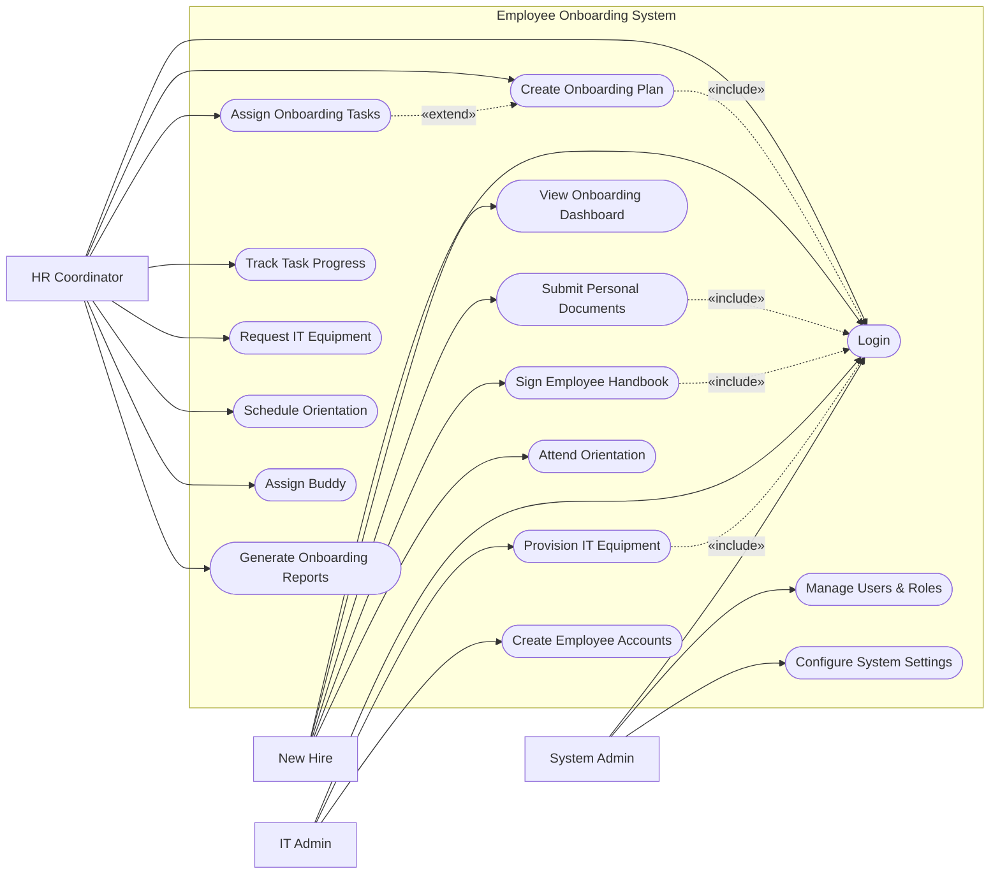

# Use Case Diagram — Employee Onboarding System

## Mermaid Code

## Actor Table | Bang Actor

| # | Actor | Actor Type | Role Description | Related Use Cases |
|---|-------|------------|------------------|-------------------|
| 1 | New Hire | Primary | Nhan vien moi gia nhap cong ty | UC01, UC02, UC03, UC04, UC12 |
| 2 | HR Coordinator | Primary | Chuyen vien HR phu trach qua trinh tiep nhan | UC01, UC05, UC06, UC07, UC08, UC11, UC13, UC14 |
| 3 | IT Admin | Primary | Nhan vien IT cap phat tai khoan va thiet bi | UC01, UC09, UC10 |
| 4 | System Admin | Primary | Quan tri vien he thong, phan quyen va cai dat | UC01, UC15, UC16 |

## Use Case Table | Bang Use Case

| # | UC ID | Use Case Name | Primary Actor | Secondary Actor | Description | Priority |
|---|-------|---------------|---------------|-----------------|-------------|----------|
| 1 | UC01 | Login | New Hire | | Authenticate user access | High |
| 2 | UC02 | View Onboarding Dashboard| New Hire | | See list of tasks to complete | High |
| 3 | UC03 | Submit Personal Documents| New Hire | | Upload ID, tax forms, bank details | High |
| 4 | UC04 | Sign Employee Handbook | New Hire | | Read and e-sign company policies | High |
| 5 | UC05 | Create Onboarding Plan | HR Coordinator | | Define tasks for a specific role | High |
| 6 | UC06 | Assign Onboarding Tasks | HR Coordinator | | Delegate setup tasks to IT/Admin | High |
| 7 | UC07 | Track Task Progress | HR Coordinator | | Monitor what is done vs pending | Medium |
| 8 | UC08 | Request IT Equipment | HR Coordinator | | Submit ticket for laptop, software | High |
| 9 | UC09 | Provision IT Equipment | IT Admin | | Mark physical equipment as ready | High |
| 10| UC10 | Create Employee Accounts | IT Admin | | Setup email and system access | High |
| 11| UC11 | Schedule Orientation | HR Coordinator | | Setup first-day training session | Medium |
| 12| UC12 | Attend Orientation | New Hire | | Mark orientation as attended | Medium |
| 13| UC13 | Assign Buddy | HR Coordinator | | Select an existing employee as mentor| Low |
| 14| UC14 | Generate Onboarding Reports| HR Coordinator | | Export stats on onboarding success | Low |
| 15| UC15 | Manage Users & Roles | System Admin | | Create, update, or deactivate user accounts | High |
| 16| UC16 | Configure System Settings | System Admin | | Update system-wide preferences and parameters | Medium |

## Use Case Specification | Dac ta Use Case

---

### UC03 — Submit Personal Documents

| Field | Detail |
|-------|--------|
| **UC ID** | UC03 |
| **Use Case Name** | Submit Personal Documents |
| **Actor(s)** | Primary: New Hire |
| **Description** | Cho phep nhan vien moi tai len cac giay to ca nhan can thiet (CCCD, bang cap) de hoan thien ho so. |
| **Precondition** | 1. Tai khoan New Hire da duoc kich hoat.  2. He thong dang yeu cau cung cap ho so. |
| **Main Flow** | 1. Actor dang nhap va vao muc "Document Submission".  2. System hien thi danh sach cac giay to can nop (co dau * la bat buoc).  3. Actor chon file tren may tinh va tai len tung loai giay to.  4. Actor nhan "Submit All".  5. System kiem tra da du cac file bat buoc hay chua.  6. System luu file, chuyen trang thai sang "Under Review" va thong bao HR. |
| **Alternative Flow** | **AF1** — Luu tam: O buoc 4, Actor chon "Save Draft", System luu file da tai nhung chua chuyen trang thai, de sau tai tiep. |
| **Exception Flow** | **EX1** — Thieu file bat buoc: Neu Actor nhan Submit nhung chua tai du file bat buoc, System bao loi mau do duoi cac muc con thieu.  **EX2** — File loi: Dinh dang hoac dung luong khong hop le, System chan upload ngay tai cho. |
| **Postcondition** | Ho so duoc luu tren he thong va HR nhan duoc thong bao de vao kiem tra. |
| **Business Rule** | **BR1**: Nhan vien moi bat buoc phai hoan thanh viec nay truoc ngay lam viec dau tien (Day 1). |

---

### UC05 — Create Onboarding Plan

| Field | Detail |
|-------|--------|
| **UC ID** | UC05 |
| **Use Case Name** | Create Onboarding Plan |
| **Actor(s)** | Primary: HR Coordinator |
| **Description** | HR tao mot ke hoach onboarding cu the (chon cac nhiem vu) phu hop voi vi tri cua nhan vien moi. |
| **Precondition** | 1. HR Coordinator da dang nhap.  2. Thong tin New Hire da co tren he thong tu he thong Tuyen dung. |
| **Main Flow** | 1. Actor chon New Hire dang cho xep lich onboarding.  2. System hien thi giao dien tao Onboarding Plan.  3. Actor chon Template (vi du: "Standard Developer Onboarding").  4. System dien san cac nhiem vu tu template.  5. Actor them hoac xoa bot nhiem vu tuy y, dat deadline cho tung nhiem vu.  6. Actor nhan "Publish Plan".  7. System luu ke hoach, kich hoat cac thong bao toi New Hire va cac bo phan lien quan (IT, Admin). |
| **Alternative Flow** | **AF1** — Tao tu dau: O buoc 3, Actor khong dung Template ma tu them tung nhiem vu (Add Custom Task). |
| **Exception Flow** | **EX1** — Khong co nhiem vu: Neu Actor nhan Publish nhung khong co nhiem vu nao trong plan, System bao loi "Plan must contain at least one task". |
| **Postcondition** | Ke hoach onboarding duoc ban hanh, trang thai New Hire chuyen thanh "In Progress". |
| **Business Rule** | **BR1**: Moi Onboarding Plan phai co it nhat mot nhiem vu cho IT (Cap tai khoan/thiet bi). |

---

### UC08 — Request IT Equipment

| Field | Detail |
|-------|--------|
| **UC ID** | UC08 |
| **Use Case Name** | Request IT Equipment |
| **Actor(s)** | Primary: HR Coordinator |
| **Description** | HR gui yeu cau chuan bi may tinh, tai khoan va cac thiet bi cong nghe khac cho nhan vien moi toi bo phan IT. |
| **Precondition** | 1. HR Coordinator da dang nhap.  2. Onboarding Plan da duoc tao. |
| **Main Flow** | 1. Actor mo muc "IT Requests".  2. Actor chon ten New Hire.  3. System hien thi form yeu cau thiet bi.  4. Actor chon loai may tinh (MacBook/Windows), danh sach phan mem can cai, va cac phu kien khac.  5. Actor nhan "Send Request".  6. System luu yeu cau va chuyen vao danh sach viec cua IT Admin. |
| **Alternative Flow** | **AF1** — Tu dong de xuat: System tu dong tick chon cac thiet bi tieu chuan dua theo chuc danh cua New Hire de HR do phai chon lai. |
| **Exception Flow** | **EX1** — Loi he thong: Neu khong the ket noi toi he thong helpdesk cua IT (neu co tich hop), System thong bao "Failed to send to IT Helpdesk, please try again." |
| **Postcondition** | Yeu cau thiet bi nam trong Hang doi (Queue) cua IT Admin voi trang thai "Pending". |
| **Business Rule** | **BR1**: Yeu cau nay phai duoc gui di it nhat 3 ngay lam viec truoc ngay nhan vien moi bat dau (Day 1). |

---

### UC09 — Provision IT Equipment

| Field | Detail |
|-------|--------|
| **UC ID** | UC09 |
| **Use Case Name** | Provision IT Equipment |
| **Actor(s)** | Primary: IT Admin |
| **Description** | IT Admin xac nhan da chuan bi xong thiet bi va tai khoan cho nhan vien moi. |
| **Precondition** | 1. IT Admin da dang nhap.  2. Co "IT Request" o trang thai "Pending". |
| **Main Flow** | 1. Actor mo danh sach "Pending IT Requests".  2. Actor chon mot yeu cau de xem chi tiet.  3. Actor thuc hien viec setup may tinh, tao email thuc te ngoai he thong.  4. Actor quay lai he thong, nhap Asset ID (Ma tai san) va thong tin dang nhap tam thoi vao form.  5. Actor nhan "Mark as Completed".  6. System cap nhat trang thai thanh "Provisioned" va thong bao cho HR Coordinator. |
| **Alternative Flow** | **AF1** — Het thiet bi: O buoc 4, Actor chon "Out of Stock" va ghi chu ngay du kien co hang. System thong bao lai cho HR. |
| **Exception Flow** | **EX1** — Bo trong Asset ID: Neu thiet bi yeu cau ma tai san nhung Actor quen nhap, System canh bao "Asset ID is required for Hardware". |
| **Postcondition** | Yeu cau IT chuyen sang trang thai hoan thanh. HR co the tiep tuc quy trinh. |
| **Business Rule** | **BR1**: Moi thiet bi phan cung duoc cap phat phai co ma tai san (Asset ID) de theo doi sau nay. |
