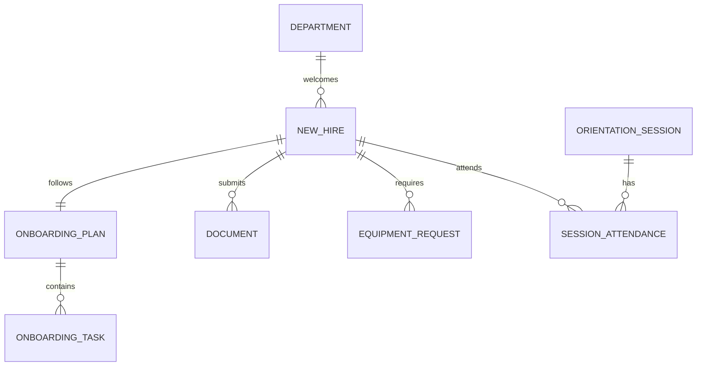

# Conceptual ERD — Employee Onboarding System
## Mermaid Code

## Entity Description Table | Bang mo ta Entity
| # | Entity Name | Vietnamese Name | Description | Key Attributes | Main Relationships |
|---|-------------|-----------------|-------------|----------------|-------------------|
| 1 | DEPARTMENT | Phong ban | Phong ban ma nhan vien moi se lam viec | department_id, name | welcomes NEW_HIRE |
| 2 | NEW_HIRE | Nhan vien moi | Thong tin cua nhan vien dang trong thoi gian tiep nhan | new_hire_id, start_date | follows ONBOARDING_PLAN |
| 3 | ONBOARDING_PLAN | Ke hoach Onboarding | Tong the tien do cua qua trinh onboarding | plan_id, completion_percentage | contains ONBOARDING_TASK |
| 4 | ONBOARDING_TASK | Nhiem vu Onboarding | Cac viec can lam (Setup IT, ky giay to,...) | task_id, due_date, status | belongs to ONBOARDING_PLAN |
| 5 | DOCUMENT | Ho so/Tai lieu | Cac file scan hoac tai lieu ky so cua New Hire | document_id, is_signed | belongs to NEW_HIRE |
| 6 | EQUIPMENT_REQUEST| Yeu cau IT/CSVC | Phieu yeu cau cap phat may tinh, the tu,... | request_id, asset_id | belongs to NEW_HIRE |
| 7 | ORIENTATION_SESSION| Buoi hoi nhap | Buoi dao tao van hoa cong ty cho nhan vien | session_id, schedule_time | has SESSION_ATTENDANCE |
| 8 | SESSION_ATTENDANCE| Diem danh hoi nhap| Ket qua tham gia buoi hoi nhap cua nhan vien | attendance_id, has_attended | belongs to NEW_HIRE |
## Relationship Description | Mo ta Quan he
| # | From Entity | Cardinality | To Entity | Relationship Label | Business Explanation |
|---|-------------|-------------|-----------|-------------------|----------------------|
| 1 | DEPARTMENT | one-to-many | NEW_HIRE | welcomes | Mot phong ban co the tiep nhan nhieu nhan vien moi. |
| 2 | NEW_HIRE | one-to-one | ONBOARDING_PLAN | follows | Moi nhan vien moi co dung mot ke hoach onboarding tong the. |
| 3 | ONBOARDING_PLAN | one-to-many | ONBOARDING_TASK | contains | Mot ke hoach bao gom nhieu nhiem vu nho can hoan thanh. |
| 4 | NEW_HIRE | one-to-many | DOCUMENT | submits | Nhan vien moi phai nop nhieu loai giay to khac nhau. |
| 5 | NEW_HIRE | one-to-many | EQUIPMENT_REQUEST | requires | Mot nhan vien co the can nhieu thiet bi/tai khoan khac nhau. |
| 6 | ORIENTATION_SESSION| one-to-many | SESSION_ATTENDANCE | has | Mot buoi hoi nhap co nhieu ban ghi diem danh cho cac nhan vien. |
| 7 | NEW_HIRE | one-to-many | SESSION_ATTENDANCE | attends | Mot nhan vien moi co the tham gia nhieu buoi dao tao khac nhau. |

