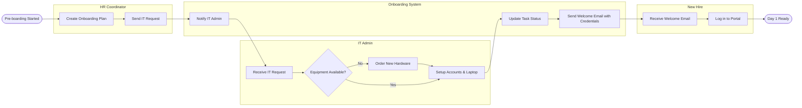

# Swimlane Diagram — Employee Onboarding System

## Mermaid Code

## Flow Description | Mo ta luong

| Lane | Actor | Role in Flow |
|------|-------|-------------|
| 1 | HR Coordinator | Nguoi khoi tao quy trinh, xac dinh cac nhu cau IT cho nhan vien moi va chuyen giao tiep. |
| 2 | Onboarding System | Dieu phoi luong cong viec, gui cac thong bao/nhiem vu den dung bo phan va theo doi trang thai. |
| 3 | IT Admin | Chuan bi thiet bi phan cung, tao tai khoan phan mem va cap nhat lai he thong khi hoan thanh. |
| 4 | New Hire | Nhan huong dan dang nhap ban dau tu he thong va thuc hien dang nhap vao ngay lam viec dau tien. |
