# Action Tree — Employee Onboarding System

## Mermaid Code

```mermaid
%%{init: {'theme': 'default'}}%%
graph TD
    Root["Employee Onboarding System"]

    Root --> M1["Pre-boarding"]
    Root --> M2["Task Management"]
    Root --> M3["IT & Facilities"]
    Root --> M4["Orientation & Training"]
    Root --> M5["Probation & Feedback"]

    M1 --> A11["Send Welcome Packet"]
    M1 --> A12["Collect Personal Data"]
    M1 --> A13["E-Sign Documents"]

    M2 --> A21["Create Onboarding Plan"]
    M2 --> A22["Assign Cross-functional Tasks"]
    M2 --> A23["Track Progress Bar"]

    M3 --> A31["Request Laptop & Software"]
    M3 --> A32["Provision IT Accounts"]
    M3 --> A33["Assign Desk & Access Card"]

    M4 --> A41["Schedule HR Orientation"]
    M4 --> A42["Assign Buddy/Mentor"]
    M4 --> A43["Enroll in Compliance Courses"]

    M5 --> A51["Conduct 30-day Check-in"]
    M5 --> A52["Conduct 60-day Review"]
    M5 --> A53["Finalize Probation Decision"]
```

## Module Description | Mo ta Module

| # | Module | Description | Actions |
|---|--------|-------------|---------|
| 1 | Pre-boarding | Giai doan truoc khi nhan vien chinh thuc bat dau lam viec (thu thap giay to). | Send Welcome Packet, Collect Personal Data, E-Sign Documents |
| 2 | Task Management | Chuc nang lap ke hoach va theo doi cac nhiem vu danh cho nhieu ben. | Create Onboarding Plan, Assign Cross-functional Tasks, Track Progress Bar |
| 3 | IT & Facilities | Chuan bi co so vat chat, thiet bi cong nghe, va tai khoan. | Request Laptop & Software, Provision IT Accounts, Assign Desk & Access Card |
| 4 | Orientation & Training | To chuc cac buoi dao tao hoi nhap, gioi thieu van hoa, phan cong nguoi huong dan. | Schedule HR Orientation, Assign Buddy/Mentor, Enroll in Compliance Courses |
| 5 | Probation & Feedback | Theo doi trong thoi gian thu viec, danh gia dinh ky de quyet dinh tiep nhan. | Conduct 30-day Check-in, Conduct 60-day Review, Finalize Probation Decision |
