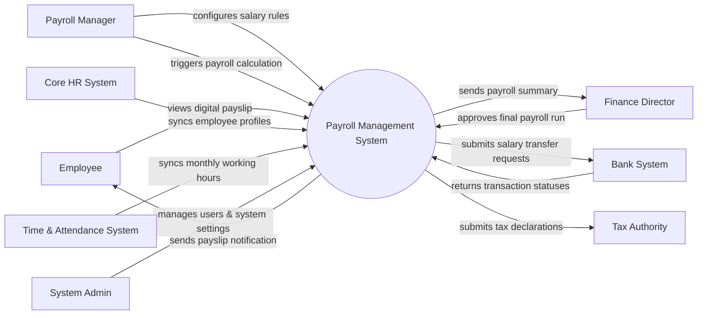

# Context Diagram — Payroll Management System

## Mermaid Code

## Actor & Interaction Table | Bang Actor & Tuong tac

| # | Actor | Actor Type | Data Sent TO System | Data Received FROM System | Notes |
|---|-------|------------|---------------------|---------------------------|-------|
| 1 | Employee | Primary | View requests for payslips | Digital payslips, tax certificates | Nhan vien nhan luong |
| 2 | Payroll Manager | Primary | Salary rules, deduction inputs, payroll triggers | Payroll calculation results, error logs | Nhan su chuyen trach luong (C&B) |
| 3 | Finance Director | Primary | Payroll approvals | Total salary expense reports | Giam doc tai chinh |
| 4 | Core HR System | Supporting | Employee data (join date, job title, basic salary) | Confirmation of sync | He thong nhan su loi |
| 5 | Time & Attendance System | Supporting | Worked hours, overtime, leave days | Sync status | He thong cham cong |
| 6 | Bank System | Supporting | Payment transaction results | Bulk salary transfer files/API requests | He thong ngan hang thanh toan |
| 7 | Tax Authority | Regulatory | Tax regulations updates | Monthly tax deduction reports | Co quan thue (Chi cuc Thue) |
| 8 | System Admin | Primary | System configurations, user roles | System logs, audit reports | Quan tri he thong |

## System Boundary Description | Mo ta Pham vi He thong

The Payroll Management System (PMS) is strictly responsible for calculating net salaries, managing deductions, generating payslips, and executing payouts. It does NOT track daily employee attendance or manage core HR profiles; it pulls this data from the Time & Attendance System and Core HR System. It interfaces directly with Bank Systems to disburse funds and with the Tax Authority for compliance reporting.
