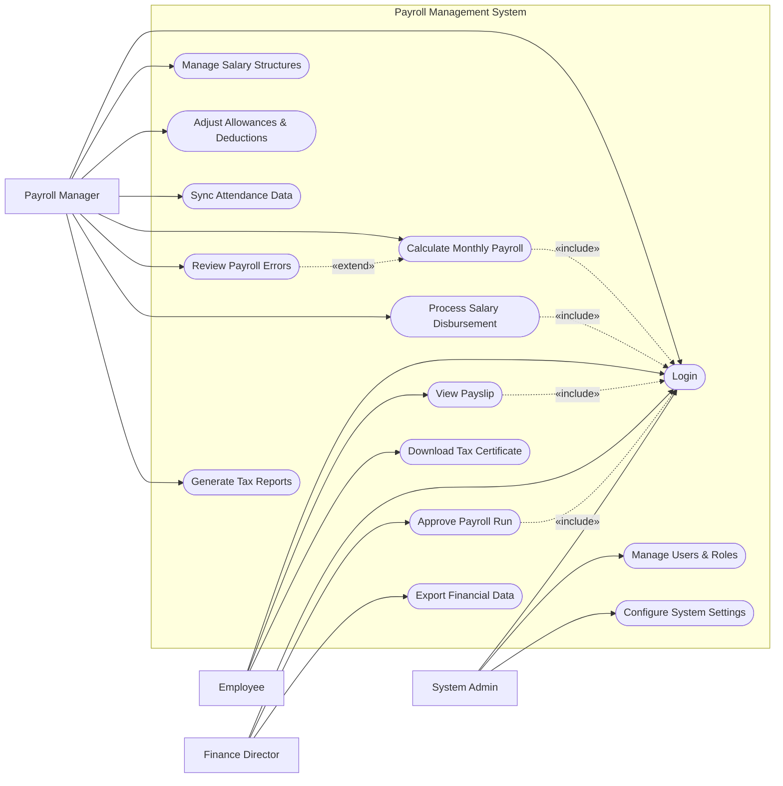

# Use Case Diagram — Payroll Management System

## Mermaid Code

## Actor Table | Bang Actor

| # | Actor | Actor Type | Role Description | Related Use Cases |
|---|-------|------------|------------------|-------------------|
| 1 | Employee | Primary | Nguoi lao dong nhan luong hang thang | UC01, UC02, UC03 |
| 2 | Payroll Manager | Primary | Chuyen vien C&B phu trach chay luong | UC01, UC04, UC05, UC06, UC07, UC08, UC10, UC11 |
| 3 | Finance Director| Primary | Nguoi xet duyet quy luong truoc khi chi tra | UC01, UC09, UC12 |
| 4 | System Admin | Primary | Quan tri vien he thong, phan quyen va cai dat | UC01, UC13, UC14 |

## Use Case Table | Bang Use Case

| # | UC ID | Use Case Name | Primary Actor | Secondary Actor | Description | Priority |
|---|-------|---------------|---------------|-----------------|-------------|----------|
| 1 | UC01 | Login | Employee | | Authenticate user access | High |
| 2 | UC02 | View Payslip | Employee | | Check monthly salary breakdown | High |
| 3 | UC03 | Download Tax Certificate| Employee | | Get documents for personal tax | Low |
| 4 | UC04 | Manage Salary Structures| Payroll Manager| | Define basic pay, grades | High |
| 5 | UC05 | Adjust Allowances | Payroll Manager| | Add bonuses or deduct penalties | High |
| 6 | UC06 | Sync Attendance Data | Payroll Manager| Time System | Pull hours worked for the month | High |
| 7 | UC07 | Calculate Monthly Payroll| Payroll Manager| | Run formula to get net pay | High |
| 8 | UC08 | Review Payroll Errors | Payroll Manager| | Fix data missing before approval | Medium |
| 9 | UC09 | Approve Payroll Run | Finance Director| | Finalize the payroll batch | High |
| 10| UC10 | Process Salary Disbursement| Payroll Manager| Bank System | Send money to employee banks | High |
| 11| UC11 | Generate Tax Reports | Payroll Manager| | Compute PIT for the company | High |
| 12| UC12 | Export Financial Data | Finance Director| | Send data to accounting software | Medium |
| 13| UC13 | Manage Users & Roles | System Admin | | Create, update, or deactivate user accounts | High |
| 14| UC14 | Configure System Settings | System Admin | | Update system-wide preferences and parameters | Medium |

## Use Case Specification | Dac ta Use Case

---

### UC02 — View Payslip

| Field | Detail |
|-------|--------|
| **UC ID** | UC02 |
| **Use Case Name** | View Payslip |
| **Actor(s)** | Primary: Employee |
| **Description** | Cho phep nhan vien xem chi tiet phieu luong tung thang cua minh. |
| **Precondition** | 1. Employee da dang nhap (Include UC01).  2. Phieu luong cua thang do da duoc he thong tao va khoa (published). |
| **Main Flow** | 1. Actor chon menu "My Payslips".  2. System hien thi danh sach cac thang da co luong.  3. Actor chon mot thang cu the.  4. System hien thi chi tiet phieu luong gom: Luong co ban, phu cap, khau tru, thue PIT, luong thuc lanh.  5. Actor co the chon "Download PDF" hoac in. |
| **Alternative Flow** | **AF1** — Xem theo nam: Actor chon nam truoc do tai bo loc, System hien thi danh sach cac thang cua nam do. |
| **Exception Flow** | **EX1** — Chua co luong: Neu Actor vao thang hien tai nhung luong chua duoc duyet, System hien thi "Payslip for this month is not yet available". |
| **Postcondition** | Nhan vien nam duoc thong tin thu nhap cua minh. |
| **Business Rule** | **BR1**: Nhan vien chi duoc phep xem phieu luong cua chinh minh.  **BR2**: Phieu luong chi hien thi sau khi Finance Director da duyet Payroll Run. |

---

### UC07 — Calculate Monthly Payroll

| Field | Detail |
|-------|--------|
| **UC ID** | UC07 |
| **Use Case Name** | Calculate Monthly Payroll |
| **Actor(s)** | Primary: Payroll Manager |
| **Description** | Chay tien trinh tinh toan luong thuc lanh cho toan bo nhan vien hoac mot nhom nhat dinh dua tren du lieu dau vao. |
| **Precondition** | 1. Du lieu cham cong da duoc dong bo (UC06).  2. Cac khoan phu cap/khau tru da cap nhat day du (UC05). |
| **Main Flow** | 1. Actor vao man hinh "Run Payroll".  2. Actor chon ky luong (Thang/Nam) va chon Tap nhan vien (Tat ca hoac theo phong ban).  3. Actor nhan "Calculate".  4. System hien thi thanh tien trinh dang tinh toan (quet qua cac cong thuc thue, bao hiem, gio lam).  5. System xuat ket qua "Draft Payroll" gom danh sach nhan vien va tong tien luong.  6. System danh dau ky luong la "Calculated". |
| **Alternative Flow** | **AF1** — Chay lai luong: Neu co sai sot, Actor cap nhat du lieu va nhan "Recalculate", System thay the ban Draft cu bang ban moi. |
| **Exception Flow** | **EX1** — Loi thieu du lieu: Neu he thong phat hien co nhan vien thieu thong tin hop dong hoac ma so thue gay loi tinh toan, System dung lai va kich hoat **UC08 Review Payroll Errors** de hien thi danh sach loi. |
| **Postcondition** | Mot bang luong nhap (Draft) duoc tao ra de cho Finance Director duyet. |
| **Business Rule** | **BR1**: Cong thuc tinh thue TNCN (PIT) phai duoc ap dung tu dong theo bac thue nha nuoc hien hanh. |

---

### UC09 — Approve Payroll Run

| Field | Detail |
|-------|--------|
| **UC ID** | UC09 |
| **Use Case Name** | Approve Payroll Run |
| **Actor(s)** | Primary: Finance Director |
| **Description** | Giam doc tai chinh kiem tra tong quy luong, so sanh voi ngan sach va xet duyet de tien hanh chi tra. |
| **Precondition** | 1. Finance Director da dang nhap.  2. Payroll Manager da tao ra "Draft Payroll" (UC07). |
| **Main Flow** | 1. Actor nhan duoc thong bao co bang luong can duyet.  2. Actor vao muc "Payroll Approvals".  3. System hien thi bang tong hop: Tong chi luong, tong thue, tong bao hiem.  4. Actor kiem tra cac con so tong va danh sach chi tiet (neu can).  5. Actor nhan "Approve" nhap ma PIN/Mat khau de xac nhan.  6. System khoa bang luong, chuyen trang thai thanh "Approved" va gui thong bao cho Payroll Manager. |
| **Alternative Flow** | **AF1** — Tu choi: O buoc 5, Actor phat hien chi phi bat thuong, nhan "Reject" va ghi chu ly do. Bang luong tro ve trang thai Draft de Payroll Manager sua. |
| **Exception Flow** | **EX1** — Khong du ngan sach (Tuy chon): Neu tong luong vuot qua ngan sach da cai dat tren he thong ERP (neu co tich hop), System hien thi canh bao mau do truoc khi cho phep Approve. |
| **Postcondition** | Bang luong duoc chot, san sang de thuc hien lenh chi tra va phieu luong co the duoc phat hanh (published). |
| **Business Rule** | **BR1**: Bang luong sau khi Approved khong the bi thay doi boi bat ky ai, ke ca he thong admin. |

---

### UC10 — Process Salary Disbursement

| Field | Detail |
|-------|--------|
| **UC ID** | UC10 |
| **Use Case Name** | Process Salary Disbursement |
| **Actor(s)** | Primary: Payroll Manager, Secondary: Bank System |
| **Description** | Chuyen tiep du lieu luong da duyet sang he thong ngan hang de thuc hien chuyen khoan cho nhan vien. |
| **Precondition** | 1. Bang luong da duoc Approve (UC09).  2. Tat ca nhan vien deu co so tai khoan ngan hang hop le tren he thong. |
| **Main Flow** | 1. Actor chon bang luong "Approved".  2. Actor nhan nut "Disburse Salary".  3. System tu dong tap hop file danh sach chuyen khoan dung format quy dinh cua Ngan hang.  4. System gui yeu cau API qua Bank System (hoac xuat file Excel de Actor tu upload).  5. Bank System xu ly giao dich va tra ve ket qua tung giao dich.  6. System doc ket qua tra ve va cap nhat trang thai thanh toan tren tung nhan vien la "Paid". |
| **Alternative Flow** | **AF1** — Xuat file thu cong: Neu Ngan hang khong ho tro API, O buoc 4, System chi tai file `.csv` ve may cho Actor de thuc hien thu cong. |
| **Exception Flow** | **EX1** — Ngan hang tu choi giao dich: Mot vai nhan vien bi sai so tai khoan, Bank System tra ve loi. System hien thi danh sach cac giao dich loi voi trang thai "Failed" de Actor xu ly rieng. |
| **Postcondition** | Luong duoc chi tra thanh cong. Phieu luong cua thang do tu dong duoc mo (published) cho nhan vien xem (UC02). |
| **Business Rule** | **BR1**: Lenh chi tra chi duoc thuc hien 1 lan tren 1 bang luong. Cac giao dich Failed se duoc tao thanh mot loai lenh chi tra bo sung (Supplemental Run). |
