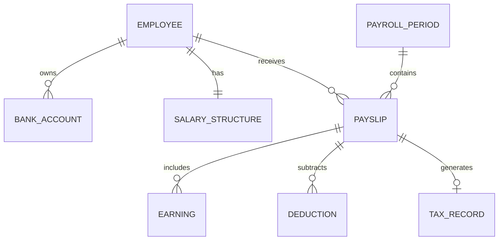

# Conceptual ERD — Payroll Management System
## Mermaid Code

## Entity Description Table | Bang mo ta Entity
| # | Entity Name | Vietnamese Name | Description | Key Attributes | Main Relationships |
|---|-------------|-----------------|-------------|----------------|-------------------|
| 1 | EMPLOYEE | Nhan vien | Thong tin co ban de quan ly thue/luong cua nhan vien | employee_id, tax_code | receives PAYSLIP |
| 2 | BANK_ACCOUNT | Tai khoan Ngan hang | Thong tin chuyen khoan luong | account_id, account_number | belongs to EMPLOYEE |
| 3 | SALARY_STRUCTURE | Cau truc luong | Muc luong co ban va phu cap co dinh hien tai | structure_id, basic_salary | belongs to EMPLOYEE |
| 4 | PAYROLL_PERIOD | Ky luong | Thong tin tong hop cua mot thang chay luong | period_id, month_year, status | contains PAYSLIP |
| 5 | PAYSLIP | Phieu luong | Tong hop ket qua tinh luong thuc lanh cua 1 nhan vien | payslip_id, net_salary | includes EARNING |
| 6 | EARNING | Khoan thu nhap | Chi tiet cac khoan cong vao (Thuong, lam them gio) | earning_id, amount | belongs to PAYSLIP |
| 7 | DEDUCTION | Khoan khau tru | Chi tiet cac khoan tru di (BHYT, BHXH, phat) | deduction_id, amount | belongs to PAYSLIP |
| 8 | TAX_RECORD | Ban ghi thue TNCN| So tien thue thu nhap ca nhan bi tru trong thang | tax_id, tax_amount | belongs to PAYSLIP |
## Relationship Description | Mo ta Quan he
| # | From Entity | Cardinality | To Entity | Relationship Label | Business Explanation |
|---|-------------|-------------|-----------|-------------------|----------------------|
| 1 | EMPLOYEE | one-to-many | BANK_ACCOUNT | owns | Mot nhan vien co the khai bao nhieu tai khoan ngan hang (mot tai khoan active chuc nang nhan luong). |
| 2 | EMPLOYEE | one-to-one | SALARY_STRUCTURE | has | Tai mot thoi diem, nhan vien co mot cau truc luong co ban duy nhat. |
| 3 | PAYROLL_PERIOD | one-to-many | PAYSLIP | contains | Mot ky luong thang bao gom nhieu phieu luong cho cac nhan vien. |
| 4 | EMPLOYEE | one-to-many | PAYSLIP | receives | Nhan vien nhan nhieu phieu luong tuong ung voi cac thang lam viec. |
| 5 | PAYSLIP | one-to-many | EARNING | includes | Phieu luong bao gom nhieu dong thu nhap khac nhau. |
| 6 | PAYSLIP | one-to-many | DEDUCTION | subtracts | Phieu luong tru di nhieu dong khau tru. |
| 7 | PAYSLIP | one-to-zero-or-one| TAX_RECORD | generates | Mot phieu luong co the phat sinh hoac khong phat sinh thue TNCN (neu luong chua toi muc dong thue). |

