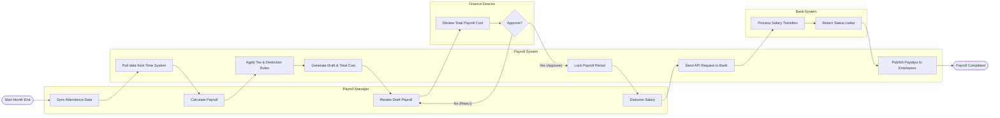

# Swimlane Diagram — Payroll Management System

## Mermaid Code

## Flow Description | Mo ta luong

| Lane | Actor | Role in Flow |
|------|-------|-------------|
| 1 | Payroll Manager | Khoi tao qua trinh dong bo du lieu, chay tinh toan va cuoi cung la nhan nut chi tra. |
| 2 | Payroll System | Chay cac thuat toan tinh toan phuc tap, luu tru du lieu, tich hop ngan hang va phan phoi phieu luong. |
| 3 | Finance Director | Kiem soat dong tien, xet duyet tong ngan sach chi tra truoc khi tien thuc su duoc chuyen ra khoi cong ty. |
| 4 | Bank System | He thong ngoai, thuc thi viec chuyen khoan thuc te den tai khoan cua nhan vien va bao cao ket qua. |
