# Action Tree — Payroll Management System

## Mermaid Code

```mermaid
%%{init: {'theme': 'default'}}%%
graph TD
    Root["Payroll Management System"]

    Root --> M1["Core Payroll"]
    Root --> M2["Benefits & Deductions"]
    Root --> M3["Tax & Compliance"]
    Root --> M4["Disbursement"]
    Root --> M5["Reporting & Analytics"]

    M1 --> A11["Manage Salary Structures"]
    M1 --> A12["Sync Attendance Data"]
    M1 --> A13["Run Payroll Calculation"]
    M1 --> A14["Approve Payroll"]

    M2 --> A21["Configure Overtime Rates"]
    M2 --> A22["Manage Employee Insurance"]
    M2 --> A23["Apply One-time Bonuses"]

    M3 --> A31["Update Tax Rules (PIT)"]
    M3 --> A32["Generate Monthly Tax Report"]
    M3 --> A33["Export Yearly Tax Certificates"]

    M4 --> A41["Generate Bank Transfer Files"]
    M4 --> A42["Execute API Payment"]
    M4 --> A43["Publish Digital Payslips"]

    M5 --> A51["View Total Salary Costs"]
    M5 --> A52["Analyze Overtime Expenses"]
    M5 --> A53["Export Journal Entries to ERP"]
```

## Module Description | Mo ta Module

| # | Module | Description | Actions |
|---|--------|-------------|---------|
| 1 | Core Payroll | Cac chuc nang cot loi de tao va tinh toan ky luong. | Manage Salary Structures, Sync Attendance Data, Run Payroll Calculation, Approve Payroll |
| 2 | Benefits & Deductions | Quan ly cac quy tac cong them (thuong, OT) va tru di (bao hiem). | Configure Overtime Rates, Manage Employee Insurance, Apply One-time Bonuses |
| 3 | Tax & Compliance | Xu ly cac van de tuan thu Phap luat, tinh thue thu nhap ca nhan. | Update Tax Rules, Generate Monthly Tax Report, Export Yearly Tax Certificates |
| 4 | Disbursement | Quan ly qua trinh thanh toan tien luong thuc te. | Generate Bank Transfer Files, Execute API Payment, Publish Digital Payslips |
| 5 | Reporting & Analytics | Phan tich chi phi luong, day du lieu sang ke toan. | View Total Salary Costs, Analyze Overtime Expenses, Export Journal Entries to ERP |
