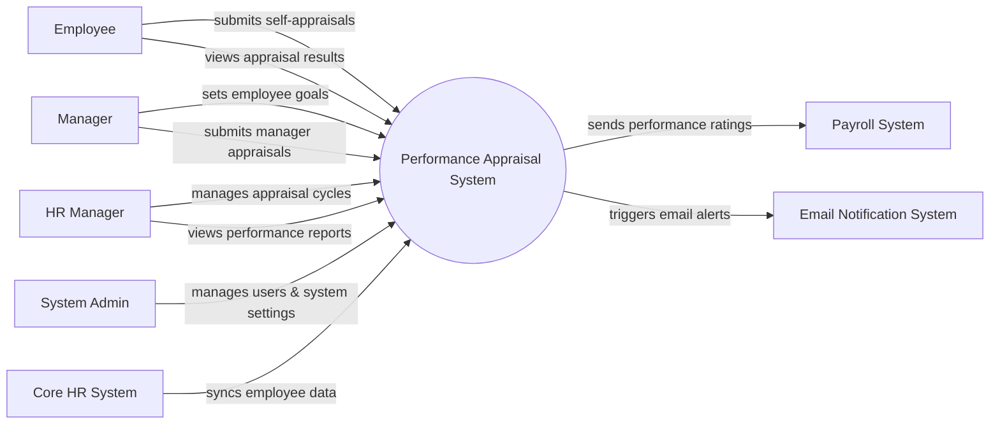

# Context Diagram — Performance Appraisal System

## Mermaid Code

## Actor & Interaction Table | Bang Actor & Tuong tac

| # | Actor | Actor Type | Data Sent TO System | Data Received FROM System | Notes |
|---|-------|------------|---------------------|---------------------------|-------|
| 1 | Employee | Primary | Self-appraisal data, goal progress, appeal requests | Appraisal results, goals, feedback | Nhan vien thong thuong |
| 2 | Manager | Primary | Employee goals, manager appraisal scores, feedback | Team performance reports, employee self-appraisals | Quan ly truc tiep |
| 3 | HR Manager | Primary | Appraisal cycle settings, evaluation templates | Organization performance reports, completion statuses | Nhan su quan tri hieu suat |
| 4 | System Admin | Primary | System configurations, user roles, permissions | System logs, audit reports | Quan tri he thong |
| 5 | Core HR System | Supporting | Employee profiles, department structures | None | He thong nhan su loi |
| 6 | Payroll System | Supporting | None | Employee performance ratings, bonus eligibility data | He thong tinh luong |
| 7 | Email Notification System | Supporting | Delivery statuses | Email contents, recipient lists | He thong gui email |

## System Boundary Description | Mo ta Pham vi He thong

The Performance Appraisal System is responsible for managing the end-to-end employee performance evaluation process, including goal setting, self-appraisals, manager evaluations, and reporting. It serves as a centralized platform for Employees, Managers, and HR Managers to track and review performance. The system does not directly manage core employee profiles or calculate payroll; instead, it receives employee data from the Core HR System and sends performance ratings to the Payroll System. It also integrates with an Email Notification System to alert users of pending tasks and results.
