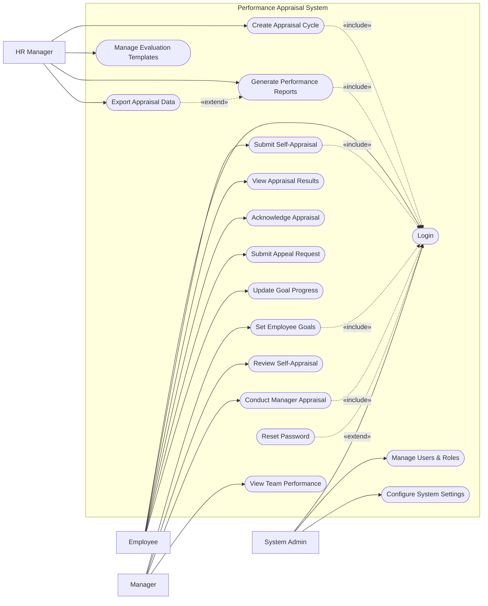

# Use Case Diagram — Performance Appraisal System

## Mermaid Code

## Actor Table | Bang Actor

| # | Actor | Actor Type | Role Description | Related Use Cases |
|---|-------|------------|------------------|-------------------|
| 1 | Employee | Primary | Nhan vien thuc hien tu danh gia va cap nhat muc tieu | UC01, UC02, UC03, UC04, UC05, UC06 |
| 2 | Manager | Primary | Quan ly thiet lap muc tieu va danh gia nhan vien | UC07, UC08, UC09, UC10 |
| 3 | HR Manager | Primary | Nhan su quan ly ky danh gia va bao cao hieu suat | UC11, UC12, UC13, UC14 |
| 4 | System Admin | Primary | Quan tri vien he thong, phan quyen va cai dat | UC01, UC15, UC16 |

## Use Case Table | Bang Use Case

| # | UC ID | Use Case Name | Primary Actor | Secondary Actor | Description | Priority |
|---|-------|---------------|---------------|-----------------|-------------|----------|
| 1 | UC01 | Login | Employee | | Authenticate user access | High |
| 2 | UC02 | Submit Self-Appraisal | Employee | | Fill and submit self-evaluation form | High |
| 3 | UC03 | View Appraisal Results | Employee | | Check final performance scores and feedback | High |
| 4 | UC04 | Acknowledge Appraisal | Employee | | Accept the final appraisal results | Medium |
| 5 | UC05 | Submit Appeal Request | Employee | HR Manager | Request a review of appraisal results | Medium |
| 6 | UC06 | Update Goal Progress | Employee | | Record achievements against set goals | Medium |
| 7 | UC07 | Set Employee Goals | Manager | | Define performance objectives for team members | High |
| 8 | UC08 | Review Self-Appraisal | Manager | | Read employee self-assessment | Medium |
| 9 | UC09 | Conduct Manager Appraisal | Manager | | Evaluate and score employee performance | High |
| 10| UC10 | View Team Performance | Manager | | Check overall performance of the team | Medium |
| 11| UC11 | Create Appraisal Cycle | HR Manager | | Initiate a new performance review period | High |
| 12| UC12 | Manage Evaluation Templates | HR Manager | | Design forms and criteria for appraisals | High |
| 13| UC13 | Generate Performance Reports | HR Manager | | Create statistical performance reports | Medium |
| 14| UC14 | Export Appraisal Data | HR Manager | | Download performance data for external use | Low |
| 15| UC15 | Manage Users & Roles | System Admin | | Create, update, or deactivate user accounts | High |
| 16| UC16 | Configure System Settings | System Admin | | Update system-wide preferences and parameters | Medium |
| 17| UC17 | Reset Password | Employee | | Recover account access | High |

## Use Case Specification | Dac ta Use Case

---

### UC01 — Login

| Field | Detail |
|-------|--------|
| **UC ID** | UC01 |
| **Use Case Name** | Login |
| **Actor(s)** | Primary: Employee, Manager, HR Manager, System Admin |
| **Description** | Cho phep nguoi dung xac thuc de dang nhap vao he thong. |
| **Precondition** | 1. Nguoi dung phai co tai khoan hop le tren he thong.  2. He thong dang hoat dong binh thuong. |
| **Main Flow** | 1. Actor mo trang dang nhap.  2. System hien thi form dang nhap.  3. Actor nhap username va password.  4. Actor nhan nut Submit.  5. System xac thuc thong tin.  6. System chuyen huong den trang chu tuong ung quyen han. |
| **Alternative Flow** | **AF1** — Quen mat khau: Neu Actor chon "Forgot Password", System kich hoat UC17 Reset Password. |
| **Exception Flow** | **EX1** — Sai thong tin: Neu xac thuc that bai, System hien thi thong bao loi va yeu cau nhap lai.  **EX2** — Tai khoan bi khoa: Neu nhap sai qua 5 lan, System khoa tai khoan va thong bao lien he Admin. |
| **Postcondition** | Nguoi dung duoc dang nhap va phien lam viec duoc khoi tao. |
| **Business Rule** | **BR1**: Mat khau phai duoc ma hoa.  **BR2**: Phien dang nhap tu dong het han sau 30 phut khong hoat dong. |

---

### UC02 — Submit Self-Appraisal

| Field | Detail |
|-------|--------|
| **UC ID** | UC02 |
| **Use Case Name** | Submit Self-Appraisal |
| **Actor(s)** | Primary: Employee |
| **Description** | Cho phep nhan vien dien va nop phieu tu danh gia nang luc va ket qua cong viec. |
| **Precondition** | 1. Nhan vien da dang nhap (Include UC01).  2. Ky danh gia (Appraisal Cycle) dang mo cho phep tu danh gia. |
| **Main Flow** | 1. Actor chon "My Appraisals" va mo phieu danh gia hien tai.  2. System hien thi form tu danh gia bao gom muc tieu va nang luc.  3. Actor dien diem tu danh gia va nhan xet cho tung tieu chi.  4. Actor nhan "Submit".  5. System kiem tra tinh day du cua cac truong bat buoc.  6. System luu phieu danh gia, chuyen trang thai sang "Submitted" va thong bao den Manager. |
| **Alternative Flow** | **AF1** — Luu nhap: Tai buoc 4, Actor nhan "Save Draft", System luu trang thai "Draft" de tiep tuc sau. |
| **Exception Flow** | **EX1** — Thieu thong tin: Neu cac truong bat buoc bi bo trong, System to do truong do va chan Submit.  **EX2** — Qua han: Neu ky danh gia da dong, System hien thi thong bao loi va chi cho phep xem (Read-only). |
| **Postcondition** | Phieu tu danh gia duoc luu voi trang thai "Submitted" va cho Manager xu ly. |
| **Business Rule** | **BR1**: Nhan vien khong the sua phieu sau khi da Submit tru khi Manager yeu cau lam lai.  **BR2**: Cac tieu chi danh gia phai dua tren mau do HR Manager thiet lap. |

---

### UC07 — Set Employee Goals

| Field | Detail |
|-------|--------|
| **UC ID** | UC07 |
| **Use Case Name** | Set Employee Goals |
| **Actor(s)** | Primary: Manager |
| **Description** | Cho phep quan ly thiet lap muc tieu (KPI/OKR) cho nhan vien thuoc nhom minh quan ly. |
| **Precondition** | 1. Manager da dang nhap (Include UC01).  2. Ky thiet lap muc tieu dang mo tren he thong. |
| **Main Flow** | 1. Actor vao muc "Team Goals" va chon mot nhan vien.  2. System hien thi danh sach muc tieu hien tai va nut "Add Goal".  3. Actor chon "Add Goal", nhap tieu de, mo ta, chi tieu va thoi han.  4. Actor nhan "Save & Assign".  5. System kiem tra thong tin va luu muc tieu vao ho so nhan vien.  6. System gui thong bao muc tieu moi cho nhan vien. |
| **Alternative Flow** | **AF1** — Chinh sua muc tieu: Actor chon muc tieu da co, chinh sua va luu lai. System cap nhat va gui thong bao. |
| **Exception Flow** | **EX1** — Nhan vien khong thuoc nhom: Neu Actor chon nhan vien ngoai quyen quan ly, System bao loi "Access Denied". |
| **Postcondition** | Muc tieu duoc luu tru tren he thong va lien ket voi nhan vien duoc chon. |
| **Business Rule** | **BR1**: Tong trong so (weight) cua cac muc tieu phai bang 100%.  **BR2**: Muc tieu chi duoc xoa neu chua co bat ky tien do hoac danh gia nao duoc ghi nhan. |

---

### UC09 — Conduct Manager Appraisal

| Field | Detail |
|-------|--------|
| **UC ID** | UC09 |
| **Use Case Name** | Conduct Manager Appraisal |
| **Actor(s)** | Primary: Manager |
| **Description** | Cho phep quan ly thuc hien danh gia, cham diem va nhan xet cho nhan vien sau khi nhan vien da tu danh gia. |
| **Precondition** | 1. Manager da dang nhap (Include UC01).  2. Nhan vien da hoan thanh tu danh gia (Submitted). |
| **Main Flow** | 1. Actor vao "Pending Appraisals" va chon phieu cua mot nhan vien.  2. System hien thi phieu danh gia kem theo diem tu danh gia cua nhan vien.  3. Actor nhap diem danh gia cua quan ly va nhan xet cho tung muc.  4. Actor nhap nhan xet chung va de xuat xep loai tong overall.  5. Actor nhan "Submit Appraisal".  6. System luu ket qua, tinh toan diem tong ket va chuyen trang thai sang "Manager Approved". |
| **Alternative Flow** | **AF1** — Yeu cau lam lai: Tai buoc 5, Actor nhan "Return to Employee" yeu cau nhan vien bo sung. System doi trang thai ve "Draft" va thong bao cho nhan vien. |
| **Exception Flow** | **EX1** — Chua hoan thanh: Neu chua cham diem du cac muc bat buoc, System canh bao va khong cho Submit. |
| **Postcondition** | Phieu danh gia chuyen sang buoc tiep theo (cho HR duyet hoac cho nhan vien xac nhan). |
| **Business Rule** | **BR1**: Manager co the xem diem tu danh gia cua nhan vien nhung khong duoc thay doi no.  **BR2**: Diem tong ket duoc tinh tu dong dua tren trong so (weight) cua tung tieu chi. |

---

### UC11 — Create Appraisal Cycle

| Field | Detail |
|-------|--------|
| **UC ID** | UC11 |
| **Use Case Name** | Create Appraisal Cycle |
| **Actor(s)** | Primary: HR Manager |
| **Description** | Cho phep HR Manager tao va thiet lap mot ky danh gia moi cho toan cong ty hoac phong ban cu the. |
| **Precondition** | 1. HR Manager da dang nhap (Include UC01). |
| **Main Flow** | 1. Actor chon "Appraisal Cycles" va nhan "Create New Cycle".  2. System hien thi form thiet lap ky danh gia.  3. Actor nhap ten ky danh gia, thoi gian bat dau/ket thuc va thoi han cho tung giai doan (Tu danh gia, Quan ly danh gia).  4. Actor chon mau danh gia (Template) va doi tuong ap dung.  5. Actor nhan "Activate Cycle".  6. System tao ky danh gia va gui thong bao kich hoat den toan bo nhan vien lien quan. |
| **Alternative Flow** | **AF1** — Luu chua kich hoat: Actor nhan "Save as Draft" de chuan bi truoc, ky danh gia luu voi trang thai "Planned". |
| **Exception Flow** | **EX1** — Trung thoi gian: Neu khoang thoi gian bi trung voi mot ky danh gia dang dien ra cung doi tuong, System hien thi loi. |
| **Postcondition** | Ky danh gia moi duoc tao tren he thong va san sang de nhan vien su dung. |
| **Business Rule** | **BR1**: Mot nhan vien chi the tham gia 1 ky danh gia chinh thuc cung thoi diem.  **BR2**: Khong the thay doi mau (Template) sau khi ky danh gia da kich hoat. |
