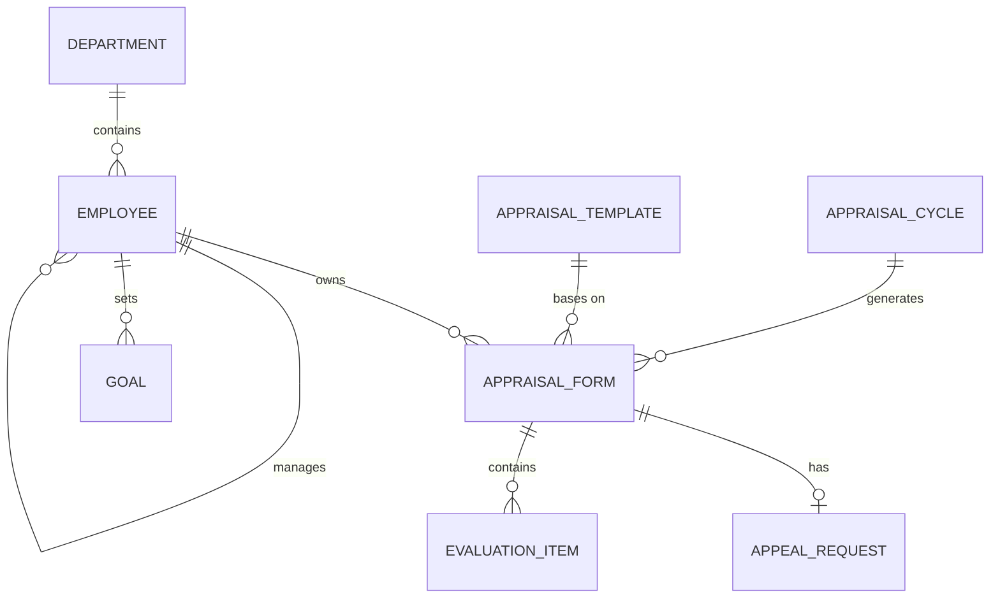

# Conceptual ERD — Performance Appraisal System
## Mermaid Code

## Entity Description Table | Bang mo ta Entity
| # | Entity Name | Vietnamese Name | Description | Key Attributes | Main Relationships |
|---|-------------|-----------------|-------------|----------------|-------------------|
| 1 | DEPARTMENT | Phong ban | Thong tin cac phong ban trong cong ty | department_id, name | contains EMPLOYEE |
| 2 | EMPLOYEE | Nhan vien | Ho so ca nhan cua nhan vien quan ly tren he thong | employee_id, full_name | owns APPRAISAL_FORM, sets GOAL |
| 3 | APPRAISAL_CYCLE | Ky danh gia | Khoang thoi gian thuc hien danh gia hieu suat | cycle_id, cycle_name, dates | generates APPRAISAL_FORM |
| 4 | APPRAISAL_TEMPLATE| Mau danh gia | Bieu mau quy dinh cac tieu chi danh gia | template_id, template_name | bases on APPRAISAL_FORM |
| 5 | APPRAISAL_FORM | Phieu danh gia | Phieu ghi nhan diem so cua mot nhan vien trong mot ky | form_id, final_score | contains EVALUATION_ITEM |
| 6 | GOAL | Muc tieu | Cac muc tieu ca nhan can hoan thanh | goal_id, title, weight | belongs to EMPLOYEE |
| 7 | EVALUATION_ITEM | Chi tiet danh gia | Tung tieu chi cu the duoc cham diem trong phieu | item_id, scores, comments | belongs to APPRAISAL_FORM |
| 8 | APPEAL_REQUEST | Yeu cau khieu nai | Khieu nai cua nhan vien ve ket qua danh gia | appeal_id, reason, status | belongs to APPRAISAL_FORM |
## Relationship Description | Mo ta Quan he
| # | From Entity | Cardinality | To Entity | Relationship Label | Business Explanation |
|---|-------------|-------------|-----------|-------------------|----------------------|
| 1 | DEPARTMENT | one-to-many | EMPLOYEE | contains | Mot phong ban bao gom nhieu nhan vien. |
| 2 | EMPLOYEE | one-to-many | EMPLOYEE | manages | Mot nhan vien (quan ly) co the quan ly nhieu nhan vien khac. |
| 3 | APPRAISAL_CYCLE | one-to-many | APPRAISAL_FORM | generates | Mot ky danh gia co the tao ra nhieu phieu danh gia cho cac nhan vien. |
| 4 | APPRAISAL_TEMPLATE| one-to-many | APPRAISAL_FORM | bases on | Mot mau danh gia co the duoc su dung de tao nhieu phieu danh gia. |
| 5 | EMPLOYEE | one-to-many | APPRAISAL_FORM | owns | Mot nhan vien so huu nhieu phieu danh gia qua cac ky khac nhau. |
| 6 | EMPLOYEE | one-to-many | GOAL | sets | Mot nhan vien co the co nhieu muc tieu trong cong viec. |
| 7 | APPRAISAL_FORM | one-to-many | EVALUATION_ITEM | contains | Mot phieu danh gia bao gom nhieu tieu chi danh gia khac nhau. |
| 8 | APPRAISAL_FORM | one-to-one/zero| APPEAL_REQUEST | has | Mot phieu danh gia co the co khong hoac mot yeu cau khieu nai. |

